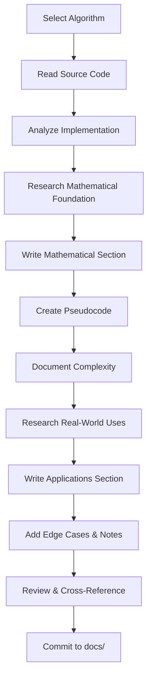

# Algorithm Documentation Plan

## Project Overview

This document outlines the comprehensive plan to create detailed algorithm reports for **TheAlgorithms/Rust** repository. Each algorithm will receive its own dedicated documentation file with mathematical foundations, pseudocode implementation, complexity analysis, and real-world applications.

---

## Documentation Structure

### Per-Algorithm Report Template

Each algorithm report will follow this standardized structure:

```
docs/
├── PLAN.md (this file)
├── backtracking/
│   ├── all_combination_of_size_k.md
│   ├── graph_coloring.md
│   └── ...
├── sorting/
│   ├── quick_sort.md
│   ├── merge_sort.md
│   └── ...
└── [category]/
    └── [algorithm].md
```

### Report Template Format

Each algorithm report will contain:

```markdown
# [Algorithm Name]

## 1. Overview
Brief description of the algorithm, its purpose, and historical context.

## 2. Mathematical Foundation
### 2.1 Problem Definition
Formal mathematical definition of the problem.

### 2.2 Mathematical Model
- Input/Output specifications
- Constraints and preconditions
- Key mathematical properties

### 2.3 Correctness Proof (where applicable)
- Invariants
- Termination proof
- Correctness theorem

## 3. Algorithm Description
### 3.1 Intuition
Plain English explanation of how the algorithm works.

### 3.2 Pseudocode
Detailed pseudocode with line-by-line annotations.

### 3.3 Step-by-Step Example
Worked example with intermediate states.

## 4. Complexity Analysis
### 4.1 Time Complexity
- Best Case: O(?)
- Average Case: O(?)
- Worst Case: O(?)
- Derivation and proof

### 4.2 Space Complexity
- Auxiliary space requirements
- Stack space for recursive algorithms

## 5. Implementation Notes
### 5.1 Rust-Specific Considerations
- Ownership and borrowing patterns
- Generic type constraints
- Iterator usage

### 5.2 Edge Cases
- Empty input handling
- Single element cases
- Boundary conditions

## 6. Real-World Applications
### 6.1 Software Engineering Use Cases
- Specific industry applications
- System design scenarios
- Integration patterns

### 6.2 Related Algorithms
- Variants and alternatives
- When to use which

## 7. References
- Original papers
- Books and resources
- Related implementations
```

---

## Algorithm Inventory

### Phase 1: Sorting Algorithms (36 algorithms)

| # | Algorithm | File | Priority | Est. Effort |
|---|-----------|------|----------|-------------|
| 1 | Quick Sort | `sorting/quick_sort.rs` | High | Medium |
| 2 | Quick Sort (3-Way) | `sorting/quick_sort_3_ways.rs` | High | Medium |
| 3 | Merge Sort | `sorting/merge_sort.rs` | High | Medium |
| 4 | Heap Sort | `sorting/heap_sort.rs` | High | Medium |
| 5 | Insertion Sort | `sorting/insertion_sort.rs` | High | Low |
| 6 | Binary Insertion Sort | `sorting/binary_insertion_sort.rs` | Medium | Low |
| 7 | Selection Sort | `sorting/selection_sort.rs` | High | Low |
| 8 | Bubble Sort | `sorting/bubble_sort.rs` | High | Low |
| 9 | Tim Sort | `sorting/tim_sort.rs` | High | High |
| 10 | Intro Sort | `sorting/intro_sort.rs` | High | High |
| 11 | Radix Sort | `sorting/radix_sort.rs` | High | Medium |
| 12 | Counting Sort | `sorting/counting_sort.rs` | High | Low |
| 13 | Bucket Sort | `sorting/bucket_sort.rs` | High | Medium |
| 14 | Shell Sort | `sorting/shell_sort.rs` | Medium | Medium |
| 15 | Comb Sort | `sorting/comb_sort.rs` | Medium | Low |
| 16 | Cocktail Shaker Sort | `sorting/cocktail_shaker_sort.rs` | Low | Low |
| 17 | Gnome Sort | `sorting/gnome_sort.rs` | Low | Low |
| 18 | Cycle Sort | `sorting/cycle_sort.rs` | Medium | Medium |
| 19 | Pancake Sort | `sorting/pancake_sort.rs` | Low | Low |
| 20 | Bogo Sort | `sorting/bogo_sort.rs` | Low | Low |
| 21 | Stooge Sort | `sorting/stooge_sort.rs` | Low | Low |
| 22 | Sleep Sort | `sorting/sleep_sort.rs` | Low | Low |
| 23 | Bead Sort | `sorting/bead_sort.rs` | Low | Low |
| 24 | Pigeonhole Sort | `sorting/pigeonhole_sort.rs` | Medium | Low |
| 25 | Bitonic Sort | `sorting/bitonic_sort.rs` | Medium | High |
| 26 | Odd-Even Sort | `sorting/odd_even_sort.rs` | Low | Low |
| 27 | Exchange Sort | `sorting/exchange_sort.rs` | Low | Low |
| 28 | Dutch National Flag Sort | `sorting/dutch_national_flag_sort.rs` | Medium | Low |
| 29 | Wave Sort | `sorting/wave_sort.rs` | Low | Low |
| 30 | Wiggle Sort | `sorting/wiggle_sort.rs` | Low | Low |
| 31 | Tree Sort | `sorting/tree_sort.rs` | Medium | Medium |
| 32 | Patience Sort | `sorting/patience_sort.rs` | Medium | Medium |
| 33 | Bingo Sort | `sorting/bingo_sort.rs` | Low | Low |

### Phase 2: Searching Algorithms (17 algorithms)

| # | Algorithm | File | Priority | Est. Effort |
|---|-----------|------|----------|-------------|
| 1 | Binary Search | `searching/binary_search.rs` | High | Low |
| 2 | Binary Search (Recursive) | `searching/binary_search_recursive.rs` | High | Low |
| 3 | Linear Search | `searching/linear_search.rs` | High | Low |
| 4 | Jump Search | `searching/jump_search.rs` | Medium | Low |
| 5 | Interpolation Search | `searching/interpolation_search.rs` | Medium | Medium |
| 6 | Exponential Search | `searching/exponential_search.rs` | Medium | Low |
| 7 | Ternary Search | `searching/ternary_search.rs` | Medium | Low |
| 8 | Ternary Search (Recursive) | `searching/ternary_search_recursive.rs` | Medium | Low |
| 9 | Ternary Search Min/Max | `searching/ternary_search_min_max.rs` | Medium | Medium |
| 10 | Ternary Search Min/Max (Recursive) | `searching/ternary_search_min_max_recursive.rs` | Medium | Medium |
| 11 | Fibonacci Search | `searching/fibonacci_search.rs` | Medium | Medium |
| 12 | Quick Select | `searching/quick_select.rs` | High | Medium |
| 13 | Kth Smallest | `searching/kth_smallest.rs` | High | Medium |
| 14 | Kth Smallest (Heap) | `searching/kth_smallest_heap.rs` | High | Medium |
| 15 | Moore Voting | `searching/moore_voting.rs` | Medium | Medium |
| 16 | Saddleback Search | `searching/saddleback_search.rs` | Low | Medium |

### Phase 3: Graph Algorithms (27 algorithms)

| # | Algorithm | File | Priority | Est. Effort |
|---|-----------|------|----------|-------------|
| 1 | Breadth-First Search | `graph/breadth_first_search.rs` | High | Medium |
| 2 | Depth-First Search | `graph/depth_first_search.rs` | High | Medium |
| 3 | Dijkstra's Algorithm | `graph/dijkstra.rs` | High | High |
| 4 | Bellman-Ford | `graph/bellman_ford.rs` | High | High |
| 5 | Floyd-Warshall | `graph/floyd_warshall.rs` | High | High |
| 6 | A* Search | `graph/astar.rs` | High | High |
| 7 | Prim's MST | `graph/prim.rs` | High | Medium |
| 8 | Minimum Spanning Tree | `graph/minimum_spanning_tree.rs` | High | Medium |
| 9 | Topological Sort | `graph/topological_sort.rs` | High | Medium |
| 10 | Detect Cycle | `graph/detect_cycle.rs` | High | Medium |
| 11 | Tarjan's SCC | `graph/tarjans_ssc.rs` | High | High |
| 12 | Kosaraju's SCC | `graph/kosaraju.rs` | High | High |
| 13 | Strongly Connected Components | `graph/strongly_connected_components.rs` | High | High |
| 14 | Disjoint Set Union | `graph/disjoint_set_union.rs` | High | Medium |
| 15 | Ford-Fulkerson | `graph/ford_fulkerson.rs` | High | High |
| 16 | Dinic Max Flow | `graph/dinic_maxflow.rs` | High | High |
| 17 | Bipartite Matching | `graph/bipartite_matching.rs` | Medium | High |
| 18 | Eulerian Path | `graph/eulerian_path.rs` | Medium | Medium |
| 19 | Lee BFS | `graph/lee_breadth_first_search.rs` | Medium | Medium |
| 20 | Lowest Common Ancestor | `graph/lowest_common_ancestor.rs` | Medium | High |
| 21 | Heavy-Light Decomposition | `graph/heavy_light_decomposition.rs` | Low | High |
| 22 | Centroid Decomposition | `graph/centroid_decomposition.rs` | Low | High |
| 23 | Prufer Code | `graph/prufer_code.rs` | Low | Medium |
| 24 | 2-SAT | `graph/two_satisfiability.rs` | Medium | High |
| 25 | Graph Enumeration | `graph/graph_enumeration.rs` | Low | Medium |
| 26 | Decremental Connectivity | `graph/decremental_connectivity.rs` | Low | High |
| 27 | DFS Tic-Tac-Toe | `graph/depth_first_search_tic_tac_toe.rs` | Low | Medium |

### Phase 4: Dynamic Programming (27 algorithms)

| # | Algorithm | File | Priority | Est. Effort |
|---|-----------|------|----------|-------------|
| 1 | Fibonacci | `dynamic_programming/fibonacci.rs` | High | Low |
| 2 | Knapsack (0/1) | `dynamic_programming/knapsack.rs` | High | Medium |
| 3 | Fractional Knapsack | `dynamic_programming/fractional_knapsack.rs` | High | Medium |
| 4 | Longest Common Subsequence | `dynamic_programming/longest_common_subsequence.rs` | High | Medium |
| 5 | Longest Common Substring | `dynamic_programming/longest_common_substring.rs` | High | Medium |
| 6 | Longest Increasing Subsequence | `dynamic_programming/longest_increasing_subsequence.rs` | High | Medium |
| 7 | Longest Continuous Increasing Subsequence | `dynamic_programming/longest_continuous_increasing_subsequence.rs` | Medium | Low |
| 8 | Coin Change | `dynamic_programming/coin_change.rs` | High | Medium |
| 9 | Edit Distance (Is Subsequence) | `dynamic_programming/is_subsequence.rs` | High | Medium |
| 10 | Maximum Subarray | `dynamic_programming/maximum_subarray.rs` | High | Medium |
| 11 | Rod Cutting | `dynamic_programming/rod_cutting.rs` | High | Medium |
| 12 | Egg Dropping | `dynamic_programming/egg_dropping.rs` | High | High |
| 13 | Matrix Chain Multiplication | `dynamic_programming/matrix_chain_multiply.rs` | High | High |
| 14 | Catalan Numbers | `dynamic_programming/catalan_numbers.rs` | Medium | Medium |
| 15 | Subset Sum | `dynamic_programming/subset_sum.rs` | High | Medium |
| 16 | Subset Generation | `dynamic_programming/subset_generation.rs` | Medium | Low |
| 17 | Word Break | `dynamic_programming/word_break.rs` | High | Medium |
| 18 | Palindrome Partitioning | `dynamic_programming/palindrome_partitioning.rs` | Medium | Medium |
| 19 | Minimum Cost Path | `dynamic_programming/minimum_cost_path.rs` | Medium | Medium |
| 20 | Maximal Square | `dynamic_programming/maximal_square.rs` | Medium | Medium |
| 21 | Optimal BST | `dynamic_programming/optimal_bst.rs` | Medium | High |
| 22 | Task Assignment | `dynamic_programming/task_assignment.rs` | Medium | Medium |
| 23 | Trapped Rainwater | `dynamic_programming/trapped_rainwater.rs` | Medium | Medium |
| 24 | Smith-Waterman | `dynamic_programming/smith_waterman.rs` | Medium | High |
| 25 | Integer Partition | `dynamic_programming/integer_partition.rs` | Medium | Medium |
| 26 | Snail | `dynamic_programming/snail.rs` | Low | Low |

### Phase 5: String Algorithms (26 algorithms)

| # | Algorithm | File | Priority | Est. Effort |
|---|-----------|------|----------|-------------|
| 1 | Knuth-Morris-Pratt | `string/knuth_morris_pratt.rs` | High | High |
| 2 | Boyer-Moore Search | `string/boyer_moore_search.rs` | High | High |
| 3 | Rabin-Karp | `string/rabin_karp.rs` | High | High |
| 4 | Z Algorithm | `string/z_algorithm.rs` | High | Medium |
| 5 | Aho-Corasick | `string/aho_corasick.rs` | High | High |
| 6 | Manacher's Algorithm | `string/manacher.rs` | High | High |
| 7 | Suffix Array | `string/suffix_array.rs` | High | High |
| 8 | Suffix Array (Manber-Myers) | `string/suffix_array_manber_myers.rs` | High | High |
| 9 | Suffix Tree | `string/suffix_tree.rs` | High | High |
| 10 | Levenshtein Distance | `string/levenshtein_distance.rs` | High | Medium |
| 11 | Hamming Distance | `string/hamming_distance.rs` | High | Low |
| 12 | Jaro-Winkler Distance | `string/jaro_winkler_distance.rs` | Medium | Medium |
| 13 | Palindrome Check | `string/palindrome.rs` | High | Low |
| 14 | Shortest Palindrome | `string/shortest_palindrome.rs` | Medium | Medium |
| 15 | Anagram Check | `string/anagram.rs` | Medium | Low |
| 16 | Isogram Check | `string/isogram.rs` | Low | Low |
| 17 | Lipogram Check | `string/lipogram.rs` | Low | Low |
| 18 | Pangram Check | `string/pangram.rs` | Low | Low |
| 19 | Isomorphism | `string/isomorphism.rs` | Medium | Medium |
| 20 | String Reverse | `string/reverse.rs` | Low | Low |
| 21 | Run Length Encoding | `string/run_length_encoding.rs` | Medium | Low |
| 22 | Burrows-Wheeler Transform | `string/burrows_wheeler_transform.rs` | Medium | High |
| 23 | Duval Algorithm | `string/duval_algorithm.rs` | Medium | Medium |
| 24 | Autocomplete (Trie) | `string/autocomplete_using_trie.rs` | High | Medium |

### Phase 6: Data Structures (24 structures)

| # | Structure | File | Priority | Est. Effort |
|---|-----------|------|----------|-------------|
| 1 | Binary Search Tree | `data_structures/binary_search_tree.rs` | High | High |
| 2 | AVL Tree | `data_structures/avl_tree.rs` | High | High |
| 3 | Red-Black Tree | `data_structures/rb_tree.rs` | High | High |
| 4 | B-Tree | `data_structures/b_tree.rs` | High | High |
| 5 | Treap | `data_structures/treap.rs` | Medium | High |
| 6 | Van Emde Boas Tree | `data_structures/veb_tree.rs` | Low | High |
| 7 | Trie | `data_structures/trie.rs` | High | Medium |
| 8 | Heap | `data_structures/heap.rs` | High | Medium |
| 9 | Linked List | `data_structures/linked_list.rs` | High | Medium |
| 10 | Queue | `data_structures/queue.rs` | High | Low |
| 11 | Stack (Linked List) | `data_structures/stack_using_singly_linked_list.rs` | High | Low |
| 12 | Hash Table | `data_structures/hash_table.rs` | High | High |
| 13 | Union-Find | `data_structures/union_find.rs` | High | Medium |
| 14 | Segment Tree | `data_structures/segment_tree.rs` | High | High |
| 15 | Segment Tree (Recursive) | `data_structures/segment_tree_recursive.rs` | High | High |
| 16 | Lazy Segment Tree | `data_structures/lazy_segment_tree.rs` | High | High |
| 17 | Fenwick Tree (BIT) | `data_structures/fenwick_tree.rs` | High | Medium |
| 18 | Range Minimum Query | `data_structures/range_minimum_query.rs` | Medium | Medium |
| 19 | Skip List | `data_structures/skip_list.rs` | Medium | High |
| 20 | Graph | `data_structures/graph.rs` | High | Medium |
| 21 | Floyd's Cycle Detection | `data_structures/floyds_algorithm.rs` | High | Medium |
| 22 | Bloom Filter | `data_structures/probabilistic/bloom_filter.rs` | Medium | Medium |
| 23 | Count-Min Sketch | `data_structures/probabilistic/count_min_sketch.rs` | Medium | Medium |

### Phase 7: Backtracking Algorithms (11 algorithms)

| # | Algorithm | File | Priority | Est. Effort |
|---|-----------|------|----------|-------------|
| 1 | N-Queens | `backtracking/n_queens.rs` | High | Medium |
| 2 | Sudoku Solver | `backtracking/sudoku.rs` | High | Medium |
| 3 | Permutations | `backtracking/permutations.rs` | High | Low |
| 4 | Combinations | `backtracking/all_combination_of_size_k.rs` | High | Low |
| 5 | Subset Sum | `backtracking/subset_sum.rs` | High | Medium |
| 6 | Graph Coloring | `backtracking/graph_coloring.rs` | High | Medium |
| 7 | Hamiltonian Cycle | `backtracking/hamiltonian_cycle.rs` | High | High |
| 8 | Knight's Tour | `backtracking/knight_tour.rs` | Medium | Medium |
| 9 | Rat in Maze | `backtracking/rat_in_maze.rs` | Medium | Medium |
| 10 | Parentheses Generator | `backtracking/parentheses_generator.rs` | Medium | Low |

### Phase 8: Mathematical Algorithms (70+ algorithms)

| # | Algorithm | File | Priority | Est. Effort |
|---|-----------|------|----------|-------------|
| 1 | GCD (Euclidean) | `math/greatest_common_divisor.rs` | High | Low |
| 2 | Extended Euclidean | `math/extended_euclidean_algorithm.rs` | High | Medium |
| 3 | LCM | `math/lcm_of_n_numbers.rs` | High | Low |
| 4 | Prime Check | `math/prime_check.rs` | High | Low |
| 5 | Prime Numbers (Sieve) | `math/prime_numbers.rs` | High | Medium |
| 6 | Sieve of Eratosthenes | `math/sieve_of_eratosthenes.rs` | High | Medium |
| 7 | Linear Sieve | `math/linear_sieve.rs` | Medium | Medium |
| 8 | Miller-Rabin | `math/miller_rabin.rs` | High | High |
| 9 | Pollard's Rho | `math/pollard_rho.rs` | Medium | High |
| 10 | Prime Factors | `math/prime_factors.rs` | High | Medium |
| 11 | Factorial | `math/factorial.rs` | High | Low |
| 12 | Fibonacci | `math/fibonacci.rs` | High | Low |
| 13 | Binomial Coefficient | `math/binomial_coefficient.rs` | High | Medium |
| 14 | Combinations | `math/combinations.rs` | High | Medium |
| 15 | Pascal's Triangle | `math/pascal_triangle.rs` | Medium | Low |
| 16 | Catalan Numbers | `math/catalan_numbers.rs` | Medium | Medium |
| 17 | Bell Numbers | `math/bell_numbers.rs` | Low | Medium |
| 18 | Modular Exponentiation | `math/modular_exponential.rs` | High | Medium |
| 19 | Fast Power | `math/fast_power.rs` | High | Low |
| 20 | Binary Exponentiation | `math/binary_exponentiation.rs` | High | Medium |
| 21 | Karatsuba Multiplication | `math/karatsuba_multiplication.rs` | High | High |
| 22 | FFT | `math/fast_fourier_transform.rs` | High | High |
| 23 | Newton-Raphson | `math/newton_raphson.rs` | High | Medium |
| 24 | Square Root | `math/square_root.rs` | High | Medium |
| 25 | Chinese Remainder Theorem | `math/chinese_remainder_theorem.rs` | Medium | High |
| 26 | Gaussian Elimination | `math/gaussian_elimination.rs` | High | High |
| 27 | Matrix Operations | `math/matrix_ops.rs` | High | Medium |
| 28 | Trapezoidal Integration | `math/trapezoidal_integration.rs` | Medium | Medium |
| 29 | Simpson's Integration | `math/simpsons_integration.rs` | Medium | Medium |
| 30 | Interpolation | `math/interpolation.rs` | Medium | Medium |
| 31 | Least Squares Approximation | `math/least_square_approx.rs` | Medium | Medium |
| 32 | Sigmoid | `math/sigmoid.rs` | High | Low |
| 33 | ReLU | `math/relu.rs` | High | Low |
| 34 | Leaky ReLU | `math/leaky_relu.rs` | Medium | Low |
| 35 | Softmax | `math/softmax.rs` | High | Low |
| 36 | Tanh | `math/tanh.rs` | Medium | Low |
| 37 | Cross Entropy Loss | `math/cross_entropy_loss.rs` | High | Medium |
| 38 | Huber Loss | `math/huber_loss.rs` | Medium | Medium |
| 39 | Perfect Numbers | `math/perfect_numbers.rs` | Low | Low |
| 40 | Armstrong Number | `math/armstrong_number.rs` | Low | Low |
| 41 | Amicable Numbers | `math/amicable_numbers.rs` | Low | Low |
| 42 | Collatz Sequence | `math/collatz_sequence.rs` | Low | Low |
| 43 | Euclidean Distance | `math/euclidean_distance.rs` | Medium | Low |
| 44 | Elliptic Curve | `math/elliptic_curve.rs` | Medium | High |
| 45 | Baby-Step Giant-Step | `math/baby_step_giant_step.rs` | Medium | High |
| 46 | Quadratic Residue | `math/quadratic_residue.rs` | Low | Medium |

### Phase 9: Ciphers & Cryptography (24 algorithms)

| # | Algorithm | File | Priority | Est. Effort |
|---|-----------|------|----------|-------------|
| 1 | AES | `ciphers/aes.rs` | High | High |
| 2 | RSA | `ciphers/rsa_cipher.rs` | High | High |
| 3 | Diffie-Hellman | `ciphers/diffie_hellman.rs` | High | High |
| 4 | SHA-256 | `ciphers/sha256.rs` | High | High |
| 5 | SHA-3 | `ciphers/sha3.rs` | High | High |
| 6 | Blake2b | `ciphers/blake2b.rs` | High | High |
| 7 | ChaCha | `ciphers/chacha.rs` | High | High |
| 8 | Salsa20 | `ciphers/salsa.rs` | High | High |
| 9 | TEA | `ciphers/tea.rs` | Medium | Medium |
| 10 | Caesar Cipher | `ciphers/caesar.rs` | High | Low |
| 11 | ROT13 | `ciphers/rot13.rs` | Low | Low |
| 12 | Vigenère Cipher | `ciphers/vigenere.rs` | Medium | Medium |
| 13 | Transposition Cipher | `ciphers/transposition.rs` | Medium | Medium |
| 14 | Rail Fence Cipher | `ciphers/rail_fence.rs` | Low | Low |
| 15 | Polybius Square | `ciphers/polybius.rs` | Low | Low |
| 16 | Baconian Cipher | `ciphers/baconian_cipher.rs` | Low | Low |
| 17 | XOR Cipher | `ciphers/xor.rs` | Low | Low |
| 18 | Morse Code | `ciphers/morse_code.rs` | Low | Low |
| 19 | Base64 | `ciphers/base64.rs` | Medium | Low |

### Phase 10: Machine Learning (15 algorithms)

| # | Algorithm | File | Priority | Est. Effort |
|---|-----------|------|----------|-------------|
| 1 | Linear Regression | `machine_learning/linear_regression.rs` | High | Medium |
| 2 | Logistic Regression | `machine_learning/logistic_regression.rs` | High | Medium |
| 3 | K-Means Clustering | `machine_learning/k_means.rs` | High | Medium |
| 4 | Cholesky Decomposition | `machine_learning/cholesky.rs` | Medium | Medium |
| 5 | Gradient Descent | `machine_learning/optimization/gradient_descent.rs` | High | Medium |
| 6 | Adam Optimizer | `machine_learning/optimization/adam.rs` | High | Medium |
| 7 | Momentum Optimizer | `machine_learning/optimization/momentum.rs` | Medium | Medium |
| 8 | MSE Loss | `machine_learning/loss_function/mean_squared_error_loss.rs` | High | Low |
| 9 | MAE Loss | `machine_learning/loss_function/mean_absolute_error_loss.rs` | High | Low |
| 10 | Hinge Loss | `machine_learning/loss_function/hinge_loss.rs` | Medium | Low |
| 11 | Huber Loss | `machine_learning/loss_function/huber_loss.rs` | Medium | Low |
| 12 | KL Divergence | `machine_learning/loss_function/kl_divergence_loss.rs` | Medium | Medium |
| 13 | Negative Log Likelihood | `machine_learning/loss_function/negative_log_likelihood.rs` | Medium | Low |

### Phase 11: Bit Manipulation (15 algorithms)

| # | Algorithm | File | Priority | Est. Effort |
|---|-----------|------|----------|-------------|
| 1 | Is Power of Two | `bit_manipulation/is_power_of_two.rs` | High | Low |
| 2 | Count Trailing Zeros | `bit_manipulation/binary_count_trailing_zeros.rs` | Medium | Low |
| 3 | Count Set Bits | `bit_manipulation/counting_bits.rs` | High | Low |
| 4 | Find Missing Number | `bit_manipulation/find_missing_number.rs` | High | Low |
| 5 | Find Unique Number | `bit_manipulation/find_unique_number.rs` | High | Low |
| 6 | Highest Set Bit | `bit_manipulation/highest_set_bit.rs` | Medium | Low |
| 7 | Rightmost Set Bit | `bit_manipulation/rightmost_set_bit.rs` | Medium | Low |
| 8 | Reverse Bits | `bit_manipulation/reverse_bits.rs` | Medium | Low |
| 9 | Gray Code | `bit_manipulation/n_bits_gray_code.rs` | Medium | Medium |
| 10 | Two's Complement | `bit_manipulation/twos_complement.rs` | Medium | Low |
| 11 | Swap Odd-Even Bits | `bit_manipulation/swap_odd_even_bits.rs` | Low | Low |
| 12 | Sum Without Operators | `bit_manipulation/sum_of_two_integers.rs` | Medium | Low |
| 13 | BCD Encoding | `bit_manipulation/binary_coded_decimal.rs` | Low | Low |
| 14 | Previous Power of Two | `bit_manipulation/find_previous_power_of_two.rs` | Low | Low |

### Phase 12: Geometry (8 algorithms)

| # | Algorithm | File | Priority | Est. Effort |
|---|-----------|------|----------|-------------|
| 1 | Graham Scan (Convex Hull) | `geometry/graham_scan.rs` | High | High |
| 2 | Jarvis March (Convex Hull) | `geometry/jarvis_scan.rs` | High | High |
| 3 | Closest Pair of Points | `geometry/closest_points.rs` | High | High |
| 4 | Ramer-Douglas-Peucker | `geometry/ramer_douglas_peucker.rs` | Medium | Medium |
| 5 | Line Segment Operations | `geometry/segment.rs` | Medium | Medium |
| 6 | Point Operations | `geometry/point.rs` | Medium | Low |
| 7 | Polygon Points | `geometry/polygon_points.rs` | Medium | Medium |

### Phase 13: Compression (4 algorithms)

| # | Algorithm | File | Priority | Est. Effort |
|---|-----------|------|----------|-------------|
| 1 | Run-Length Encoding | `compression/run_length_encoding.rs` | High | Low |
| 2 | Burrows-Wheeler Transform | `compression/burrows_wheeler_transform.rs` | High | High |
| 3 | Move-to-Front | `compression/move_to_front.rs` | Medium | Medium |

### Phase 14: Number Theory (4 algorithms)

| # | Algorithm | File | Priority | Est. Effort |
|---|-----------|------|----------|-------------|
| 1 | Euler's Totient | `number_theory/euler_totient.rs` | High | Medium |
| 2 | Compute Totient | `number_theory/compute_totient.rs` | Medium | Medium |
| 3 | Kth Factor | `number_theory/kth_factor.rs` | Medium | Low |

### Phase 15: Navigation (3 algorithms)

| # | Algorithm | File | Priority | Est. Effort |
|---|-----------|------|----------|-------------|
| 1 | Haversine Distance | `navigation/haversine.rs` | High | Medium |
| 2 | Rhumb Line | `navigation/rhumbline.rs` | Medium | Medium |
| 3 | Bearing Calculation | `navigation/bearing.rs` | Medium | Low |

### Phase 16: Conversions (14 algorithms)

| # | Algorithm | File | Priority | Est. Effort |
|---|-----------|------|----------|-------------|
| 1 | Binary to Decimal | `conversions/binary_to_decimal.rs` | High | Low |
| 2 | Decimal to Binary | `conversions/decimal_to_binary.rs` | High | Low |
| 3 | Hexadecimal to Decimal | `conversions/hexadecimal_to_decimal.rs` | Medium | Low |
| 4 | Decimal to Hexadecimal | `conversions/decimal_to_hexadecimal.rs` | Medium | Low |
| 5 | Octal Conversions | `conversions/octal_to_*.rs` | Low | Low |
| 6 | RGB to CMYK | `conversions/rgb_cmyk_conversion.rs` | Low | Low |
| 7 | Length Conversion | `conversions/length_conversion.rs` | Low | Low |

### Phase 17: General Algorithms (12 algorithms)

| # | Algorithm | File | Priority | Est. Effort |
|---|-----------|------|----------|-------------|
| 1 | Huffman Encoding | `general/huffman_encoding.rs` | High | High |
| 2 | Convex Hull | `general/convex_hull.rs` | High | High |
| 3 | Fisher-Yates Shuffle | `general/fisher_yates_shuffle.rs` | High | Low |
| 4 | Kadane's Algorithm | `general/kadane_algorithm.rs` | High | Medium |
| 5 | Two Sum | `general/two_sum.rs` | High | Low |
| 6 | K-Means | `general/kmeans.rs` | High | Medium |
| 7 | Genetic Algorithm | `general/genetic.rs` | Medium | High |
| 8 | Hanoi Tower | `general/hanoi.rs` | Medium | Low |
| 9 | MEX | `general/mex.rs` | Low | Low |
| 10 | Heap Permutation | `general/permutations/heap.rs` | Medium | Medium |
| 11 | Steinhaus-Johnson-Trotter | `general/permutations/steinhaus_johnson_trotter.rs` | Medium | Medium |

### Phase 18: Financial Algorithms (7 algorithms)

| # | Algorithm | File | Priority | Est. Effort |
|---|-----------|------|----------|-------------|
| 1 | NPV (Net Present Value) | `financial/npv.rs` | High | Medium |
| 2 | NPV Sensitivity | `financial/npv_sensitivity.rs` | Medium | Medium |
| 3 | Present Value | `financial/present_value.rs` | High | Low |
| 4 | Compound Interest | `financial/compound_interest.rs` | High | Low |
| 5 | Payback Period | `financial/payback.rs` | Medium | Low |
| 6 | Finance Ratios | `financial/finance_ratios.rs` | Medium | Medium |
| 7 | Treynor Ratio | `financial/treynor_ratio.rs` | Low | Low |

### Phase 19: Big Integer (4 algorithms)

| # | Algorithm | File | Priority | Est. Effort |
|---|-----------|------|----------|-------------|
| 1 | Big Integer Multiplication | `big_integer/multiply.rs` | High | High |
| 2 | Fast Factorial | `big_integer/fast_factorial.rs` | High | Medium |
| 3 | Poly1305 | `big_integer/poly1305.rs` | Medium | High |

### Phase 20: Greedy & Signal Analysis (2 algorithms)

| # | Algorithm | File | Priority | Est. Effort |
|---|-----------|------|----------|-------------|
| 1 | Stable Matching | `greedy/stable_matching.rs` | High | High |
| 2 | YIN Algorithm | `signal_analysis/yin.rs` | Medium | High |

---

## Execution Timeline

### Sprint 1: Foundation (Weeks 1-2)
- **Focus**: High-priority sorting and searching algorithms
- **Deliverables**: 20 algorithm reports
- **Algorithms**:
  - Quick Sort, Merge Sort, Heap Sort, Tim Sort
  - Binary Search, Linear Search, Quick Select
  - Insertion Sort, Selection Sort, Bubble Sort

### Sprint 2: Graph Fundamentals (Weeks 3-4)
- **Focus**: Core graph algorithms
- **Deliverables**: 15 algorithm reports
- **Algorithms**:
  - BFS, DFS, Dijkstra, Bellman-Ford
  - Floyd-Warshall, A*, Topological Sort
  - Prim's MST, Kruskal's MST

### Sprint 3: Dynamic Programming (Weeks 5-6)
- **Focus**: DP fundamentals and classics
- **Deliverables**: 15 algorithm reports
- **Algorithms**:
  - Fibonacci, Knapsack variants
  - LCS, LIS, Coin Change
  - Matrix Chain, Rod Cutting

### Sprint 4: String & Data Structures (Weeks 7-8)
- **Focus**: String matching and core data structures
- **Deliverables**: 20 algorithm reports
- **Algorithms**:
  - KMP, Boyer-Moore, Rabin-Karp
  - BST, AVL, Red-Black Tree
  - Segment Tree, Fenwick Tree

### Sprint 5: Cryptography & Math (Weeks 9-10)
- **Focus**: Security and mathematical algorithms
- **Deliverables**: 25 algorithm reports
- **Algorithms**:
  - AES, RSA, SHA-256
  - GCD, Prime algorithms, FFT
  - Modular arithmetic

### Sprint 6: Remaining Categories (Weeks 11-12)
- **Focus**: Complete all remaining algorithms
- **Deliverables**: 30+ algorithm reports
- **Algorithms**:
  - Machine Learning algorithms
  - Geometry, Backtracking
  - Financial, Navigation, Bit Manipulation

---

## Quality Assurance Checklist

### Per-Report Verification
- [ ] Mathematical notation is correct (LaTeX/KaTeX)
- [ ] Pseudocode matches actual implementation
- [ ] Complexity analysis is verified against code
- [ ] At least 3 real-world use cases provided
- [ ] Edge cases documented
- [ ] Cross-references to related algorithms
- [ ] Code snippets compile and run

### Documentation Standards
- [ ] Consistent formatting across all reports
- [ ] Proper markdown rendering
- [ ] Working internal links
- [ ] Diagrams where beneficial (Mermaid)
- [ ] Examples with expected outputs

---

## Report Generation Workflow



---

## File Organization

```
docs/
├── PLAN.md                          # This planning document
├── README.md                        # Documentation index
├── backtracking/
│   ├── README.md                    # Category overview
│   ├── n_queens.md
│   ├── sudoku.md
│   └── ...
├── sorting/
│   ├── README.md
│   ├── quick_sort.md
│   ├── merge_sort.md
│   └── ...
├── searching/
│   ├── README.md
│   ├── binary_search.md
│   └── ...
├── graph/
│   ├── README.md
│   ├── dijkstra.md
│   └── ...
├── dynamic_programming/
│   ├── README.md
│   ├── knapsack.md
│   └── ...
├── string/
│   ├── README.md
│   ├── kmp.md
│   └── ...
├── data_structures/
│   ├── README.md
│   ├── avl_tree.md
│   └── ...
├── ciphers/
│   ├── README.md
│   ├── aes.md
│   └── ...
├── math/
│   ├── README.md
│   ├── gcd.md
│   └── ...
├── machine_learning/
│   ├── README.md
│   ├── linear_regression.md
│   └── ...
├── bit_manipulation/
│   ├── README.md
│   └── ...
├── geometry/
│   ├── README.md
│   └── ...
├── compression/
│   ├── README.md
│   └── ...
├── number_theory/
│   ├── README.md
│   └── ...
├── navigation/
│   ├── README.md
│   └── ...
├── conversions/
│   ├── README.md
│   └── ...
├── general/
│   ├── README.md
│   └── ...
├── financial/
│   ├── README.md
│   └── ...
├── big_integer/
│   ├── README.md
│   └── ...
├── greedy/
│   ├── README.md
│   └── ...
└── signal_analysis/
    ├── README.md
    └── ...
```

---

## Statistics Summary

| Category | Algorithm Count | Priority High | Est. Total Effort |
|----------|-----------------|---------------|-------------------|
| Sorting | 33 | 12 | High |
| Searching | 16 | 8 | Medium |
| Graph | 27 | 16 | Very High |
| Dynamic Programming | 26 | 14 | High |
| String | 24 | 12 | High |
| Data Structures | 23 | 16 | Very High |
| Backtracking | 10 | 7 | Medium |
| Math | 70+ | 30 | Very High |
| Ciphers | 19 | 9 | High |
| Machine Learning | 13 | 7 | Medium |
| Bit Manipulation | 14 | 5 | Low |
| Geometry | 7 | 4 | Medium |
| Compression | 3 | 2 | Low |
| Number Theory | 3 | 1 | Low |
| Navigation | 3 | 1 | Low |
| Conversions | 14 | 2 | Low |
| General | 11 | 6 | Medium |
| Financial | 7 | 3 | Low |
| Big Integer | 3 | 2 | Medium |
| Greedy/Signal | 2 | 1 | Medium |
| **TOTAL** | **~230** | **~158** | **~12 weeks** |

---

## Success Metrics

1. **Completeness**: 100% of algorithms documented
2. **Accuracy**: All complexity claims verified
3. **Usability**: Each report standalone and understandable
4. **Consistency**: Uniform format across all reports
5. **Practicality**: Real-world use cases for every algorithm

---

## Next Steps

1. ✅ Create PLAN.md (this document)
2. ⬜ Set up folder structure in `docs/`
3. ⬜ Create category README.md files
4. ⬜ Begin Sprint 1 with sorting algorithms
5. ⬜ Establish review process
6. ⬜ Track progress in this document

---

*Last Updated: December 30, 2025*
*Total Algorithms: ~230*
*Estimated Completion: 12 weeks*
