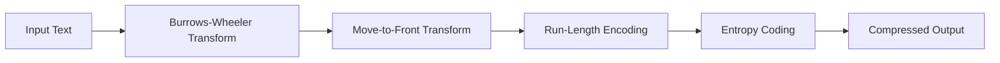

# Compression Algorithms

This module contains implementations of data compression and transformation algorithms. These algorithms reduce data size for storage and transmission while maintaining the ability to perfectly reconstruct the original data (lossless compression).

## Overview

Data compression is essential for:
- **Storage efficiency**: Reducing disk space requirements
- **Transmission speed**: Faster data transfer over networks
- **Bandwidth optimization**: Making better use of limited network capacity

The algorithms in this module form a complete compression pipeline used in tools like **bzip2**.

## Algorithms

| Algorithm | File | Description | Complexity |
|-----------|------|-------------|------------|
| [Run-Length Encoding](run_length_encoding.md) | `run_length_encoding.rs` | Encodes consecutive repeated values as (value, count) pairs | O(n) |
| [Burrows-Wheeler Transform](burrows_wheeler_transform.md) | `burrows_wheeler_transform.rs` | Reversible transformation that groups similar characters | O(n² log n) |
| [Move-to-Front Transform](move_to_front.md) | `move_to_front.rs` | Exploits temporal locality by encoding recently-used symbols as small integers | O(n) |

## The Compression Pipeline

These three algorithms work together in a powerful compression pipeline:



### Why This Order?

1. **BWT**: Rearranges data to cluster similar characters together
   - `"BANANA"` → `"BNN^AAA"` (notice the grouped characters)

2. **MTF**: Converts clustered characters to small integers (mostly zeros)
   - Repeated characters → position 0
   - Creates long runs of zeros

3. **RLE**: Compresses the runs of zeros efficiently
   - `[0, 0, 0, 0, 0]` → `[(0, 5)]`

4. **Entropy Coding** (Huffman/Arithmetic): Final compression using statistical properties

## Quick Start

### Run-Length Encoding

```rust
use the_algorithms_rust::compression::{run_length_encode, run_length_decode};

let encoded = run_length_encode("AAAABBBCCDAA");
// Result: [('A', 4), ('B', 3), ('C', 2), ('D', 1), ('A', 2)]

let decoded = run_length_decode(&encoded);
// Result: "AAAABBBCCDAA"
```

### Burrows-Wheeler Transform

```rust
use the_algorithms_rust::compression::{bwt_transform, reverse_bwt};

let result = bwt_transform("^BANANA");
// result.bwt_string = "BNN^AAA"
// result.idx_original_string = 6

let original = reverse_bwt("BNN^AAA", 6);
// Result: "^BANANA"
```

### Move-to-Front Transform

```rust
use the_algorithms_rust::compression::{move_to_front_encode, move_to_front_decode};

let encoded = move_to_front_encode("banana");
// Result: [98, 98, 110, 1, 1, 1]

let decoded = move_to_front_decode(&encoded);
// Result: "banana"
```

## Complexity Summary

| Algorithm | Time (Encode) | Time (Decode) | Space |
|-----------|---------------|---------------|-------|
| RLE | O(n) | O(m) | O(r) |
| BWT | O(n² log n)* | O(n³ log n)* | O(n²)* |
| MTF | O(n) | O(n) | O(n + \|Σ\|) |

\* Naive implementation. Optimized versions achieve O(n) using suffix arrays.

Where:
- n = input length
- m = output length
- r = number of runs
- |Σ| = alphabet size (256 for bytes)

## When to Use

| Algorithm | Best For | Avoid When |
|-----------|----------|------------|
| **RLE** | Data with many consecutive repeats (images, simple graphics) | Data without repetition |
| **BWT** | Text compression pipelines, substring search indices | Real-time streaming |
| **MTF** | After BWT output, data with temporal locality | Random data |

## Real-World Usage

### bzip2

The popular bzip2 compression tool uses exactly this pipeline:
```
BWT → MTF → RLE → Huffman
```

It typically achieves 10-15% better compression than gzip on text files.

### Bioinformatics

BWT is fundamental to modern genomics:
- **FM-index**: Enables fast substring search in compressed space
- **Bowtie/BWA**: Industry-standard DNA alignment tools
- Enables searching terabytes of genomic data efficiently

## Learning Path

1. Start with **[Run-Length Encoding](run_length_encoding.md)** - simplest concept
2. Move to **[Move-to-Front Transform](move_to_front.md)** - builds intuition for locality
3. Finally, study **[Burrows-Wheeler Transform](burrows_wheeler_transform.md)** - most complex, ties everything together

## References

1. Salomon, D. (2007). *Data Compression: The Complete Reference*
2. Sayood, K. (2017). *Introduction to Data Compression*
3. [bzip2 and libbzip2](https://sourceware.org/bzip2/)
4. [Wikipedia: Data Compression](https://en.wikipedia.org/wiki/Data_compression)
