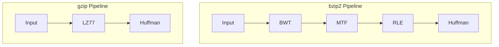

# Move-to-Front (MTF) Transform

## 1. Overview

The Move-to-Front (MTF) transform is a data encoding technique that was first described by Boris Ryabko in 1980 under the name "book stack." Later, it was independently rediscovered and popularized by Jon Bentley, Daniel Sleator, Robert Tarjan, and Victor Wei in 1986.

MTF is a **reversible transformation** that converts a string into a sequence of integers. It exploits **temporal locality**—the tendency of recently used symbols to be used again soon. When a symbol is accessed, it moves to the front of a list, so frequently repeated or recently used symbols encode as small numbers.

The transform is particularly powerful when combined with the **Burrows-Wheeler Transform (BWT)**, which clusters similar characters together. After BWT, repeated characters become runs of zeros under MTF, which compress extremely well with Run-Length Encoding.

## 2. Mathematical Foundation

### 2.1 Problem Definition

Given:
- An input sequence $S = s_1, s_2, ..., s_n$ over alphabet $\Sigma$
- An initial ordered list $L = [\sigma_0, \sigma_1, ..., \sigma_{|\Sigma|-1}]$ of all symbols in $\Sigma$

Produce:
- A sequence of non-negative integers $E = e_1, e_2, ..., e_n$ where $0 \leq e_i < |\Sigma|$

Such that the transformation is reversible.

### 2.2 Mathematical Model

**State Definition:**

At any step $i$, we maintain a permutation $L_i$ of the alphabet $\Sigma$.
- $L_0$ = initial alphabet ordering (typically ASCII order: 0, 1, ..., 255)
- $L_i$ = state after processing $s_i$

**Encoding Rule:**

For each input symbol $s_i$:
1. $e_i = \text{position of } s_i \text{ in } L_{i-1}$
2. $L_i = \text{moveToFront}(L_{i-1}, s_i)$

Where $\text{moveToFront}(L, s)$ moves element $s$ to position 0, shifting other elements right.

**Decoding Rule:**

For each encoded value $e_i$:
1. $s_i = L_{i-1}[e_i]$ (character at position $e_i$)
2. $L_i = \text{moveToFront}(L_{i-1}, s_i)$

**Key Properties:**

1. **Self-inverse structure:** Encoding and decoding use the same MTF operation
2. **Local encoding:** Output depends only on recent history
3. **Locality exploitation:** Repeated symbols produce zeros

### 2.3 Correctness Proof

**Claim:** MTF encoding is bijective (one-to-one and onto).

**Proof:**

1. **Determinism:** Given $L_{i-1}$ and $s_i$, both $e_i$ and $L_i$ are uniquely determined.

2. **Invertibility:** Given $L_{i-1}$ and $e_i$:
   - $s_i = L_{i-1}[e_i]$ is unique (valid index into list)
   - $L_i = \text{moveToFront}(L_{i-1}, s_i)$ is uniquely determined

3. **State synchronization:** Since both encoder and decoder:
   - Start with identical $L_0$
   - Apply identical MTF operations
   - They maintain synchronized states: $L_i^{enc} = L_i^{dec}$

4. **Perfect reconstruction:** At each step, $s_i^{decoded} = L_{i-1}[e_i] = s_i^{original}$

Therefore, $\text{decode}(\text{encode}(S)) = S$ for all $S$. ∎

## 3. Algorithm Description

### 3.1 Intuition

**Analogy: Book Stack**

Imagine a stack of books, one for each possible character. Initially, they're arranged in a standard order (like ASCII).

**Encoding:** When you encounter a character:
1. Find its book in the stack (count position from top)
2. Output that position number
3. Pull the book out and place it on top

**Decoding:** Given a position number:
1. Grab the book at that position
2. Read the character on it
3. Move that book to the top

**Why it helps compression:**

After BWT, a string like `"AAAAAABBBB"` becomes highly clustered.
- First `A`: position might be 65 (ASCII of 'A')
- Subsequent `A`s: position is 0 (already at front)
- First `B`: position is some value (B's current position)  
- Subsequent `B`s: position is 0

The output becomes: `[65, 0, 0, 0, 0, 0, 66, 0, 0, 0]`

Many zeros = excellent for Run-Length Encoding!

### 3.2 Pseudocode

**Encoding:**
```
function MTF_ENCODE(text):
    char_table ← [0, 1, 2, ..., 255]  // Initial ASCII order
    result ← empty list
    
    for each character ch in text:
        position ← find index of ch in char_table
        append position to result
        
        // Move ch to front
        remove ch from char_table at position
        insert ch at beginning of char_table
    
    return result
```

**Decoding:**
```
function MTF_DECODE(encoded):
    char_table ← [0, 1, 2, ..., 255]  // Same initial order
    result ← empty string
    
    for each position in encoded:
        ch ← char_table[position]
        append ch to result
        
        // Move ch to front
        remove ch from char_table at position
        insert ch at beginning of char_table
    
    return result
```

### 3.3 Step-by-Step Example

**Encoding Example:**

Input: `"banana"`

Initial char_table (showing only relevant part): `[..., 'a'(97), 'b'(98), ..., 'n'(110), ...]`

| Step | Char | Position | Output | char_table (front portion) |
|------|------|----------|--------|---------------------------|
| 1 | 'b' | 98 | [98] | ['b', ...] |
| 2 | 'a' | 98 | [98, 98] | ['a', 'b', ...] |
| 3 | 'n' | 110 | [98, 98, 110] | ['n', 'a', 'b', ...] |
| 4 | 'a' | 1 | [98, 98, 110, 1] | ['a', 'n', 'b', ...] |
| 5 | 'n' | 1 | [98, 98, 110, 1, 1] | ['n', 'a', 'b', ...] |
| 6 | 'a' | 1 | [98, 98, 110, 1, 1, 1] | ['a', 'n', 'b', ...] |

**Result:** `[98, 98, 110, 1, 1, 1]`

Notice how the repeated pattern "ana" produces `[1, 1, 1]` — small numbers that compress well!

**Decoding Example:**

Input: `[98, 98, 110, 1, 1, 1]`

| Step | Position | Char | Output | char_table (front portion) |
|------|----------|------|--------|---------------------------|
| 1 | 98 | 'b' | "b" | ['b', ...] |
| 2 | 98 | 'a' | "ba" | ['a', 'b', ...] |
| 3 | 110 | 'n' | "ban" | ['n', 'a', 'b', ...] |
| 4 | 1 | 'a' | "bana" | ['a', 'n', 'b', ...] |
| 5 | 1 | 'n' | "banan" | ['n', 'a', 'b', ...] |
| 6 | 1 | 'a' | "banana" | ['a', 'n', 'b', ...] |

**Result:** `"banana"` ✓

## 4. Complexity Analysis

### 4.1 Time Complexity

**Naive Implementation (using list/array):**

| Operation | Per Character | Total |
|-----------|---------------|-------|
| Find position | $O(|\Sigma|)$ | $O(n \cdot |\Sigma|)$ |
| Remove element | $O(|\Sigma|)$ | $O(n \cdot |\Sigma|)$ |
| Insert at front | $O(|\Sigma|)$ | $O(n \cdot |\Sigma|)$ |
| **Total** | | $O(n \cdot |\Sigma|)$ |

For ASCII (256 characters): $O(256n) = O(n)$

**Optimized Implementation (using splay tree):**

- Amortized $O(\log |\Sigma|)$ per operation
- Total: $O(n \log |\Sigma|)$

**Practical Note:** For byte-oriented data with $|\Sigma| = 256$, the naive $O(n)$ implementation is often faster due to cache efficiency and low constant factors.

### 4.2 Space Complexity

| Component | Space |
|-----------|-------|
| Character table | $O(|\Sigma|)$ |
| Output array | $O(n)$ |
| **Total** | $O(n + |\Sigma|)$ |

For ASCII: $O(n + 256) = O(n)$

## 5. Implementation Notes

### 5.1 Rust-Specific Considerations

**Character Table Initialization:**
```rust
fn blank_char_table() -> Vec<char> {
    (0..=255).map(|ch| ch as u8 as char).collect()
}
```
- Creates a table of all 256 byte values as characters
- Uses range iteration for clean initialization

**Encoding Function:**
```rust
pub fn move_to_front_encode(text: &str) -> Vec<u8> {
    let mut char_table = blank_char_table();
    let mut result = Vec::new();

    for ch in text.chars() {
        if let Some(position) = char_table.iter().position(|&x| x == ch) {
            result.push(position as u8);
            char_table.remove(position);
            char_table.insert(0, ch);
        }
    }
    result
}
```

**Key Rust patterns:**
- `iter().position()` for linear search with index
- `Vec::remove()` and `Vec::insert()` for list manipulation
- `if let Some()` handles the case where character might not be found

**Decoding Function:**
```rust
pub fn move_to_front_decode(encoded: &[u8]) -> String {
    let mut char_table = blank_char_table();
    let mut result = String::new();

    for &pos in encoded {
        let ch = char_table[pos as usize];
        result.push(ch);
        char_table.remove(pos as usize);
        char_table.insert(0, ch);
    }
    result
}
```

- Takes `&[u8]` slice for flexibility
- Uses `String::push()` for efficient character appending

### 5.2 Edge Cases

| Case | Input | Encoded Output |
|------|-------|----------------|
| Empty string | `""` | `[]` |
| Single char | `"@"` | `[64]` (ASCII of '@') |
| Repeated char | `"aaa"` | `[97, 0, 0]` |
| Alternating | `"abab"` | `[97, 98, 1, 1]` |
| Special chars | `"\0\n\t"` | `[0, 10, 10]` |

**Important Considerations:**
- Works correctly with any byte value (0-255)
- Special characters like null and newline are handled normally
- For Unicode beyond ASCII, would need larger character table

## 6. Real-World Applications

### 6.1 Software Engineering Use Cases

**bzip2 Compression Pipeline:**
```
Input → BWT → MTF → RLE → Huffman → Output
```

MTF is the crucial middle step that converts BWT's clustered output into small integers.

**Why MTF after BWT:**

BWT output for text: `"...AAAAAABBBBCCC..."`

| Stage | Representation |
|-------|----------------|
| After BWT | Clustered characters |
| After MTF | Mostly 0s with occasional larger values |
| After RLE | Very compact (e.g., "6 zeros, value 65, 4 zeros, ...") |

**Data Caching Simulation:**
MTF naturally models the "least recently used" (LRU) cache behavior, making it useful for:
- Memory access pattern analysis
- Cache hit prediction
- Working set estimation

**Adaptive Compression:**
MTF adapts to local character frequencies without explicit statistics, making it suitable for:
- Streaming compression
- Real-time encoding
- Memory-constrained systems

### 6.2 Related Algorithms

| Algorithm | Relationship | Trade-off |
|-----------|--------------|-----------|
| **Burrows-Wheeler** | Preprocessing step | BWT clusters → MTF produces zeros |
| **Run-Length Encoding** | Post-processing | Compresses zero runs from MTF |
| **Huffman Coding** | Final entropy coding | Assigns short codes to common values |
| **Arithmetic Coding** | Alternative to Huffman | Better compression, slower |

**Compression Pipeline Comparison:**



### 6.3 MTF Variants

**Weighted MTF:**
Instead of always moving to front, move to position based on frequency:
- More frequent → closer to front
- Provides smoother adaptation

**Move-to-Front-If-High:**
Only move to front if position is above threshold:
- Reduces overhead for already-front elements
- Better for highly repetitive data

## 7. References

1. **Ryabko, B. Ya.** (1980). "Data compression by means of a 'book stack'". Problems of Information Transmission, 16(4), 265-269.

2. **Bentley, J. L., Sleator, D. D., Tarjan, R. E., & Wei, V. K.** (1986). "A locally adaptive data compression scheme". Communications of the ACM, 29(4), 320-330.

3. **Burrows, M. & Wheeler, D. J.** (1994). "A Block-sorting Lossless Data Compression Algorithm". DEC SRC Research Report 124.

4. **Wikipedia**: [Move-to-front transform](https://en.wikipedia.org/wiki/Move-to-front_transform)

5. **Salomon, D.** (2007). *Data Compression: The Complete Reference* (4th ed.). Springer.

6. **Implementation**: [TheAlgorithms/Rust - move_to_front.rs](https://github.com/TheAlgorithms/Rust/blob/master/src/compression/move_to_front.rs)
