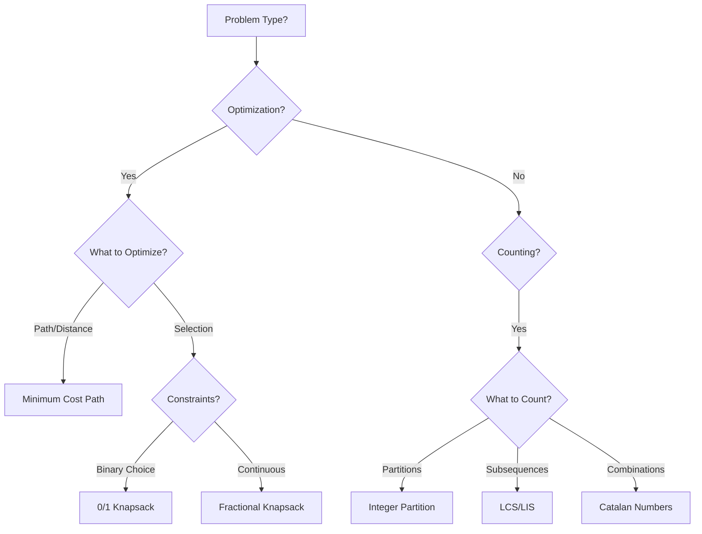

# Dynamic Programming Algorithms

This directory contains comprehensive documentation for the dynamic programming algorithms implemented in the `src/dynamic_programming` module.

## Overview

Dynamic Programming (DP) is a powerful algorithmic paradigm that solves complex problems by breaking them into simpler overlapping subproblems. The key idea is to store solutions to subproblems to avoid redundant computations.

### Core Principles

1. **Optimal Substructure**: An optimal solution contains optimal solutions to subproblems
2. **Overlapping Subproblems**: The same subproblems are solved multiple times
3. **Memoization**: Top-down approach storing computed results
4. **Tabulation**: Bottom-up approach building solutions iteratively

## Algorithm Categories

### Classic DP Problems

| Algorithm | File | Time | Space | Description |
|-----------|------|------|-------|-------------|
| [Fibonacci](fibonacci.md) | `fibonacci.rs` | O(n) to O(log n) | O(1) to O(n) | Multiple Fibonacci implementations |
| [Coin Change](coin_change.md) | `coin_change.rs` | O(n×m) | O(n) | Minimum coins for amount |
| [Rod Cutting](rod_cutting.md) | `rod_cutting.rs` | O(n²) | O(n) | Maximum profit from cutting rod |

### Knapsack Variants

| Algorithm | File | Time | Space | Description |
|-----------|------|------|-------|-------------|
| [0/1 Knapsack](knapsack.md) | `knapsack.rs` | O(n×W) | O(n×W) | Binary item selection |
| [Fractional Knapsack](fractional_knapsack.md) | `fractional_knapsack.rs` | O(n log n) | O(n) | Greedy fractional selection |

### Sequence Problems

| Algorithm | File | Time | Space | Description |
|-----------|------|------|-------|-------------|
| [LCS](longest_common_subsequence.md) | `longest_common_subsequence.rs` | O(n×m) | O(n×m) | Longest Common Subsequence |
| [LCS String](longest_common_substring.md) | `longest_common_substring.rs` | O(n×m) | O(n×m) | Longest Common Substring |
| [LIS](longest_increasing_subsequence.md) | `longest_increasing_subsequence.rs` | O(n log n) | O(n) | Longest Increasing Subsequence |
| [LCIS](longest_continuous_increasing_subsequence.md) | `longest_continuous_increasing_subsequence.rs` | O(n) | O(1) | Longest Continuous Increasing Subsequence |
| [Is Subsequence](is_subsequence.md) | `is_subsequence.rs` | O(n) | O(1) | Check if string is subsequence |

### Array/Matrix Problems

| Algorithm | File | Time | Space | Description |
|-----------|------|------|-------|-------------|
| [Maximum Subarray](maximum_subarray.md) | `maximum_subarray.rs` | O(n) | O(1) | Kadane's algorithm |
| [Minimum Cost Path](minimum_cost_path.md) | `minimum_cost_path.rs` | O(n×m) | O(m) | Grid path minimization |
| [Maximal Square](maximal_square.md) | `maximal_square.rs` | O(n²) | O(n) | Largest square of 1s |
| [Trapped Rainwater](trapped_rainwater.md) | `trapped_rainwater.rs` | O(n) | O(n) | Water trapping problem |
| [Snail Sort](snail.md) | `snail.rs` | O(n×m) | O(n×m) | Spiral matrix traversal |

### Combinatorial Problems

| Algorithm | File | Time | Space | Description |
|-----------|------|------|-------|-------------|
| [Catalan Numbers](catalan_numbers.md) | `catalan_numbers.rs` | O(n²) | O(n) | Compute Catalan sequence |
| [Integer Partition](integer_partition.md) | `integer_partition.rs` | O(n²) | O(n²) | Number of partitions |
| [Subset Sum](subset_sum.md) | `subset_sum.rs` | O(n×sum) | O(n×sum) | Subset with target sum |
| [Subset Generation](subset_generation.md) | `subset_generation.rs` | O(C(n,r)) | O(r) | Generate all subsets |

### String Problems

| Algorithm | File | Time | Space | Description |
|-----------|------|------|-------|-------------|
| [Word Break](word_break.md) | `word_break.rs` | O(n²) | O(n) | Dictionary segmentation |
| [Palindrome Partitioning](palindrome_partitioning.md) | `palindrome_partitioning.rs` | O(n²) | O(n²) | Minimum palindrome cuts |

### Optimization Problems

| Algorithm | File | Time | Space | Description |
|-----------|------|------|-------|-------------|
| [Matrix Chain Multiply](matrix_chain_multiply.md) | `matrix_chain_multiply.rs` | O(n³) | O(n²) | Optimal parenthesization |
| [Optimal BST](optimal_bst.md) | `optimal_bst.rs` | O(n³) | O(n²) | Optimal search tree |
| [Egg Dropping](egg_dropping.md) | `egg_dropping.rs` | O(e×f²) | O(e×f) | Minimum egg drops |
| [Task Assignment](task_assignment.md) | `task_assignment.rs` | O(2^m × n) | O(2^m × n) | Bitmask DP assignment |

### Bioinformatics

| Algorithm | File | Time | Space | Description |
|-----------|------|------|-------|-------------|
| [Smith-Waterman](smith_waterman.md) | `smith_waterman.rs` | O(n×m) | O(n×m) | Local sequence alignment |

## Complexity Summary

```
┌─────────────────────────────────────────────────────────────────┐
│                  Time Complexity Distribution                    │
├─────────────────────────────────────────────────────────────────┤
│  O(1)/O(n)      ████████░░░░░░░░░░░░░░░░░░░░░░░░  Linear        │
│  O(n log n)     ██░░░░░░░░░░░░░░░░░░░░░░░░░░░░░░  Linearithmic  │
│  O(n²)/O(n×m)   ████████████████████░░░░░░░░░░░░  Quadratic     │
│  O(n³)          ████░░░░░░░░░░░░░░░░░░░░░░░░░░░░  Cubic         │
│  O(2^n)         ██░░░░░░░░░░░░░░░░░░░░░░░░░░░░░░  Exponential   │
└─────────────────────────────────────────────────────────────────┘
```

## Quick Start

### Basic Usage Pattern

```rust
use the_algorithms_rust::dynamic_programming::*;

// Fibonacci
let fib_10 = fibonacci(10);  // 89

// Coin Change
let min_coins = coin_change(&[1, 2, 5], 11);  // Some(3)

// Longest Common Subsequence
let lcs = longest_common_subsequence("abcdef", "xbcxxxe");  // "bce"

// Maximum Subarray (Kadane's)
let max_sum = maximum_subarray(&[-2, 1, -3, 4, -1, 2, 1, -5, 4]);  // Ok(6)
```

### Choosing the Right Algorithm



## Learning Path

### Beginner Level
1. **Fibonacci** - Foundation of DP, compare recursive vs. iterative
2. **Maximum Subarray** - Simple 1D DP with Kadane's algorithm
3. **Coin Change** - Classic unbounded knapsack variant

### Intermediate Level
4. **0/1 Knapsack** - Foundation for many optimization problems
5. **Longest Common Subsequence** - 2D DP with backtracking
6. **Longest Increasing Subsequence** - Binary search optimization

### Advanced Level
7. **Matrix Chain Multiplication** - Interval DP
8. **Optimal BST** - Tree-based DP
9. **Task Assignment** - Bitmask DP

## Common Patterns

### 1. Linear DP
```rust
// Pattern: dp[i] depends on dp[i-1], dp[i-2], etc.
// Examples: Fibonacci, Maximum Subarray
let mut dp = vec![0; n];
for i in 1..n {
    dp[i] = f(dp[i-1], ...);
}
```

### 2. 2D Grid DP
```rust
// Pattern: dp[i][j] depends on adjacent cells
// Examples: LCS, Minimum Cost Path
let mut dp = vec![vec![0; m]; n];
for i in 1..n {
    for j in 1..m {
        dp[i][j] = f(dp[i-1][j], dp[i][j-1], dp[i-1][j-1]);
    }
}
```

### 3. Interval DP
```rust
// Pattern: dp[i][j] represents interval [i, j]
// Examples: Matrix Chain, Palindrome Partitioning
for len in 2..=n {
    for i in 0..=n-len {
        let j = i + len - 1;
        dp[i][j] = min_over_k(dp[i][k] + dp[k+1][j] + cost);
    }
}
```

### 4. Bitmask DP
```rust
// Pattern: Use bitmask to represent subset state
// Examples: Task Assignment
let mut dp = vec![vec![-1; tasks]; 1 << people];
fn solve(mask: usize, task: usize) -> i64 {
    // ...
}
```

## References

- [Introduction to Algorithms (CLRS)](https://mitpress.mit.edu/9780262046305/introduction-to-algorithms/)
- [Dynamic Programming - Wikipedia](https://en.wikipedia.org/wiki/Dynamic_programming)
- [Competitive Programmer's Handbook](https://cses.fi/book/book.pdf)
