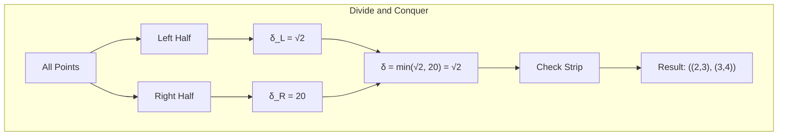

# Closest Pair of Points Algorithm

## 1. Overview

The Closest Pair of Points algorithm finds the two points with the minimum Euclidean distance among a set of points in the plane. This classic computational geometry problem is solved efficiently using a divide-and-conquer approach, achieving $O(n \log n)$ time complexity.

### Historical Context
- **Classical Problem**: One of the foundational problems in computational geometry
- **Optimal Algorithm**: Shamos & Hoey (1975) established the $O(n \log n)$ lower bound and matching algorithm
- **Paradigm**: Quintessential example of divide-and-conquer in geometry

## 2. Mathematical Foundation

### 2.1 Problem Definition

Given a set $P = \{p_1, p_2, \ldots, p_n\}$ of $n$ points in the 2D plane, find two points $p_i, p_j \in P$ such that the Euclidean distance $d(p_i, p_j)$ is minimized.

$$\min_{i \neq j} d(p_i, p_j) = \min_{i \neq j} \sqrt{(x_i - x_j)^2 + (y_i - y_j)^2}$$

### 2.2 Mathematical Model

**Input**: A set of $n$ points $P = \{(x_1, y_1), (x_2, y_2), \ldots, (x_n, y_n)\}$

**Output**: A pair of points $(p_i, p_j)$ with minimum distance, or `None` if $n < 2$

**Constraints**:
- $n \geq 2$ for a valid pair
- Points have floating-point coordinates

### 2.3 Key Mathematical Insight

The divide-and-conquer approach relies on a crucial observation:

**Sparse Strip Property**: After finding the minimum distance $\delta$ in the left and right halves, the strip of width $2\delta$ around the dividing line contains at most $O(n)$ candidate pairs.

More specifically, for any point in the strip, there are at most **7 other points** within distance $\delta$ that need to be checked. This is because:

$$\text{In a } \delta \times 2\delta \text{ rectangle, at most 8 points can be } \geq \delta \text{ apart}$$

```
    ┌─────┬─────┐
    │  •  │  •  │  2δ
    ├─────┼─────┤   ↕
    │  •  │  •  │
    └─────┴─────┘
      δ     δ
```

### 2.4 Correctness Proof

**Theorem**: The algorithm correctly finds the closest pair of points.

**Proof**:
1. **Base Case**: For $n \leq 3$ points, brute force correctly finds the minimum
2. **Inductive Step**: 
   - The closest pair is either entirely in the left half, entirely in the right half, or split across the dividing line
   - Recursive calls correctly find the minimum in each half
   - The strip processing correctly finds any closer split pair
3. **Strip Correctness**: The sparse strip property guarantees we check all necessary pairs

## 3. Algorithm Description

### 3.1 Intuition

1. **Divide**: Split points into left and right halves by x-coordinate
2. **Conquer**: Recursively find closest pairs in each half
3. **Combine**: Check if there's a closer pair spanning the dividing line

The key insight is that the "combine" step is efficient because we only need to check a narrow strip and compare each point with at most 7 neighbors.

### 3.2 Pseudocode

```
CLOSEST_POINTS(points):
    // Preprocessing: Sort by x and y
    points_x ← sort points by x-coordinate (then y as tiebreaker)
    points_y ← sort points by y-coordinate
    
    return CLOSEST_POINTS_AUX(points_x, points_y, 0, n)

CLOSEST_POINTS_AUX(points_x, points_y, start, end):
    n ← end - start
    
    // Base case: brute force for small inputs
    if n ≤ 3:
        return BRUTE_FORCE(points_x[start..end])
    
    // Divide: Split at midpoint
    mid ← start + (end - start) / 2
    mid_x ← points_x[mid].x
    
    // Partition points_y into left and right based on x-coordinate
    y_left ← points in points_y with x < mid_x
    y_right ← points in points_y with x ≥ mid_x
    
    // Conquer: Recursively find closest pairs
    left_pair ← CLOSEST_POINTS_AUX(points_x, y_left, start, mid)
    right_pair ← CLOSEST_POINTS_AUX(points_x, y_right, mid, end)
    
    // Get minimum distance from recursive calls
    δ ← min(distance(left_pair), distance(right_pair))
    best_pair ← pair with distance δ
    
    // Combine: Check strip for closer pairs
    // Narrow the x-range to [mid_x - δ, mid_x + δ]
    
    for each point p in points_y:
        for each of next 7 points q in points_y:
            if distance(p, q) < δ:
                δ ← distance(p, q)
                best_pair ← (p, q)
    
    return best_pair
```

### 3.3 Step-by-Step Example

**Input Points**: $\{(2,3), (12,30), (40,50), (5,1), (12,10), (3,4)\}$

```
Step 1: Sort points
        By x: [(2,3), (3,4), (5,1), (12,10), (12,30), (40,50)]
        By y: [(5,1), (2,3), (3,4), (12,10), (12,30), (40,50)]

Step 2: Divide at mid (between (5,1) and (12,10))
        Left:  [(2,3), (3,4), (5,1)]
        Right: [(12,10), (12,30), (40,50)]

Step 3: Conquer (recursive calls)
        Left half closest: (2,3) and (3,4), distance = √2 ≈ 1.41
        Right half closest: (12,10) and (12,30), distance = 20
        
        δ = min(√2, 20) = √2

Step 4: Combine (check strip)
        Strip width: 2δ = 2√2 ≈ 2.83
        Strip range: [5 - √2, 12 + √2] ≈ [3.59, 13.41]
        Points in strip by y: [(5,1), (3,4), (12,10)]
        
        Check pairs in strip (max 7 neighbors each):
        - (5,1) vs (3,4): √((5-3)² + (1-4)²) = √13 ≈ 3.61 > δ
        - (3,4) vs (12,10): √((3-12)² + (4-10)²) = √117 ≈ 10.82 > δ
        - (5,1) vs (12,10): √((5-12)² + (1-10)²) = √130 ≈ 11.40 > δ
        
        No improvement found

Final Result: ((2,3), (3,4)) with distance √2 ≈ 1.414
```



## 4. Complexity Analysis

### 4.1 Time Complexity

| Case | Complexity | Explanation |
|------|------------|-------------|
| Best | $O(n \log n)$ | Sorting dominates |
| Average | $O(n \log n)$ | Balanced recursion |
| Worst | $O(n \log n)$ | Guaranteed by sparse strip property |

**Recurrence Relation**:
$$T(n) = 2T(n/2) + O(n)$$

By the Master Theorem: $T(n) = O(n \log n)$

**Detailed Breakdown**:
- Sorting by x and y: $O(n \log n)$
- Recursive division: $O(\log n)$ levels
- Each level processes $O(n)$ points
- Strip checking: $O(n)$ per level (7 comparisons per point)

### 4.2 Space Complexity

| Component | Space | Notes |
|-----------|-------|-------|
| Sorted arrays | $O(n)$ | points_x and points_y |
| Recursion stack | $O(\log n)$ | Balanced division |
| y_left, y_right | $O(n)$ | Per level, reused |
| **Total** | $O(n)$ | |

## 5. Implementation Notes

### 5.1 Rust-Specific Considerations

```rust
// Key implementation patterns from the codebase:

// 1. Custom comparator for x-coordinate sorting
fn cmp_x(p1: &Point, p2: &Point) -> Ordering {
    let acmp = f64_cmp(&p1.x, &p2.x);
    match acmp {
        Ordering::Equal => f64_cmp(&p1.y, &p2.y),  // Tiebreaker
        _ => acmp,
    }
}

// 2. Partitioning points_y into left and right
let mut y_left = vec![];
let mut y_right = vec![];
for point in &points_y {
    if point.x < mid_x {
        y_left.push(point.clone());
    } else {
        y_right.push(point.clone());
    }
}

// 3. Efficient strip checking (at most 7 neighbors)
for (i, e) in points_y.iter().enumerate() {
    for k in 1..8 {
        if i + k >= points_y.len() {
            break;
        }
        let new = e.euclidean_distance(&points_y[i + k]);
        if new < min_sqr_dist {
            min_sqr_dist = new;
            pair = ((*e).clone(), points_y[i + k].clone());
        }
    }
}
```

### 5.2 Edge Cases

| Case | Handling |
|------|----------|
| Empty input | Return `None` |
| Single point | Return `None` |
| Two points | Return the pair |
| Three points | Brute force comparison |
| Duplicate points | Distance = 0 (valid result) |
| All collinear | Works correctly |

### 5.3 Optimization Notes

1. **Avoid recomputing**: Pre-sort both arrays once
2. **Magic number 7**: Theoretically correct bound for strip checking
3. **Early termination**: Could add distance threshold for pruning
4. **Distance squared**: Could avoid square root until final result

## 6. Real-World Applications

### 6.1 Software Engineering Use Cases

1. **Geographic Information Systems (GIS)**
   - Finding nearest facilities (hospitals, fire stations)
   - Collision detection between GPS-tracked objects
   - Clustering analysis for location-based services

2. **Computer Graphics**
   - Collision detection in physics simulations
   - Mesh simplification (finding nearby vertices to merge)
   - Point cloud processing

3. **Machine Learning**
   - K-nearest neighbors preprocessing
   - Cluster analysis initialization
   - Outlier detection (finding isolated points)

4. **Wireless Networks**
   - Signal interference detection
   - Optimal node placement
   - Coverage overlap analysis

5. **Computational Biology**
   - Protein docking simulations
   - Molecular structure analysis
   - Gene expression clustering

### 6.2 Related Algorithms

| Algorithm | Use Case | Complexity |
|-----------|----------|------------|
| **Closest Pair** | Find minimum distance pair | $O(n \log n)$ |
| k-Nearest Neighbors | Find k closest points | $O(n \log n)$ with KD-tree |
| All Nearest Neighbors | Nearest neighbor for each point | $O(n \log n)$ |
| Range Search | Find points within distance | $O(n \log n + k)$ |

### 6.3 Variants and Extensions

1. **Higher Dimensions**: Algorithm generalizes but with higher constant factors
2. **Streaming/Online**: Maintain closest pair as points are added
3. **Bichromatic**: Closest pair between two different sets
4. **k-Closest Pairs**: Find the k smallest distances

## 7. References

1. Shamos, M. I., & Hoey, D. (1975). "Closest-point problems". *16th Annual Symposium on Foundations of Computer Science*.
2. Preparata, F. P., & Shamos, M. I. (1985). *Computational Geometry: An Introduction*. Springer.
3. Cormen, T. H., et al. (2009). *Introduction to Algorithms* (3rd ed.). MIT Press. Section 33.4.
4. de Berg, M., et al. (2008). *Computational Geometry: Algorithms and Applications*. Springer.
