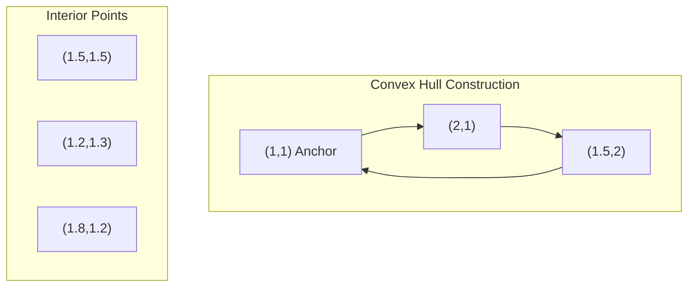

# Graham Scan Algorithm

## 1. Overview

Graham Scan is an efficient algorithm for computing the convex hull of a set of points in the plane. Invented by Ronald Graham in 1972, it finds the smallest convex polygon that contains all given points.

The convex hull can be visualized as the shape formed by stretching a rubber band around all the points and letting it snap tight.

### Historical Context
- **Year**: 1972
- **Author**: Ronald Graham
- **Publication**: "An Efficient Algorithm for Determining the Convex Hull of a Finite Planar Set"

## 2. Mathematical Foundation

### 2.1 Problem Definition

Given a set $P = \{p_1, p_2, \ldots, p_n\}$ of $n$ points in the 2D plane, find the convex hull $CH(P)$, which is the smallest convex polygon containing all points in $P$.

### 2.2 Mathematical Model

**Input**: A set of $n$ points $P = \{(x_1, y_1), (x_2, y_2), \ldots, (x_n, y_n)\}$

**Output**: An ordered list of vertices forming the convex hull in counter-clockwise order

**Constraints**:
- $n \geq 3$ for a non-degenerate hull
- Points must not all be collinear

### 2.3 Key Mathematical Concepts

#### Cross Product for Orientation
For three points $A$, $B$, $C$, the orientation is determined by the cross product of vectors $\vec{AB}$ and $\vec{AC}$:

$$\text{orientation}(A, B, C) = (B_x - A_x)(C_y - A_y) - (B_y - A_y)(C_x - A_x)$$

- **Positive**: Counter-clockwise (left turn)
- **Negative**: Clockwise (right turn)
- **Zero**: Collinear

#### Polar Angle
The polar angle $\theta$ of point $P$ relative to anchor point $O$:

$$\theta = \arctan\left(\frac{P_y - O_y}{P_x - O_x}\right)$$

### 2.4 Correctness Proof

**Invariant**: At each step, the stack contains vertices of the convex hull of the points processed so far, in counter-clockwise order.

**Proof Sketch**:
1. The bottom-most point is always on the convex hull
2. Processing points in polar angle order ensures we traverse the hull boundary
3. Removing points that cause right turns maintains convexity
4. The algorithm terminates when all points are processed

## 3. Algorithm Description

### 3.1 Intuition

1. **Find anchor**: Start with the lowest point (guaranteed to be on the hull)
2. **Sort by angle**: Sort remaining points by polar angle relative to anchor
3. **Build hull**: Process points in order, keeping only those that maintain a left turn

### 3.2 Pseudocode

```
GRAHAM_SCAN(points):
    if |points| ≤ 2:
        return []  // No convex hull possible
    
    // Step 1: Find the bottom-most point (leftmost if tie)
    anchor ← point with minimum y (minimum x if tie)
    remove anchor from points
    
    // Step 2: Sort points by polar angle relative to anchor
    SORT points by angle with anchor (counter-clockwise)
    // For collinear points, keep only the furthest
    
    // Step 3: Build the convex hull
    stack ← [anchor, points[0]]
    
    for i ← 1 to |points| - 1:
        // Skip collinear points (keep only furthest)
        if collinear(anchor, points[i], stack.top()):
            continue
            
        // Remove points that make a right turn
        while |stack| > 1 AND orientation(stack.second_top(), stack.top(), points[i]) ≤ 0:
            stack.pop()
        
        stack.push(points[i])
    
    if |stack| ≤ 2:
        return []  // Degenerate case
    
    return stack
```

### 3.3 Step-by-Step Example

**Input Points**: $\{(1,1), (2,1), (1.5,2), (1.5,1.5), (1.2,1.3), (1.8,1.2)\}$

```
Step 1: Find anchor point
        Anchor = (1, 1) (lowest y-coordinate)

Step 2: Sort by polar angle relative to (1, 1)
        Sorted: [(2,1), (1.8,1.2), (1.5,1.5), (1.2,1.3), (1.5,2)]

Step 3: Build hull
        Initialize: stack = [(1,1), (2,1)]
        
        Process (1.8, 1.2):
          - Check orientation((1,1), (2,1), (1.8,1.2))
          - It's a right turn, skip (collinear handling)
        
        Process (1.5, 1.5):
          - Check orientation, left turn → push
          - stack = [(1,1), (2,1), (1.5,1.5)]
          - Wait, (1.5,1.5) makes right turn → pop (2,1)
          - stack = [(1,1), (1.5,1.5)]
        
        ... continue processing
        
Final Hull: [(1,1), (2,1), (1.5,2)]
```



## 4. Complexity Analysis

### 4.1 Time Complexity

| Case | Complexity | Explanation |
|------|------------|-------------|
| Best | $O(n \log n)$ | Sorting dominates |
| Average | $O(n \log n)$ | Sorting + linear scan |
| Worst | $O(n \log n)$ | All points on hull |

**Derivation**:
- Finding minimum point: $O(n)$
- Sorting by polar angle: $O(n \log n)$
- Stack operations: Each point is pushed and popped at most once → $O(n)$
- **Total**: $O(n) + O(n \log n) + O(n) = O(n \log n)$

### 4.2 Space Complexity

| Component | Space | Notes |
|-----------|-------|-------|
| Input storage | $O(n)$ | Points vector |
| Stack | $O(n)$ | Worst case: all points on hull |
| **Total** | $O(n)$ | |

## 5. Implementation Notes

### 5.1 Rust-Specific Considerations

```rust
// Key implementation patterns from the codebase:

// 1. Finding minimum point using iterator
let min_point = points.iter().min_by(point_min).unwrap().clone();

// 2. Custom comparator for sorting by polar angle
let point_cmp = |a: &Point, b: &Point| -> Ordering {
    let orientation = min_point.consecutive_orientation(a, b);
    if orientation < 0.0 {
        Ordering::Greater
    } else if orientation > 0.0 {
        Ordering::Less
    } else {
        // Collinear: sort by distance (further first)
        let a_dist = min_point.euclidean_distance(a);
        let b_dist = min_point.euclidean_distance(b);
        b_dist.partial_cmp(&a_dist).unwrap()
    }
};

// 3. Stack-based hull construction
convex_hull.push(min_point.clone());
convex_hull.push(points[0].clone());
```

### 5.2 Edge Cases

| Case | Handling |
|------|----------|
| Empty input | Return empty vector |
| Single point | Return empty vector |
| Two points | Return empty vector |
| All collinear | Return empty vector |
| All same point | Return empty vector |

### 5.3 Numerical Precision

The implementation uses `f64` for coordinates. Care is taken with floating-point comparisons:
- Use `partial_cmp` for float ordering
- Handle collinear points by keeping only the furthest

## 6. Real-World Applications

### 6.1 Software Engineering Use Cases

1. **Computer Graphics**
   - Collision detection boundaries
   - Minimum bounding regions for rendering optimization
   - Shadow volume computation

2. **Geographic Information Systems (GIS)**
   - Territory boundary calculation
   - Coverage area analysis
   - Minimum enclosing region for points of interest

3. **Robotics and Path Planning**
   - Obstacle representation
   - Safe zone calculation
   - Workspace boundary determination

4. **Image Processing**
   - Shape recognition
   - Object boundary detection
   - Image segmentation

5. **Computational Biology**
   - Protein structure analysis
   - Molecular surface computation

### 6.2 Related Algorithms

| Algorithm | Use When | Complexity |
|-----------|----------|------------|
| **Graham Scan** | General purpose, dense point sets | $O(n \log n)$ |
| [Jarvis March](jarvis_scan.md) | Output-sensitive, few hull points | $O(nh)$ |
| Quickhull | Average-case efficiency | $O(n \log n)$ avg |
| Chan's Algorithm | Optimal output-sensitive | $O(n \log h)$ |

## 7. References

1. Graham, R. L. (1972). "An Efficient Algorithm for Determining the Convex Hull of a Finite Planar Set". *Information Processing Letters*.
2. Preparata, F. P., & Shamos, M. I. (1985). *Computational Geometry: An Introduction*. Springer.
3. de Berg, M., et al. (2008). *Computational Geometry: Algorithms and Applications*. Springer.
4. Cormen, T. H., et al. (2009). *Introduction to Algorithms* (3rd ed.). MIT Press. Chapter 33.
