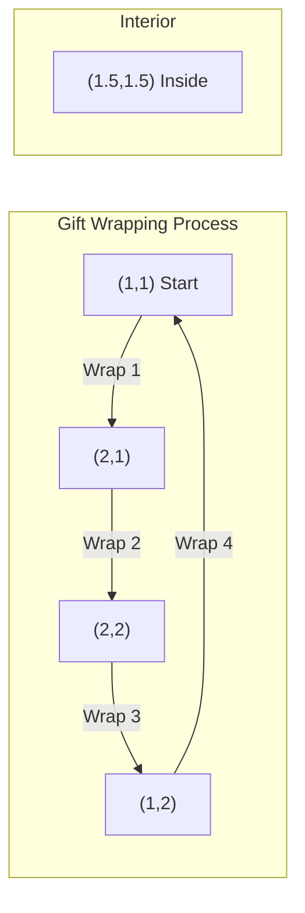

# Jarvis March (Gift Wrapping) Algorithm

## 1. Overview

Jarvis March, also known as the Gift Wrapping algorithm, is an output-sensitive algorithm for computing the convex hull of a set of points. Invented by R.A. Jarvis in 1973, it works by "wrapping" the points like wrapping a gift with string.

The algorithm is particularly efficient when the number of points on the convex hull is small relative to the total number of input points.

### Historical Context
- **Year**: 1973
- **Author**: R.A. Jarvis
- **Also Known As**: Gift Wrapping Algorithm

## 2. Mathematical Foundation

### 2.1 Problem Definition

Given a set $P = \{p_1, p_2, \ldots, p_n\}$ of $n$ points in the 2D plane, find the convex hull $CH(P)$ by iteratively selecting the point that makes the smallest counter-clockwise angle with the current hull edge.

### 2.2 Mathematical Model

**Input**: A set of $n$ points $P = \{(x_1, y_1), (x_2, y_2), \ldots, (x_n, y_n)\}$

**Output**: An ordered list of $h$ vertices forming the convex hull in counter-clockwise order, where $h$ is the number of hull vertices.

**Constraints**:
- $n \geq 3$ for a non-degenerate hull
- Points must not all be collinear

### 2.3 Key Mathematical Concepts

#### Counter-Clockwise Orientation
For points $P$, $Q$, and $R$, the orientation is determined by:

$$\text{orientation}(P, Q, R) = (Q_x - P_x)(R_y - P_y) - (Q_y - P_y)(R_x - P_x)$$

- **Positive**: $R$ is counter-clockwise from $\vec{PQ}$
- **Negative**: $R$ is clockwise from $\vec{PQ}$
- **Zero**: Points are collinear

#### Gift Wrapping Intuition
Imagine standing at a point on the hull with a string extending to infinity. Rotate the string counter-clockwise until it hits the next point—that point is on the hull.

### 2.4 Correctness Proof

**Invariant**: At each iteration, the current point is on the convex hull and the next selected point is the most counter-clockwise point visible from the current edge.

**Proof**:
1. The leftmost point must be on the convex hull (extremal point property)
2. From any hull vertex, the next hull vertex is the point that makes the largest counter-clockwise angle
3. The algorithm terminates when it returns to the starting point
4. All selected points are hull vertices by construction

## 3. Algorithm Description

### 3.1 Intuition

1. **Start at an extreme**: Find the leftmost point (guaranteed on hull)
2. **Wrap counter-clockwise**: From current point, find the point that is most counter-clockwise
3. **Repeat**: Continue until returning to the start point
4. **Handle collinearity**: Remove intermediate collinear points

### 3.2 Pseudocode

```
JARVIS_MARCH(points):
    if |points| ≤ 2:
        return []  // No convex hull possible
    
    // Step 1: Find the leftmost point (lowest if tie)
    left_point ← index of point with minimum x (minimum y if tie)
    
    hull ← [points[left_point]]
    p ← left_point
    
    // Step 2: Wrap around the points
    loop:
        // Find the most counter-clockwise point from p
        next_p ← (p + 1) mod n
        
        for each point i in points:
            if orientation(points[p], points[i], points[next_p]) > 0:
                next_p ← i  // Found more counter-clockwise point
        
        // Check if we've completed the hull
        if next_p = left_point:
            break
        
        p ← next_p
        
        // Handle collinear points: keep only non-collinear vertices
        if hull.size > 1 AND collinear(points[p], hull[last-1], hull[last]):
            hull[last] ← points[p]  // Replace with further point
        else:
            hull.append(points[p])
    
    // Clean up last point if collinear with first and second-to-last
    if hull.size > 2 AND collinear(hull[0], hull[last-1], hull[last]):
        hull.pop()
    
    if |hull| ≤ 2:
        return []
    
    return hull
```

### 3.3 Step-by-Step Example

**Input Points**: $\{(1,1), (2,1), (2,2), (1,2), (1.5,1.5)\}$

```
Step 1: Find leftmost point
        Left point = (1, 1) at index 0

Step 2: Start wrapping
        hull = [(1, 1)]
        
        Iteration 1: From (1, 1)
          Check all points for most counter-clockwise
          → (2, 1) is most counter-clockwise
          hull = [(1, 1), (2, 1)]
        
        Iteration 2: From (2, 1)
          Check all points for most counter-clockwise
          → (2, 2) is most counter-clockwise
          hull = [(1, 1), (2, 1), (2, 2)]
        
        Iteration 3: From (2, 2)
          Check all points for most counter-clockwise
          → (1, 2) is most counter-clockwise
          hull = [(1, 1), (2, 1), (2, 2), (1, 2)]
        
        Iteration 4: From (1, 2)
          Check all points for most counter-clockwise
          → (1, 1) is most counter-clockwise (back to start!)
          Break loop
        
Final Hull: [(1, 1), (2, 1), (2, 2), (1, 2)]
```



## 4. Complexity Analysis

### 4.1 Time Complexity

| Case | Complexity | Explanation |
|------|------------|-------------|
| Best | $O(n)$ | Triangle hull ($h = 3$) |
| Average | $O(nh)$ | Depends on hull size |
| Worst | $O(n^2)$ | All points on hull ($h = n$) |

**Derivation**:
- Finding leftmost point: $O(n)$
- For each hull vertex (there are $h$): $O(n)$ to find next vertex
- **Total**: $O(n) + O(nh) = O(nh)$

Where $h$ is the number of vertices on the convex hull.

### 4.2 Space Complexity

| Component | Space | Notes |
|-----------|-------|-------|
| Input reference | $O(1)$ | Borrows input |
| Hull storage | $O(h)$ | Only hull vertices |
| **Total** | $O(h)$ | Output-sensitive |

### 4.3 Output-Sensitive Analysis

The algorithm is **output-sensitive**: its complexity depends on the output size $h$.

| Hull Size | Efficiency |
|-----------|------------|
| $h = O(1)$ | Excellent, $O(n)$ |
| $h = O(\log n)$ | Very good, $O(n \log n)$ |
| $h = O(\sqrt{n})$ | Good, $O(n\sqrt{n})$ |
| $h = O(n)$ | Poor, $O(n^2)$ |

## 5. Implementation Notes

### 5.1 Rust-Specific Considerations

```rust
// Key implementation patterns from the codebase:

// 1. Finding leftmost point with bottom-most tiebreaker
let mut left_point = 0;
for i in 1..points.len() {
    if points[i].x < points[left_point].x
        || (points[i].x == points[left_point].x 
            && points[i].y < points[left_point].y)
    {
        left_point = i;
    }
}

// 2. Finding next counter-clockwise point
let mut next_p = (p + 1) % points.len();
for i in 0..points.len() {
    let orientation = points[p].consecutive_orientation(
        &points[i], 
        &points[next_p]
    );
    if orientation > 0.0 {
        next_p = i;
    }
}

// 3. Collinear point handling using Segment
if Segment::from_points(points[p].clone(), convex_hull[last - 1].clone())
    .on_segment(&convex_hull[last])
{
    convex_hull[last] = points[p].clone();
}
```

### 5.2 Edge Cases

| Case | Handling |
|------|----------|
| Empty input | Return empty vector |
| Single point | Return empty vector |
| Two points | Return empty vector |
| All collinear | Return empty vector |
| Collinear hull edges | Remove intermediate points |

### 5.3 Collinearity Handling

The implementation carefully handles collinear points:
- During construction: If a new point is collinear with the last two hull points, replace the last point
- After construction: Check if the last point is collinear with the first and second-to-last

## 6. Real-World Applications

### 6.1 Software Engineering Use Cases

1. **Interactive Graphics**
   - Real-time convex hull updates when points change
   - Best when few points are expected on the hull

2. **Pattern Recognition**
   - Convex hull features for shape classification
   - Defect detection in quality control

3. **Computational Chemistry**
   - Molecular surface approximation
   - Solvent-accessible surface calculation

4. **Game Development**
   - Simple bounding volume computation
   - Visibility determination

5. **Surveying and Mapping**
   - Boundary determination from sparse data
   - Minimum enclosing area calculation

### 6.2 Related Algorithms

| Algorithm | Complexity | Use When |
|-----------|------------|----------|
| **Jarvis March** | $O(nh)$ | Small number of hull points |
| [Graham Scan](graham_scan.md) | $O(n \log n)$ | General purpose |
| Quickhull | $O(n \log n)$ avg | Average-case efficiency |
| Chan's Algorithm | $O(n \log h)$ | Optimal for any $h$ |

### 6.3 Comparison with Graham Scan

| Aspect | Jarvis March | Graham Scan |
|--------|--------------|-------------|
| Time | $O(nh)$ | $O(n \log n)$ |
| Space | $O(h)$ | $O(n)$ |
| Best when | $h \ll n$ | General case |
| Sorting needed | No | Yes |
| Online capable | Yes | No |

## 7. References

1. Jarvis, R. A. (1973). "On the identification of the convex hull of a finite set of points in the plane". *Information Processing Letters*.
2. Preparata, F. P., & Shamos, M. I. (1985). *Computational Geometry: An Introduction*. Springer.
3. de Berg, M., et al. (2008). *Computational Geometry: Algorithms and Applications*. Springer.
4. O'Rourke, J. (1998). *Computational Geometry in C* (2nd ed.). Cambridge University Press.
