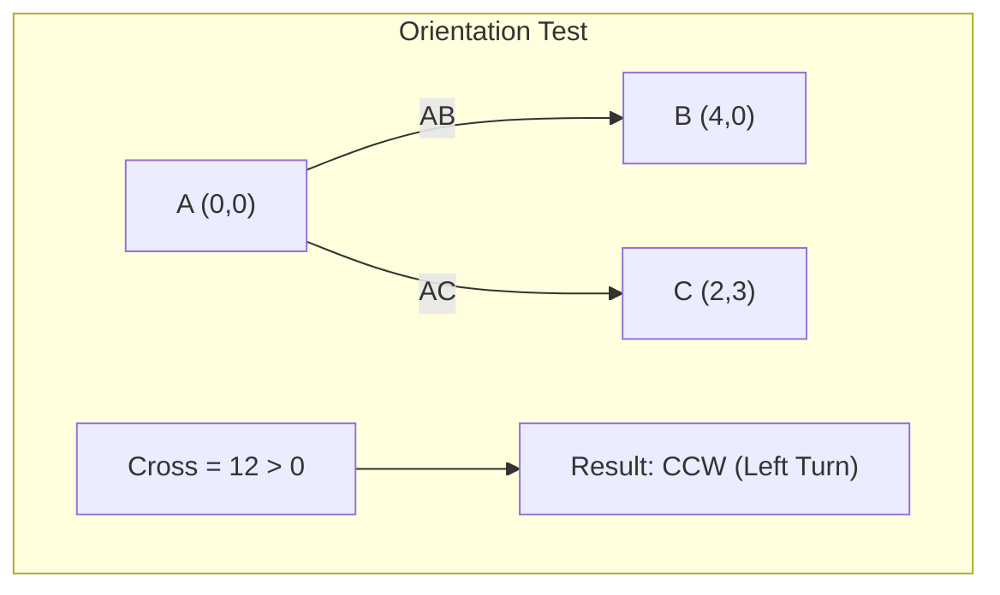

# Point Operations

## 1. Overview

The Point module provides a 2D point representation with fundamental geometric operations including Euclidean distance calculation, cross product, and orientation testing. This data structure serves as the foundation for all other geometry algorithms in the module.

### Core Features
- 2D point representation with floating-point coordinates
- Euclidean distance calculation
- Cross product for orientation testing
- Vector subtraction
- Equality comparison

## 2. Mathematical Foundation

### 2.1 Point Representation

A point $P$ in 2D Euclidean space is represented by Cartesian coordinates:

$$P = (x, y) \in \mathbb{R}^2$$

### 2.2 Key Mathematical Operations

#### Euclidean Distance
The distance between points $P_1 = (x_1, y_1)$ and $P_2 = (x_2, y_2)$:

$$d(P_1, P_2) = \sqrt{(x_2 - x_1)^2 + (y_2 - y_1)^2}$$

This is derived from the Pythagorean theorem applied to the right triangle formed by the coordinate differences.

#### Cross Product (2D)
For vectors $\vec{a} = (a_x, a_y)$ and $\vec{b} = (b_x, b_y)$, the 2D cross product (also called the "perp dot product" or "wedge product") is:

$$\vec{a} \times \vec{b} = a_x \cdot b_y - a_y \cdot b_x$$

Geometrically, this equals the signed area of the parallelogram formed by $\vec{a}$ and $\vec{b}$:

$$|\vec{a} \times \vec{b}| = |\vec{a}| \cdot |\vec{b}| \cdot \sin(\theta)$$

where $\theta$ is the angle between the vectors.

#### Consecutive Orientation
For three points $A$, $B$, $C$, the orientation determines the turn direction when traversing $A \to B \to C$:

$$\text{orientation}(A, B, C) = \vec{AB} \times \vec{AC} = (B - A) \times (C - A)$$

- **Positive (> 0)**: Counter-clockwise turn (left turn)
- **Negative (< 0)**: Clockwise turn (right turn)
- **Zero (= 0)**: Collinear points

### 2.3 Vector Operations

#### Vector Subtraction
The vector from point $Q$ to point $P$:

$$\vec{QP} = P - Q = (P_x - Q_x, P_y - Q_y)$$

## 3. Implementation

### 3.1 Rust Structure

```rust
#[derive(Clone, Debug, PartialEq)]
pub struct Point {
    pub x: f64,
    pub y: f64,
}
```

### 3.2 Core Methods

```rust
impl Point {
    /// Create a new point
    pub fn new(x: f64, y: f64) -> Point {
        Point { x, y }
    }

    /// Calculate orientation of consecutive segments AB and AC
    /// Returns: positive (CCW), negative (CW), zero (collinear)
    pub fn consecutive_orientation(&self, b: &Point, c: &Point) -> f64 {
        let p1 = b - self;  // Vector AB
        let p2 = c - self;  // Vector AC
        p1.cross_prod(&p2)
    }

    /// Calculate 2D cross product (z-component of 3D cross product)
    pub fn cross_prod(&self, other: &Point) -> f64 {
        self.x * other.y - self.y * other.x
    }

    /// Calculate Euclidean distance to another point
    pub fn euclidean_distance(&self, other: &Point) -> f64 {
        ((self.x - other.x).powi(2) + (self.y - other.y).powi(2)).sqrt()
    }
}
```

### 3.3 Trait Implementations

```rust
impl Sub for &Point {
    type Output = Point;

    fn sub(self, other: Self) -> Point {
        Point::new(self.x - other.x, self.y - other.y)
    }
}
```

## 4. Usage Examples

### 4.1 Basic Point Operations

```rust
// Create points
let a = Point::new(0.0, 0.0);
let b = Point::new(3.0, 0.0);
let c = Point::new(3.0, 4.0);

// Calculate distance
let dist = a.euclidean_distance(&c);  // √(9 + 16) = 5.0

// Vector subtraction
let vec_ab = &b - &a;  // Point { x: 3.0, y: 0.0 }

// Cross product
let cross = vec_ab.cross_prod(&Point::new(0.0, 4.0));  // 3*4 - 0*0 = 12.0
```

### 4.2 Orientation Testing

```rust
// Triangle vertices
let a = Point::new(0.0, 0.0);
let b = Point::new(1.0, 0.0);
let c = Point::new(0.5, 1.0);

// Check orientation A → B → C
let orientation = a.consecutive_orientation(&b, &c);
// orientation > 0: Counter-clockwise (left turn at B)
```

### 4.3 Step-by-Step: Orientation Calculation

**Points**: $A = (0, 0)$, $B = (4, 0)$, $C = (2, 3)$

```
Step 1: Compute vectors
        AB = B - A = (4, 0) - (0, 0) = (4, 0)
        AC = C - A = (2, 3) - (0, 0) = (2, 3)

Step 2: Cross product
        AB × AC = (4)(3) - (0)(2) = 12 - 0 = 12

Step 3: Interpret result
        12 > 0 → Counter-clockwise orientation
        → C is to the LEFT of the directed line A → B
```



## 5. Complexity Analysis

### 5.1 Time Complexity

| Operation | Complexity | Notes |
|-----------|------------|-------|
| `new` | $O(1)$ | Direct assignment |
| `euclidean_distance` | $O(1)$ | Constant arithmetic |
| `cross_prod` | $O(1)$ | Two multiplications, one subtraction |
| `consecutive_orientation` | $O(1)$ | Two subtractions + cross product |
| `sub` | $O(1)$ | Two subtractions |
| `eq` (PartialEq) | $O(1)$ | Two comparisons |
| `clone` | $O(1)$ | Copy two floats |

### 5.2 Space Complexity

| Operation | Space | Notes |
|-----------|-------|-------|
| Point storage | $O(1)$ | Two `f64` values (16 bytes) |
| All operations | $O(1)$ | No dynamic allocation |

## 6. API Reference

### 6.1 Constructors

| Method | Description | Example |
|--------|-------------|---------|
| `new(x, y)` | Create point from coordinates | `Point::new(1.0, 2.0)` |

### 6.2 Instance Methods

| Method | Return Type | Description |
|--------|-------------|-------------|
| `consecutive_orientation(&b, &c)` | `f64` | Orientation of turn A→B→C |
| `cross_prod(&other)` | `f64` | 2D cross product |
| `euclidean_distance(&other)` | `f64` | Distance to another point |

### 6.3 Trait Implementations

| Trait | Description |
|-------|-------------|
| `Clone` | Deep copy of point |
| `Debug` | Debug formatting |
| `PartialEq` | Equality comparison |
| `Sub for &Point` | Vector subtraction |

## 7. Real-World Applications

### 7.1 Software Engineering Use Cases

1. **Computer Graphics**
   - Vertex representation
   - Transform calculations
   - Rasterization

2. **Game Development**
   - Entity positions
   - Collision detection
   - Physics calculations

3. **Geographic Information Systems**
   - GPS coordinate storage
   - Distance calculations
   - Route planning

4. **Computer-Aided Design**
   - Shape vertices
   - Measurement tools
   - Constraint solving

5. **Scientific Computing**
   - Data point representation
   - Interpolation
   - Curve fitting

### 7.2 Integration with Other Algorithms

| Algorithm | Uses Point Operations |
|-----------|----------------------|
| [Graham Scan](graham_scan.md) | Orientation, distance |
| [Jarvis March](jarvis_scan.md) | Orientation |
| [Closest Points](closest_points.md) | Distance |
| [RDP Simplification](ramer_douglas_peucker.md) | Distance |
| [Segment Operations](segment.md) | Cross product, distance |

## 8. Numerical Considerations

### 8.1 Floating-Point Precision

The `f64` type provides approximately 15-17 significant decimal digits. Be aware of:

1. **Comparison Issues**: Direct equality (`==`) may fail for computed points
   ```rust
   // May fail due to floating-point errors
   assert_eq!(computed_point, expected_point);
   
   // Better: use epsilon comparison
   const EPSILON: f64 = 1e-10;
   assert!((computed_point.x - expected_point.x).abs() < EPSILON);
   ```

2. **Accumulation Errors**: Repeated operations accumulate error
3. **Catastrophic Cancellation**: Subtracting nearly equal numbers loses precision

### 8.2 Coordinate System

The implementation assumes:
- **Origin**: $(0, 0)$ at bottom-left
- **X-axis**: Positive to the right
- **Y-axis**: Positive upward
- **Orientation**: Counter-clockwise is positive

## 9. References

1. Schneider, P. J., & Eberly, D. H. (2003). *Geometric Tools for Computer Graphics*. Morgan Kaufmann.
2. de Berg, M., et al. (2008). *Computational Geometry: Algorithms and Applications*. Springer.
3. O'Rourke, J. (1998). *Computational Geometry in C* (2nd ed.). Cambridge University Press.
4. Rust Documentation. "std::ops::Sub trait". https://doc.rust-lang.org/std/ops/trait.Sub.html
