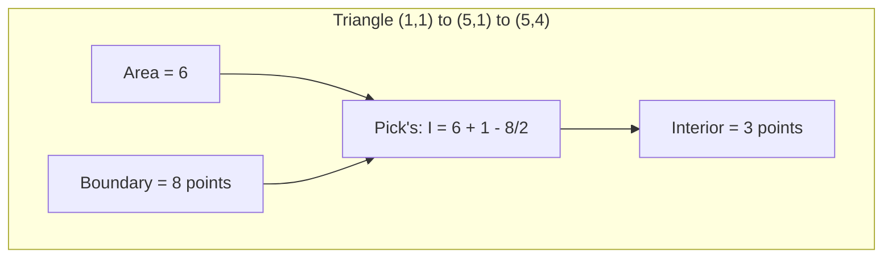

# Polygon Points (Area and Lattice Points)

## 1. Overview

The Polygon Points module provides algorithms for computing polygon area and counting lattice points (points with integer coordinates) using classical geometric formulas. The implementation uses the **Shoelace Formula** for area calculation and **Pick's Theorem** for lattice point counting.

### Core Operations
- Polygon area calculation (Shoelace Formula)
- Boundary lattice point counting
- Interior lattice point counting (Pick's Theorem)

## 2. Mathematical Foundation

### 2.1 Problem Definitions

#### Polygon Area
Given a simple polygon with vertices $P = [(x_0, y_0), (x_1, y_1), \ldots, (x_{n-1}, y_{n-1})]$ in order (clockwise or counter-clockwise), compute the area.

#### Lattice Points
Given a simple polygon with vertices at integer coordinates, count:
1. **Boundary points** ($B$): Lattice points on the polygon edges
2. **Interior points** ($I$): Lattice points strictly inside the polygon

### 2.2 The Shoelace Formula

The area of a simple polygon with vertices $(x_0, y_0), (x_1, y_1), \ldots, (x_{n-1}, y_{n-1})$ is:

$$A = \frac{1}{2} \left| \sum_{i=0}^{n-1} (x_i y_{i+1} - x_{i+1} y_i) \right|$$

where indices are taken modulo $n$ (so $x_n = x_0$, $y_n = y_0$).

**Alternative formulation using cross product**:
$$A = \frac{1}{2} \left| \sum_{i=2}^{n-1} \vec{P_0P_{i-1}} \times \vec{P_0P_i} \right|$$

### 2.3 Pick's Theorem

For a simple polygon with vertices at lattice points:

$$A = I + \frac{B}{2} - 1$$

where:
- $A$ = Area of the polygon
- $I$ = Number of interior lattice points
- $B$ = Number of boundary lattice points

**Rearranged to find interior points**:
$$I = A - \frac{B}{2} + 1$$

### 2.4 Counting Boundary Points

For a line segment from $(x_1, y_1)$ to $(x_2, y_2)$:

$$\text{boundary points} = \gcd(|x_2 - x_1|, |y_2 - y_1|) + 1$$

The $+1$ accounts for one endpoint. When summing over all edges, we add each vertex once, then subtract duplicates:

$$B = \sum_{i=0}^{n-1} \gcd(|\Delta x_i|, |\Delta y_i|)$$

where $\Delta x_i = x_{i+1} - x_i$ and $\Delta y_i = y_{i+1} - y_i$ (indices mod $n$).

## 3. Algorithm Descriptions

### 3.1 Polygon Area (Shoelace Formula)

```
POLYGON_AREA(vertices):
    n ← |vertices|
    if n < 3:
        return 0
    
    // Use cross product from first vertex
    area_sum ← 0
    for i ← 2 to n - 1:
        // Vector from vertices[0] to vertices[i-1]
        v1 ← (vertices[i-1].x - vertices[0].x, 
              vertices[i-1].y - vertices[0].y)
        
        // Vector from vertices[0] to vertices[i]
        v2 ← (vertices[i].x - vertices[0].x, 
              vertices[i].y - vertices[0].y)
        
        // Add cross product
        area_sum ← area_sum + CROSS(v1, v2)
    
    return |area_sum| / 2

CROSS(v1, v2):
    return v1.x * v2.y - v2.x * v1.y
```

### 3.2 Boundary Point Count

```
BOUNDARY_POINTS(vertices):
    n ← |vertices|
    count ← n  // Start with vertices
    
    for i ← 0 to n - 1:
        next_i ← (i + 1) mod n
        delta_x ← vertices[i].x - vertices[next_i].x
        delta_y ← vertices[i].y - vertices[next_i].y
        
        // Points on edge (excluding one endpoint)
        count ← count + GCD(|delta_x|, |delta_y|) - 1
    
    return count
```

### 3.3 Interior Lattice Points (Pick's Theorem)

```
LATTICE_POINTS(vertices):
    B ← BOUNDARY_POINTS(vertices)
    A ← POLYGON_AREA(vertices)
    
    // Pick's Theorem: A = I + B/2 - 1
    // Rearranged: I = A + 1 - B/2
    I ← A + 1 - B / 2
    
    return I
```

### 3.4 Step-by-Step Example

**Triangle**: Vertices at $(1, 1)$, $(5, 1)$, $(5, 4)$

```
Step 1: Calculate Area (Shoelace Formula)
        Vectors from (1,1):
        - v1 = (5,1) - (1,1) = (4, 0)
        - v2 = (5,4) - (1,1) = (4, 3)
        
        Cross product:
        v1 × v2 = 4 * 3 - 0 * 4 = 12
        
        Area = |12| / 2 = 6

Step 2: Calculate Boundary Points
        Edge (1,1) → (5,1):
          Δx = 4, Δy = 0
          gcd(4, 0) = 4
          Points on edge = 4 + 1 = 5 (including both endpoints)
        
        Edge (5,1) → (5,4):
          Δx = 0, Δy = 3
          gcd(0, 3) = 3
          Points on edge = 3 + 1 = 4
        
        Edge (5,4) → (1,1):
          Δx = -4, Δy = -3
          gcd(4, 3) = 1
          Points on edge = 1 + 1 = 2
        
        Total boundary (accounting for shared vertices):
        B = 5 + 3 + 1 = 9
        (Or using the formula: 3 + gcd(4,0)-1 + gcd(0,3)-1 + gcd(4,3)-1 = 9)

Step 3: Calculate Interior Points (Pick's Theorem)
        I = A + 1 - B/2
        I = 6 + 1 - 9/2
        I = 7 - 4.5
        I = 2.5 → rounds to 3 interior points
        
        Wait, let's recalculate with integer area:
        Using integer formula from code:
        B = 3 (vertices) + (4-1) + (3-1) + (1-1) = 3 + 3 + 2 + 0 = 8
        A = 6 (integer area without division by 2 yet)
        
        Actually from the code:
        B = n + Σ(gcd - 1) = 3 + 3 + 2 + 0 = 8
        I = A + 1 - B/2 = 6 + 1 - 4 = 3

Result: 3 interior lattice points
```



## 4. Complexity Analysis

### 4.1 Time Complexity

| Operation | Complexity | Notes |
|-----------|------------|-------|
| `polygon_area` | $O(n)$ | Single pass over vertices |
| `boundary` | $O(n \cdot \log(\max(\Delta)))$ | GCD for each edge |
| `lattice_points` | $O(n \cdot \log(\max(\Delta)))$ | Area + boundary |

Where $n$ is the number of vertices and $\Delta$ is the maximum coordinate difference.

### 4.2 Space Complexity

| Operation | Space | Notes |
|-----------|-------|-------|
| All operations | $O(1)$ | Only scalar variables |

## 5. Implementation Notes

### 5.1 Rust-Specific Considerations

```rust
// Key implementation patterns from the codebase:

// Type definitions for integer coordinates
type Ll = i64;
type Pll = (Ll, Ll);

// Cross product calculation
fn cross(x1: Ll, y1: Ll, x2: Ll, y2: Ll) -> Ll {
    x1 * y2 - x2 * y1
}

// Polygon area using cross product from first vertex
pub fn polygon_area(pts: &[Pll]) -> Ll {
    let mut ats = 0;
    for i in 2..pts.len() {
        ats += cross(
            pts[i].0 - pts[0].0,
            pts[i].1 - pts[0].1,
            pts[i - 1].0 - pts[0].0,
            pts[i - 1].1 - pts[0].1,
        );
    }
    Ll::abs(ats / 2)
}

// GCD using Euclidean algorithm
fn gcd(mut a: Ll, mut b: Ll) -> Ll {
    while b != 0 {
        let temp = b;
        b = a % b;
        a = temp;
    }
    a
}

// Boundary point counting
fn boundary(pts: &[Pll]) -> Ll {
    let mut ats = pts.len() as Ll;
    for i in 0..pts.len() {
        let deltax = pts[i].0 - pts[(i + 1) % pts.len()].0;
        let deltay = pts[i].1 - pts[(i + 1) % pts.len()].1;
        ats += Ll::abs(gcd(deltax, deltay)) - 1;
    }
    ats
}

// Interior points using Pick's theorem
pub fn lattice_points(pts: &[Pll]) -> Ll {
    let bounds = boundary(pts);
    let area = polygon_area(pts);
    area + 1 - bounds / 2
}
```

### 5.2 Integer Arithmetic

The implementation uses `i64` to:
- Avoid floating-point precision issues
- Support large coordinate values
- Enable exact computation for lattice point counting

### 5.3 Edge Cases

| Case | Handling |
|------|----------|
| Empty polygon | Returns 0 |
| Single point | Returns 0 area |
| Line segment | Returns 0 area |
| Clockwise vertices | Absolute value handles sign |
| Collinear vertices | May return 0 area |

## 6. Real-World Applications

### 6.1 Software Engineering Use Cases

1. **Geographic Information Systems**
   - Land area calculation
   - Parcel measurement
   - Zoning analysis

2. **Computer Graphics**
   - Polygon filling algorithms
   - Area-based rendering decisions
   - Memory allocation for textures

3. **Game Development**
   - Collision area calculation
   - Spawn point validation
   - Territory scoring

4. **Civil Engineering**
   - Plot area measurement
   - Material estimation
   - Construction planning

5. **Mathematics Education**
   - Interactive geometry tools
   - Proof visualization
   - Formula demonstration

### 6.2 Pick's Theorem Applications

1. **Discrete Mathematics**
   - Combinatorial geometry problems
   - Integer programming
   - Lattice theory

2. **Crystallography**
   - Unit cell calculations
   - Crystal structure analysis

3. **Number Theory**
   - Farey sequence connections
   - Visible lattice points

### 6.3 Related Algorithms

| Algorithm | Use Case | Complexity |
|-----------|----------|------------|
| **Shoelace Formula** | Polygon area | $O(n)$ |
| **Pick's Theorem** | Lattice point counting | $O(n)$ |
| Green's Theorem | Area via line integrals | $O(n)$ |
| Monte Carlo | Approximate area | $O(k)$ samples |

## 7. Mathematical Proofs

### 7.1 Shoelace Formula Derivation

The formula derives from the cross product interpretation of area:

1. Triangulate the polygon from vertex $P_0$
2. Each triangle $P_0 P_{i-1} P_i$ has signed area $\frac{1}{2}(\vec{P_0P_{i-1}} \times \vec{P_0P_i})$
3. Sum all triangle areas (signs handle overlapping triangulations)

### 7.2 Pick's Theorem Proof Sketch

1. **Base case**: Prove for a unit square (A=1, I=0, B=4)
2. **Additivity**: Show theorem is additive when splitting polygons
3. **Induction**: Any simple lattice polygon can be triangulated into unit triangles

## 8. References

1. Pick, G. (1899). "Geometrisches zur Zahlenlehre". *Sitzungsberichte des deutschen naturwissenschaftlich-medicinischen Vereines für Böhmen "Lotos" in Prag*.
2. Grünbaum, B., & Shephard, G. C. (1993). "Pick's Theorem". *The American Mathematical Monthly*.
3. Braden, B. (1986). "The Surveyor's Area Formula". *The College Mathematics Journal*.
4. O'Rourke, J. (1998). *Computational Geometry in C* (2nd ed.). Cambridge University Press.
5. de Berg, M., et al. (2008). *Computational Geometry: Algorithms and Applications*. Springer.
