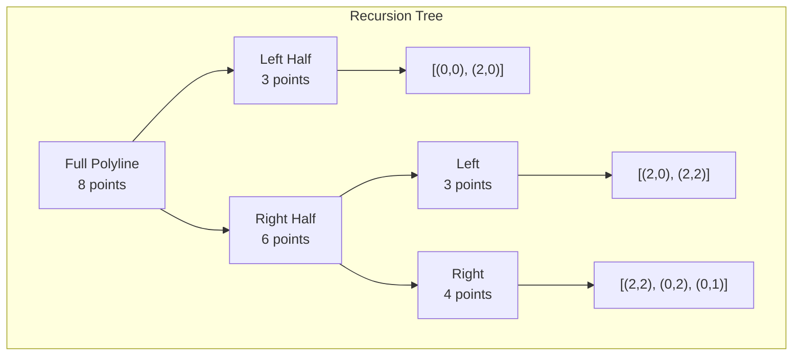

# Ramer-Douglas-Peucker Algorithm

## 1. Overview

The Ramer-Douglas-Peucker algorithm is a polyline simplification algorithm that reduces the number of points in a curve while preserving its essential shape. Also known as the Douglas-Peucker algorithm or iterative end-point fit algorithm, it is widely used in cartography, computer graphics, and data compression.

### Historical Context
- **Year**: 1972-1973
- **Authors**: Independently discovered by Urs Ramer (1972) and David Douglas & Thomas Peucker (1973)
- **Also Known As**: Douglas-Peucker algorithm, RDP algorithm, iterative end-point fit

## 2. Mathematical Foundation

### 2.1 Problem Definition

Given a polyline (ordered sequence of points) $P = [p_0, p_1, \ldots, p_n]$ and a tolerance parameter $\varepsilon > 0$, find a simplified polyline $P' \subseteq P$ such that:
1. $P'$ preserves the endpoints: $p_0, p_n \in P'$
2. Every point in $P$ is within perpendicular distance $\varepsilon$ from $P'$
3. $|P'|$ is minimized (approximately)

### 2.2 Mathematical Model

**Input**: 
- Polyline $P = [(x_0, y_0), (x_1, y_1), \ldots, (x_n, y_n)]$
- Tolerance $\varepsilon > 0$

**Output**: Simplified polyline $P' \subseteq P$ with $|P'| \leq |P|$

**Quality Guarantee**: 
$$\forall p_i \in P: d_\perp(p_i, P') \leq \varepsilon$$

where $d_\perp$ is the perpendicular distance to the nearest segment in $P'$.

### 2.3 Key Mathematical Concepts

#### Perpendicular Distance
The perpendicular distance from point $P = (x_p, y_p)$ to the line through points $A = (x_a, y_a)$ and $B = (x_b, y_b)$:

$$d_\perp(P, \overline{AB}) = \frac{|(y_b - y_a) \cdot x_p - (x_b - x_a) \cdot y_p + x_b \cdot y_a - y_b \cdot x_a|}{\sqrt{(y_b - y_a)^2 + (x_b - x_a)^2}}$$

This formula derives from the cross product of vectors $\vec{AP}$ and $\vec{AB}$:

$$d_\perp = \frac{|\vec{AP} \times \vec{AB}|}{|\vec{AB}|}$$

### 2.4 Correctness Proof

**Theorem**: The RDP algorithm produces a valid simplification satisfying the $\varepsilon$-tolerance.

**Proof**:
1. **Base Case**: For fewer than 3 points, return the original polyline (trivially correct)
2. **Recursive Case**:
   - If max perpendicular distance $d_{max} \leq \varepsilon$: The line segment from first to last point is within tolerance for all intermediate points
   - If $d_{max} > \varepsilon$: The point with maximum distance must be in the result; recursively simplify each half ensures both halves satisfy the tolerance
3. **Induction**: By structural induction on the recursion tree, all points in the output satisfy the distance bound

## 3. Algorithm Description

### 3.1 Intuition

1. **Connect endpoints**: Draw a line from the first to the last point
2. **Find farthest**: Locate the point with maximum perpendicular distance
3. **Decide**:
   - If distance ≤ ε: Replace all points with just the endpoints
   - If distance > ε: Keep this point and recursively simplify each half

### 3.2 Pseudocode

```
RAMER_DOUGLAS_PEUCKER(points, ε):
    // Base case: cannot simplify further
    if |points| < 3:
        return points
    
    // Find the point with maximum perpendicular distance
    first ← points[0]
    last ← points[|points| - 1]
    
    d_max ← 0
    index ← 0
    
    for i ← 1 to |points| - 2:
        d ← PERPENDICULAR_DISTANCE(points[i], first, last)
        if d > d_max:
            d_max ← d
            index ← i
    
    // Check if simplification is acceptable
    if d_max > ε:
        // Recursive case: split and simplify each half
        left ← RAMER_DOUGLAS_PEUCKER(points[0..index], ε)
        right ← RAMER_DOUGLAS_PEUCKER(points[index..end], ε)
        
        // Combine results (avoid duplicate at split point)
        left.pop()  // Remove last point of left (will be first of right)
        return left + right
    else:
        // Simplification acceptable: return just endpoints
        return [first, last]

PERPENDICULAR_DISTANCE(p, a, b):
    numerator ← |(b.y - a.y) * p.x - (b.x - a.x) * p.y + b.x * a.y - b.y * a.x|
    denominator ← EUCLIDEAN_DISTANCE(a, b)
    return numerator / denominator
```

### 3.3 Step-by-Step Example

**Input**: Polygon with points representing a simplified rectangle  
$[(0,0), (1,0), (2,0), (2,1), (2,2), (1,2), (0,2), (0,1)]$  
$\varepsilon = 0.7$

```
Step 1: Initial call
        first = (0,0), last = (0,1)
        Find point farthest from line (0,0)-(0,1)
        Point (2,0) has distance 2 > ε
        
Step 2: Split at (2,0) - index 2
        Left half: [(0,0), (1,0), (2,0)]
        Right half: [(2,0), (2,1), (2,2), (1,2), (0,2), (0,1)]

Step 3: Recurse on left [(0,0), (1,0), (2,0)]
        Line from (0,0) to (2,0)
        Point (1,0) has distance 0 ≤ ε
        → Return [(0,0), (2,0)]

Step 4: Recurse on right [(2,0), (2,1), (2,2), (1,2), (0,2), (0,1)]
        Line from (2,0) to (0,1)
        Find maximum distance point
        Point (2,2) has max distance > ε
        
        Split at (2,2):
        - Left: [(2,0), (2,1), (2,2)] → simplifies to [(2,0), (2,2)]
        - Right: [(2,2), (1,2), (0,2), (0,1)] → continues recursively

Step 5: Continue recursion...
        
Final Result: [(0,0), (2,0), (2,2), (0,2), (0,1)]
        (5 points instead of 8 - removed collinear points)
```



## 4. Complexity Analysis

### 4.1 Time Complexity

| Case | Complexity | Explanation |
|------|------------|-------------|
| Best | $O(n)$ | All points eliminated at first level |
| Average | $O(n \log n)$ | Balanced recursion |
| Worst | $O(n^2)$ | Unbalanced splits (split at index 1 each time) |

**Recurrence Analysis**:

*Best case* (elimination): $T(n) = O(n)$

*Average case* (balanced): $T(n) = 2T(n/2) + O(n) = O(n \log n)$

*Worst case* (maximally unbalanced):  
$T(n) = T(1) + T(n-1) + O(n) = O(n^2)$

### 4.2 Space Complexity

| Component | Space | Notes |
|-----------|-------|-------|
| Recursion stack | $O(n)$ | Worst case depth |
| Result storage | $O(n)$ | At most n points |
| **Total** | $O(n)$ | |

### 4.3 Output Sensitivity

The output size $m$ depends on:
- The shape complexity (curvature)
- The tolerance $\varepsilon$

For a smooth curve, $m = O(n^{1-1/d})$ where $d$ is the fractal dimension.

## 5. Implementation Notes

### 5.1 Rust-Specific Considerations

```rust
// Key implementation patterns from the codebase:

// 1. Base case handling
pub fn ramer_douglas_peucker(points: &[Point], epsilon: f64) -> Vec<Point> {
    if points.len() < 3 {
        return points.to_vec();
    }
    // ...
}

// 2. Finding maximum distance point
let mut dmax = 0.0;
let mut index = 0;
let end = points.len() - 1;

for i in 1..end {
    let d = perpendicular_distance(&points[i], &points[0], &points[end]);
    if d > dmax {
        index = i;
        dmax = d;
    }
}

// 3. Perpendicular distance calculation
fn perpendicular_distance(p: &Point, a: &Point, b: &Point) -> f64 {
    let num = (b.y - a.y) * p.x - (b.x - a.x) * p.y + b.x * a.y - b.y * a.x;
    let den = a.euclidean_distance(b);
    num.abs() / den
}

// 4. Recursive combination
if dmax > epsilon {
    let mut results = ramer_douglas_peucker(&points[..=index], epsilon);
    results.pop();  // Remove duplicate at split point
    results.extend(ramer_douglas_peucker(&points[index..], epsilon));
    results
} else {
    vec![points[0].clone(), points[end].clone()]
}
```

### 5.2 Edge Cases

| Case | Handling |
|------|----------|
| Empty input | Return empty vector |
| Single point | Return single point |
| Two points | Return both points |
| All collinear | Collapse to endpoints |
| ε = 0 | Return all points (no simplification) |
| ε = ∞ | Return endpoints only |

### 5.3 Numerical Considerations

1. **Division by zero**: Handle case where first and last points are identical
2. **Floating-point precision**: Use appropriate tolerance for comparisons
3. **Distance calculation**: The perpendicular distance formula is numerically stable

## 6. Real-World Applications

### 6.1 Software Engineering Use Cases

1. **Cartography & GIS**
   - Map generalization for different zoom levels
   - Coastline and boundary simplification
   - GPS track compression

2. **Computer Graphics**
   - Vector path optimization
   - Font outline simplification
   - SVG compression

3. **Signal Processing**
   - Time series compression
   - Waveform simplification
   - Sensor data reduction

4. **Robotics**
   - Path planning simplification
   - Map representation
   - Trajectory smoothing

5. **Data Compression**
   - Reducing storage for geographic data
   - Network transmission optimization
   - Database indexing efficiency

### 6.2 Choosing Epsilon

| Use Case | Recommended ε | Rationale |
|----------|---------------|-----------|
| High detail maps | 0.00001° | Preserve fine features |
| City-level maps | 0.001° | Balance detail and size |
| Country-level maps | 0.01° | Aggressive simplification |
| Thumbnails | 0.1° | Maximum compression |

### 6.3 Related Algorithms

| Algorithm | Approach | Use When |
|-----------|----------|----------|
| **Ramer-Douglas-Peucker** | Perpendicular distance | General simplification |
| Visvalingam-Whyatt | Area-based elimination | Preserve topology |
| Reumann-Witkam | Corridor search | Online processing |
| Lang Simplification | Angular deviation | Smooth curves |

## 7. Variants and Extensions

### 7.1 Iterative Version

The recursive algorithm can be converted to iterative using an explicit stack:

```
ITERATIVE_RDP(points, ε):
    stack ← [(0, |points| - 1)]
    keep ← {0, |points| - 1}
    
    while stack not empty:
        (start, end) ← stack.pop()
        d_max, index ← find_farthest(points, start, end)
        
        if d_max > ε:
            keep.add(index)
            stack.push((start, index))
            stack.push((index, end))
    
    return points at sorted indices in keep
```

### 7.2 Parallel Version

The recursive structure enables parallelization:
- Process left and right halves concurrently
- Combine results when both complete

### 7.3 Topologically-Aware Version

For preserving polygon validity:
- Check for self-intersections after simplification
- Revert problematic simplifications

## 8. References

1. Ramer, U. (1972). "An iterative procedure for the polygonal approximation of plane curves". *Computer Graphics and Image Processing*.
2. Douglas, D. H., & Peucker, T. K. (1973). "Algorithms for the reduction of the number of points required to represent a digitized line or its caricature". *Cartographica*.
3. Hershberger, J., & Snoeyink, J. (1992). "Speeding up the Douglas-Peucker line-simplification algorithm". *Proc. 5th Intl. Symp. on Spatial Data Handling*.
4. Visvalingam, M., & Whyatt, J. D. (1993). "Line generalisation by repeated elimination of points". *The Cartographic Journal*.
