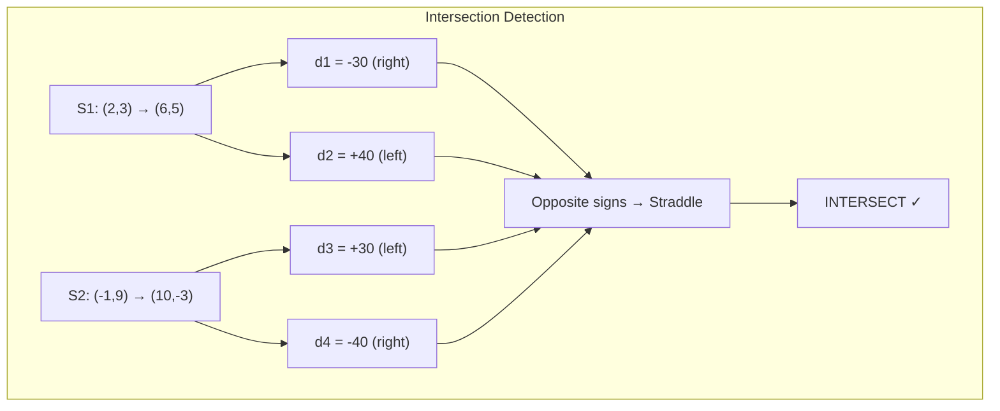

# Line Segment Operations

## 1. Overview

The Segment module provides fundamental operations on line segments in 2D space, including intersection detection, collinearity testing, and point-on-segment verification. These operations form the building blocks for more complex geometric algorithms.

### Core Operations
- Segment intersection detection
- Point collinearity with a line
- Point containment on a segment
- Line equation computation
- Segment direction calculation

## 2. Mathematical Foundation

### 2.1 Segment Representation

A line segment is defined by two endpoints $A = (x_1, y_1)$ and $B = (x_2, y_2)$.

**Parametric Form**:
$$P(t) = A + t \cdot (B - A), \quad t \in [0, 1]$$

**Implicit Form** (for non-vertical lines):
$$y = mx + b$$
where $m = \frac{y_2 - y_1}{x_2 - x_1}$ (slope) and $b = y_1 - m \cdot x_1$ (y-intercept)

### 2.2 Key Mathematical Concepts

#### Direction (Cross Product Test)
The direction of point $P$ relative to segment $\overline{AB}$ uses the cross product:

$$\text{direction}(A, B, P) = \vec{AP} \times \vec{AB} = (P_x - A_x)(B_y - A_y) - (P_y - A_y)(B_x - A_x)$$

- **Positive**: $P$ is to the left of $\overrightarrow{AB}$
- **Negative**: $P$ is to the right of $\overrightarrow{AB}$
- **Zero**: $P$ is collinear with $A$ and $B$

#### Segment Intersection Condition
Two segments $\overline{AB}$ and $\overline{CD}$ intersect if and only if:
1. $C$ and $D$ lie on opposite sides of line $AB$, **AND**
2. $A$ and $B$ lie on opposite sides of line $CD$

Or, in the boundary cases:
- An endpoint lies exactly on the other segment

### 2.3 Collinearity

Point $P$ is collinear with segment $\overline{AB}$ if:
- For vertical segments: $P_x = A_x$
- For non-vertical segments: $P_y = m \cdot P_x + b$ (within tolerance)

## 3. Algorithm Descriptions

### 3.1 Segment Intersection Test

```
INTERSECTS(segment1, segment2):
    // Get directions of segment2's endpoints relative to segment1
    d1 ← direction(segment1, segment2.a)
    d2 ← direction(segment1, segment2.b)
    
    // Get directions of segment1's endpoints relative to segment2
    d3 ← direction(segment2, segment1.a)
    d4 ← direction(segment2, segment1.b)
    
    // Main case: segments straddle each other
    if ((d1 > 0 AND d2 < 0) OR (d1 < 0 AND d2 > 0)) AND
       ((d3 > 0 AND d4 < 0) OR (d3 < 0 AND d4 > 0)):
        return true
    
    // Boundary cases: endpoint lies on segment
    if d1 = 0 AND on_segment(segment1, segment2.a): return true
    if d2 = 0 AND on_segment(segment1, segment2.b): return true
    if d3 = 0 AND on_segment(segment2, segment1.a): return true
    if d4 = 0 AND on_segment(segment2, segment1.b): return true
    
    return false
```

### 3.2 Point on Segment Test

```
ON_SEGMENT(segment, point):
    if NOT is_collinear(segment, point):
        return false
    
    // Check if point is within bounding box
    (low_x, high_x) ← sorted(segment.a.x, segment.b.x)
    (low_y, high_y) ← sorted(segment.a.y, segment.b.y)
    
    return low_x ≤ point.x ≤ high_x AND
           low_y ≤ point.y ≤ high_y
```

### 3.3 Step-by-Step Example: Intersection Test

**Segments**: 
- $S_1$: $(2, 3) \to (6, 5)$
- $S_2$: $(-1, 9) \to (10, -3)$

```
Step 1: Calculate directions for S2 endpoints relative to S1
        direction(S1, (-1, 9)):
          = ((-1) - 2)(5 - 3) - (9 - 3)(6 - 2)
          = (-3)(2) - (6)(4)
          = -6 - 24 = -30 (negative → right of S1)
        
        direction(S1, (10, -3)):
          = (10 - 2)(5 - 3) - ((-3) - 3)(6 - 2)
          = (8)(2) - (-6)(4)
          = 16 + 24 = 40 (positive → left of S1)

Step 2: Calculate directions for S1 endpoints relative to S2
        direction(S2, (2, 3)):
          = (2 - (-1))((-3) - 9) - (3 - 9)(10 - (-1))
          = (3)(-12) - (-6)(11)
          = -36 + 66 = 30 (positive → left of S2)
        
        direction(S2, (6, 5)):
          = (6 - (-1))((-3) - 9) - (5 - 9)(10 - (-1))
          = (7)(-12) - (-4)(11)
          = -84 + 44 = -40 (negative → right of S2)

Step 3: Check straddling condition
        S2 endpoints straddle S1: -30 and 40 have opposite signs ✓
        S1 endpoints straddle S2: 30 and -40 have opposite signs ✓
        
Result: Segments INTERSECT
```



## 4. Complexity Analysis

### 4.1 Time Complexity

| Operation | Complexity | Notes |
|-----------|------------|-------|
| Direction calculation | $O(1)$ | Single cross product |
| Collinearity test | $O(1)$ | One comparison |
| On-segment test | $O(1)$ | Collinearity + bounds check |
| Intersection test | $O(1)$ | Four direction tests |
| Line equation | $O(1)$ | Direct computation |

### 4.2 Space Complexity

All operations use $O(1)$ auxiliary space.

## 5. Implementation Notes

### 5.1 Rust-Specific Considerations

```rust
// Key implementation patterns from the codebase:

// 1. Segment structure
pub struct Segment {
    pub a: Point,
    pub b: Point,
}

// 2. Construction methods
impl Segment {
    pub fn new(x1: f64, y1: f64, x2: f64, y2: f64) -> Segment {
        Segment {
            a: Point::new(x1, y1),
            b: Point::new(x2, y2),
        }
    }

    pub fn from_points(a: Point, b: Point) -> Segment {
        Segment { a, b }
    }
}

// 3. Direction calculation using Point's cross_prod
pub fn direction(&self, p: &Point) -> f64 {
    let a = Point::new(p.x - self.a.x, p.y - self.a.y);
    let b = Point::new(self.b.x - self.a.x, self.b.y - self.a.y);
    a.cross_prod(&b)
}

// 4. Line equation computation
pub fn get_line_equation(&self) -> (f64, f64) {
    let slope = (self.a.y - self.b.y) / (self.a.x - self.b.x);
    let y_intercept = self.a.y - slope * self.a.x;
    (slope, y_intercept)
}
```

### 5.2 Edge Cases

| Case | Handling |
|------|----------|
| Vertical segment | Special case in `is_colinear` |
| Zero-length segment | Points coincide (degenerate) |
| Parallel segments | Don't intersect (unless overlapping) |
| Collinear segments | Check for overlap |
| Endpoint on segment | Boundary case in intersection |

### 5.3 Numerical Tolerance

The implementation uses a tolerance constant for floating-point comparisons:

```rust
const TOLERANCE: f64 = 0.0001;

pub fn is_colinear(&self, p: &Point) -> bool {
    if self.is_vertical() {
        p.x == self.a.x
    } else {
        (self.compute_y_at_x(p.x) - p.y).abs() < TOLERANCE
    }
}
```

## 6. API Reference

### 6.1 Constructors

| Method | Description | Example |
|--------|-------------|---------|
| `new(x1, y1, x2, y2)` | Create from coordinates | `Segment::new(0.0, 0.0, 1.0, 1.0)` |
| `from_points(a, b)` | Create from Point objects | `Segment::from_points(p1, p2)` |

### 6.2 Query Methods

| Method | Return Type | Description |
|--------|-------------|-------------|
| `direction(&self, p)` | `f64` | Cross product for orientation |
| `is_vertical(&self)` | `bool` | True if segment is vertical |
| `get_line_equation(&self)` | `(f64, f64)` | Returns (slope, y-intercept) |
| `compute_y_at_x(&self, x)` | `f64` | Y value at given X (infinite line) |
| `is_colinear(&self, p)` | `bool` | True if point on segment's line |
| `colinear_point_on_segment(&self, p)` | `bool` | True if collinear point is on segment |
| `on_segment(&self, p)` | `bool` | True if point is on segment |
| `intersects(&self, other)` | `bool` | True if segments intersect |

## 7. Real-World Applications

### 7.1 Software Engineering Use Cases

1. **Computer Graphics**
   - Line clipping (Cohen-Sutherland, Liang-Barsky)
   - Polygon boolean operations
   - Ray-segment intersection for rendering

2. **Game Development**
   - Collision detection between objects
   - Line-of-sight calculations
   - Physics engine boundaries

3. **Geographic Information Systems**
   - Road network analysis
   - Boundary intersection detection
   - River/coastline crossing detection

4. **CAD/CAM Systems**
   - Path intersection checking
   - Toolpath validation
   - Design rule checking

5. **Computational Geometry**
   - Convex hull algorithms (uses orientation)
   - Polygon triangulation
   - Voronoi diagram construction

### 7.2 Integration with Other Algorithms

| Algorithm | Uses Segment Operations |
|-----------|------------------------|
| [Graham Scan](graham_scan.md) | Orientation testing |
| [Jarvis March](jarvis_scan.md) | Direction calculation, on-segment check |
| [Closest Points](closest_points.md) | Distance calculations |
| Bentley-Ottmann | Segment intersection |
| Polygon Clipping | Intersection, collinearity |

## 8. References

1. Cormen, T. H., et al. (2009). *Introduction to Algorithms* (3rd ed.). MIT Press. Chapter 33.
2. de Berg, M., et al. (2008). *Computational Geometry: Algorithms and Applications*. Springer.
3. O'Rourke, J. (1998). *Computational Geometry in C* (2nd ed.). Cambridge University Press.
4. Preparata, F. P., & Shamos, M. I. (1985). *Computational Geometry: An Introduction*. Springer.
