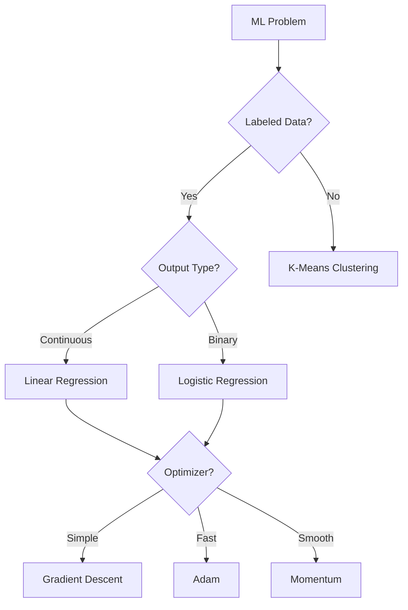

# Machine Learning Algorithms

This directory contains comprehensive documentation for machine learning algorithms implemented in **TheAlgorithms/Rust**.

## Overview

The machine learning module provides fundamental building blocks for:
- **Supervised Learning**: Regression and classification algorithms
- **Unsupervised Learning**: Clustering algorithms
- **Optimization**: Gradient-based parameter optimization
- **Loss Functions**: Objective functions for model training
- **Numerical Methods**: Matrix decompositions and linear algebra

## Algorithm Index

### Models

| Algorithm | Description | Complexity | Documentation |
|-----------|-------------|------------|---------------|
| [Linear Regression](linear_regression.md) | Simple linear regression using OLS | $O(n)$ | ✅ |
| [Logistic Regression](logistic_regression.md) | Binary classification with sigmoid | $O(knd)$ | ✅ |
| [K-Means Clustering](k_means.md) | Partition-based clustering | $O(Tnk)$ | ✅ |

### Optimization Algorithms

| Algorithm | Description | Memory | Documentation |
|-----------|-------------|--------|---------------|
| [Gradient Descent](gradient_descent.md) | Basic iterative optimization | $O(n)$ | ✅ |
| [Adam Optimizer](adam.md) | Adaptive moment estimation | $O(2n)$ | ✅ |
| [Momentum](momentum.md) | Velocity-accelerated GD | $O(n)$ | ✅ |

### Loss Functions

| Loss Function | Use Case | Documentation |
|---------------|----------|---------------|
| [Mean Squared Error](mean_squared_error.md) | Regression | ✅ |
| [Mean Absolute Error](mean_absolute_error.md) | Robust regression | ✅ |
| [Hinge Loss](hinge_loss.md) | SVM classification | ✅ |
| [Huber Loss](huber_loss.md) | Outlier-robust regression | ✅ |
| [KL Divergence](kl_divergence.md) | Distribution matching | ✅ |
| [Negative Log Likelihood](negative_log_likelihood.md) | Probabilistic classification | ✅ |

### Numerical Methods

| Algorithm | Description | Complexity | Documentation |
|-----------|-------------|------------|---------------|
| [Cholesky Decomposition](cholesky.md) | Matrix factorization | $O(n^3/6)$ | ✅ |

## Quick Reference

### When to Use What



### Loss Function Selection

| Problem Type | Recommended Loss | Alternative |
|--------------|------------------|-------------|
| Regression (normal) | MSE | MAE |
| Regression (outliers) | Huber | MAE |
| Binary Classification | NLL | Hinge |
| Multi-class | Cross-Entropy | - |
| Distribution Matching | KL Divergence | - |

### Optimizer Selection

| Scenario | Recommended | Why |
|----------|-------------|-----|
| First attempt | Adam | Robust defaults |
| Simple problems | Gradient Descent | Simple, interpretable |
| Ravine-like loss | Momentum | Faster convergence |
| Sparse gradients | Adam | Adaptive learning rates |
| Fine-tuning | SGD + Schedule | Better generalization |

## Source Code Structure

```
src/machine_learning/
├── mod.rs                    # Module exports
├── linear_regression.rs      # OLS regression
├── logistic_regression.rs    # Binary classification
├── k_means.rs                # Clustering
├── cholesky.rs               # Matrix decomposition
├── optimization/
│   ├── mod.rs
│   ├── gradient_descent.rs   # Basic GD
│   ├── adam.rs               # Adam optimizer
│   └── momentum.rs           # Momentum optimizer
└── loss_function/
    ├── mod.rs
    ├── mean_squared_error_loss.rs
    ├── mean_absolute_error_loss.rs
    ├── hinge_loss.rs
    ├── huber_loss.rs
    ├── kl_divergence_loss.rs
    └── negative_log_likelihood.rs
```

## Usage Examples

### Linear Regression

```rust
use the_algorithms_rust::machine_learning::linear_regression;

let data = vec![(1.0, 2.0), (2.0, 4.0), (3.0, 6.0)];
if let Some((intercept, slope)) = linear_regression(data) {
    println!("y = {} + {}x", intercept, slope);
}
```

### Logistic Regression

```rust
use the_algorithms_rust::machine_learning::logistic_regression;

let data = vec![
    (vec![1.0, 2.0], 0.0),
    (vec![3.0, 4.0], 1.0),
];
let weights = logistic_regression(data, 1000, 0.01).unwrap();
```

### K-Means Clustering

```rust
use the_algorithms_rust::machine_learning::k_means;

let points = vec![(0.0, 0.0), (1.0, 1.0), (10.0, 10.0)];
let labels = k_means(points, 2, 100).unwrap();
```

### Using Adam Optimizer

```rust
use the_algorithms_rust::machine_learning::optimization::Adam;

let mut optimizer = Adam::new(Some(0.001), None, None, 10);
let gradients = vec![0.1; 10];
let updates = optimizer.step(&gradients);
```

## Complexity Summary

| Algorithm | Time | Space |
|-----------|------|-------|
| Linear Regression | $O(n)$ | $O(1)$ |
| Logistic Regression | $O(knd)$ | $O(d)$ |
| K-Means | $O(Tnk)$ | $O(n+k)$ |
| Gradient Descent | $O(kn)$ | $O(n)$ |
| Adam | $O(kn)$ | $O(2n)$ |
| Momentum | $O(kn)$ | $O(n)$ |
| Cholesky | $O(n^3/6)$ | $O(n^2)$ |

Where:
- $n$ = number of samples (or parameters for optimizers)
- $d$ = number of features
- $k$ = number of iterations (or clusters)
- $T$ = max iterations

## References

### Foundational Papers

- Kingma, D. P., & Ba, J. (2015). "Adam: A Method for Stochastic Optimization"
- Lloyd, S. P. (1982). "Least squares quantization in PCM"
- Polyak, B. T. (1964). "Some methods of speeding up the convergence"

### Books

- Bishop, C. M. (2006). *Pattern Recognition and Machine Learning*
- Goodfellow, I., et al. (2016). *Deep Learning*
- Murphy, K. P. (2012). *Machine Learning: A Probabilistic Perspective*

### Online Resources

- [Stanford CS229](http://cs229.stanford.edu/)
- [Sebastian Ruder's Optimizer Overview](https://ruder.io/optimizing-gradient-descent/)

## Contributing

When adding new ML algorithms:

1. Follow the documentation template in [PLAN.md](../PLAN.md)
2. Include complexity analysis with derivation
3. Provide worked examples
4. List real-world applications
5. Add tests for edge cases
6. Update this README
