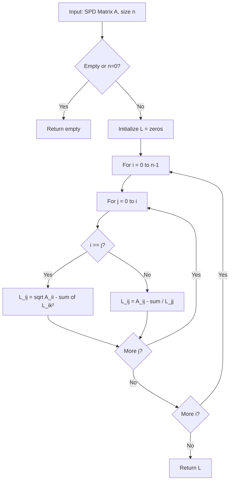

# Cholesky Decomposition

## 1. Overview

**Cholesky Decomposition** is a matrix factorization technique that decomposes a symmetric positive-definite matrix $\mathbf{A}$ into the product of a lower triangular matrix $\mathbf{L}$ and its transpose $\mathbf{L}^T$:

$$\mathbf{A} = \mathbf{L} \mathbf{L}^T$$

This implementation provides an efficient algorithm for computing the Cholesky factor of a given matrix, which is essential for solving linear systems, computing determinants, and various machine learning applications.

### Historical Context

The decomposition is named after **André-Louis Cholesky** (1875-1918), a French military officer and geodesist who developed this method for surveying calculations during World War I. His work was published posthumously in 1924. Today, Cholesky decomposition is fundamental in numerical linear algebra and machine learning.

## 2. Mathematical Foundation

### 2.1 Problem Definition

Given an $n \times n$ symmetric positive-definite matrix $\mathbf{A}$, find a lower triangular matrix $\mathbf{L}$ such that:

$$\mathbf{A} = \mathbf{L} \mathbf{L}^T$$

Where:
- $\mathbf{L}$ is lower triangular: $L_{ij} = 0$ for $j > i$
- All diagonal elements of $\mathbf{L}$ are positive

### 2.2 Mathematical Model

**Positive Definite Matrix**: A symmetric matrix $\mathbf{A}$ is positive definite if:
$$\mathbf{x}^T \mathbf{A} \mathbf{x} > 0 \quad \forall \mathbf{x} \neq \mathbf{0}$$

Equivalently, all eigenvalues are positive.

**Element Formulas**:

For diagonal elements ($i = j$):
$$L_{ii} = \sqrt{A_{ii} - \sum_{k=0}^{i-1} L_{ik}^2}$$

For off-diagonal elements ($i > j$):
$$L_{ij} = \frac{1}{L_{jj}} \left( A_{ij} - \sum_{k=0}^{j-1} L_{ik} L_{jk} \right)$$

### 2.3 Matrix Representation

For a $3 \times 3$ matrix:

$$\begin{pmatrix} a_{11} & a_{12} & a_{13} \\ a_{21} & a_{22} & a_{23} \\ a_{31} & a_{32} & a_{33} \end{pmatrix} = \begin{pmatrix} L_{11} & 0 & 0 \\ L_{21} & L_{22} & 0 \\ L_{31} & L_{32} & L_{33} \end{pmatrix} \begin{pmatrix} L_{11} & L_{21} & L_{31} \\ 0 & L_{22} & L_{32} \\ 0 & 0 & L_{33} \end{pmatrix}$$

### 2.4 Existence and Uniqueness

**Theorem**: For every symmetric positive-definite matrix $\mathbf{A}$, there exists a unique lower triangular matrix $\mathbf{L}$ with positive diagonal entries such that $\mathbf{A} = \mathbf{L}\mathbf{L}^T$.

## 3. Algorithm Description

### 3.1 Intuition

Cholesky decomposition "unpacks" a symmetric positive-definite matrix into its square root. Just as $25 = 5 \times 5$, we factor $\mathbf{A} = \mathbf{L} \times \mathbf{L}^T$.

The algorithm processes the matrix column by column:
1. Compute the diagonal element (using square root)
2. Compute elements below the diagonal (using division)

### 3.2 Pseudocode

```
FUNCTION cholesky(mat, n)
    INPUT: 
        mat: Flattened n×n matrix (row-major order)
        n: Matrix dimension
    OUTPUT: Lower triangular matrix L (flattened)
    
    IF mat is empty OR n = 0 THEN
        RETURN empty array
    
    L ← array of zeros, size n×n
    
    FOR i = 0 TO n-1 DO
        FOR j = 0 TO i DO
            // Compute sum of products
            s ← 0
            FOR k = 0 TO j-1 DO
                s ← s + L[i,k] × L[j,k]
            
            IF i = j THEN
                // Diagonal element
                value ← A[i,i] - s
                IF value is NaN THEN
                    L[i,j] ← 0
                ELSE
                    L[i,j] ← √value
            ELSE
                // Off-diagonal element
                value ← (A[i,j] - s) / L[j,j]
                IF value is NaN THEN
                    L[i,j] ← 0
                ELSE
                    L[i,j] ← value
    
    RETURN L
```

### 3.3 Step-by-Step Example

**Input Matrix** (flattened row-major):
$$\mathbf{A} = \begin{pmatrix} 25 & 15 & -5 \\ 15 & 18 & 0 \\ -5 & 0 & 11 \end{pmatrix}$$

`mat = [25, 15, -5, 15, 18, 0, -5, 0, 11]`, `n = 3`

**Step-by-Step Computation**:

| $(i,j)$ | Formula | Calculation | Result |
|---------|---------|-------------|--------|
| $(0,0)$ | $L_{00} = \sqrt{A_{00}}$ | $\sqrt{25}$ | $5$ |
| $(1,0)$ | $L_{10} = A_{10}/L_{00}$ | $15/5$ | $3$ |
| $(1,1)$ | $L_{11} = \sqrt{A_{11} - L_{10}^2}$ | $\sqrt{18-9}$ | $3$ |
| $(2,0)$ | $L_{20} = A_{20}/L_{00}$ | $-5/5$ | $-1$ |
| $(2,1)$ | $L_{21} = (A_{21} - L_{20}L_{10})/L_{11}$ | $(0-(-3))/3$ | $1$ |
| $(2,2)$ | $L_{22} = \sqrt{A_{22} - L_{20}^2 - L_{21}^2}$ | $\sqrt{11-1-1}$ | $3$ |

**Output**:
$$\mathbf{L} = \begin{pmatrix} 5 & 0 & 0 \\ 3 & 3 & 0 \\ -1 & 1 & 3 \end{pmatrix}$$

**Verification**: $\mathbf{L}\mathbf{L}^T = \mathbf{A}$ ✓

## 4. Complexity Analysis

### 4.1 Time Complexity

| Case | Complexity | Explanation |
|------|------------|-------------|
| All Cases | $O(n^3)$ | Triple nested loops |

**Detailed Analysis**:
- Outer loop: $n$ iterations
- Middle loop: $i$ iterations (average $n/2$)
- Inner loop: $j$ iterations (average $n/4$)
- Total: $\sum_{i=0}^{n-1} \sum_{j=0}^{i} j \approx \frac{n^3}{6}$

**Comparison with Alternatives**:
| Method | Time Complexity | Notes |
|--------|-----------------|-------|
| Cholesky | $O(n^3/6)$ | Best for SPD matrices |
| LU | $O(n^3/3)$ | General matrices |
| QR | $O(2n^3/3)$ | Most stable |

### 4.2 Space Complexity

| Type | Complexity | Explanation |
|------|------------|-------------|
| Output matrix | $O(n^2)$ | Full matrix stored |
| Auxiliary | $O(1)$ | Only scalar variables |
| Input | $O(n^2)$ | Input matrix |
| **Total** | $O(n^2)$ | Dominated by matrices |

**Note**: Could be reduced to $O(n^2/2)$ by storing only lower triangle.

## 5. Implementation Notes

### 5.1 Rust-Specific Considerations

```rust
pub fn cholesky(mat: Vec<f64>, n: usize) -> Vec<f64>
```

**Matrix Storage**:
- Uses flattened row-major representation
- Index $(i,j) \to i \cdot n + j$

**NaN Handling**:
```rust
if value.is_nan() {
    0.0
} else {
    value.sqrt()  // or value for off-diagonal
}
```
This provides graceful degradation for non-positive-definite input.

**No Bounds Checking**: Direct array indexing assumes valid input.

### 5.2 Edge Cases

| Case | Behavior | Recommendation |
|------|----------|----------------|
| Empty matrix | Returns `[]` | Handled correctly |
| $n = 0$ | Returns `[]` | Handled correctly |
| Non-SPD matrix | May produce NaN/0 | Add validation |
| Near-singular | Numerical instability | Use pivoting |
| Non-symmetric | Incorrect result | Add symmetry check |

### 5.3 Potential Improvements

1. **Input Validation**:
   ```rust
   fn is_positive_definite(mat: &[f64], n: usize) -> bool {
       // Check if all eigenvalues are positive
       // Or attempt decomposition and check for failures
   }
   ```

2. **Symmetry Enforcement**:
   ```rust
   // Use only lower triangle of input
   let a_ij = mat[max(i,j) * n + min(i,j)];
   ```

3. **In-Place Computation**:
   Modify input matrix directly to save memory.

4. **Block Algorithm**:
   For large matrices, use blocked version for cache efficiency.

5. **Return Result Type**:
   ```rust
   pub fn cholesky(mat: &[f64], n: usize) -> Result<Vec<f64>, CholeskyError>
   ```

## 6. Real-World Applications

### 6.1 Machine Learning Use Cases

| Application | Description |
|-------------|-------------|
| **Gaussian Processes** | Efficient covariance matrix operations |
| **Linear Regression** | Solving normal equations: $(\mathbf{X}^T\mathbf{X})^{-1}$ |
| **Kalman Filters** | State estimation with covariance matrices |
| **PCA** | Eigenvalue problems via SVD |
| **Sampling** | Generating multivariate normal distributions |

### 6.2 Industry Applications

- **Finance**: Portfolio optimization, risk management (covariance matrices)
- **Physics**: Solving systems of equations in simulations
- **Graphics**: Mesh deformation, physics engines
- **Signal Processing**: Whitening transformations
- **Statistics**: Maximum likelihood estimation

### 6.3 Why Use Cholesky?

| Benefit | Explanation |
|---------|-------------|
| **Faster than LU** | About 2× fewer operations |
| **Numerically Stable** | For SPD matrices |
| **Exploits Symmetry** | Only computes half the matrix |
| **Easy Back-substitution** | Solving $\mathbf{Ax} = \mathbf{b}$ |

### 6.4 Solving Linear Systems

To solve $\mathbf{Ax} = \mathbf{b}$ where $\mathbf{A}$ is SPD:

1. Decompose: $\mathbf{A} = \mathbf{LL}^T$
2. Solve $\mathbf{Ly} = \mathbf{b}$ (forward substitution)
3. Solve $\mathbf{L}^T\mathbf{x} = \mathbf{y}$ (back substitution)

Total: $O(n^3/3 + 2n^2)$ vs $O(n^3)$ for direct inversion.

## 7. Visualization

### Decomposition Structure

```
Original Matrix A          Cholesky Factor L         L^T
┌─────────────────┐        ┌──────────────┐        ┌──────────────┐
│  ●   ●   ●   ●  │        │  ●           │        │  ●  ●  ●  ●  │
│  ●   ●   ●   ●  │   =    │  ●   ●       │   ×    │     ●  ●  ●  │
│  ●   ●   ●   ●  │        │  ●   ●   ●   │        │        ●  ●  │
│  ●   ●   ●   ●  │        │  ●   ●   ●  ●│        │           ●  │
└─────────────────┘        └──────────────┘        └──────────────┘
  Symmetric SPD            Lower Triangular         Upper Triangular
```

### Algorithm Flow



## 8. Related Algorithms

| Algorithm | Relationship |
|-----------|--------------|
| **LU Decomposition** | General factorization $\mathbf{A} = \mathbf{LU}$ |
| **LDL^T Decomposition** | Avoids square roots: $\mathbf{A} = \mathbf{LDL}^T$ |
| **QR Decomposition** | Orthogonal factorization |
| **Eigenvalue Decomposition** | $\mathbf{A} = \mathbf{Q\Lambda Q}^T$ |
| **SVD** | Most general factorization |

## 9. References

### Academic Papers
- Cholesky, A.-L. (1924). "Sur la résolution numérique des systèmes d'équations linéaires"
- Golub, G. H., & Van Loan, C. F. (2013). *Matrix Computations*, 4th ed.

### Books
- Press, W. H., et al. (2007). *Numerical Recipes*, Chapter 2.9
- Trefethen, L. N., & Bau, D. (1997). *Numerical Linear Algebra*

### Implementation Reference
- Source: [src/machine_learning/cholesky.rs](../../src/machine_learning/cholesky.rs)
