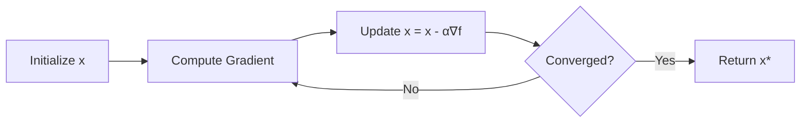

# Gradient Descent

## 1. Overview

**Gradient Descent** is the foundational optimization algorithm used to minimize objective functions in machine learning. It iteratively adjusts parameters by moving in the direction of steepest descent (negative gradient) of the loss function.

This implementation provides a general-purpose gradient descent optimizer that works with any differentiable objective function, making it a building block for training machine learning models.

### Historical Context

The method of steepest descent was first proposed by **Augustin-Louis Cauchy** in 1847. It gained prominence in machine learning with the development of backpropagation for neural networks in the 1980s. Today, gradient descent and its variants form the backbone of deep learning optimization.

## 2. Mathematical Foundation

### 2.1 Problem Definition

Given an objective function $f: \mathbb{R}^n \to \mathbb{R}$, find parameters $\mathbf{x}^*$ that minimize $f$:

$$\mathbf{x}^* = \arg\min_{\mathbf{x}} f(\mathbf{x})$$

### 2.2 Mathematical Model

**Gradient**: The gradient $\nabla f(\mathbf{x})$ points in the direction of steepest ascent.

**Update Rule**:
$$\mathbf{x}_{k+1} = \mathbf{x}_k - \alpha \nabla f(\mathbf{x}_k)$$

Where:
- $\mathbf{x}_k$ is the parameter vector at iteration $k$
- $\alpha > 0$ is the learning rate (step size)
- $\nabla f(\mathbf{x}_k)$ is the gradient at $\mathbf{x}_k$

**Component-wise**:
$$x_i^{(k+1)} = x_i^{(k)} - \alpha \frac{\partial f}{\partial x_i}(\mathbf{x}^{(k)})$$

### 2.3 Convergence Conditions

For a function $f$ that is:
- **Convex**: Gradient descent converges to global minimum
- **L-smooth** (Lipschitz continuous gradient): With $\alpha \leq 1/L$, convergence guaranteed
- **Strongly convex**: Linear convergence rate $O(\rho^k)$ where $\rho < 1$

**Convergence Rate**:
- Convex functions: $O(1/k)$
- Strongly convex: $O(\rho^k)$ (linear/exponential)

### 2.4 Intuition: The Landscape

```
Loss
  │    
  │╲   ╱    Local maxima
  │ ╲ ╱
  │  ╲      Saddle point
  │ ╱ ╲
  │╱   ╲    Global minimum ← Goal
  └────────→ Parameters
```

Gradient descent follows the downhill slope until reaching a minimum.

## 3. Algorithm Description

### 3.1 Intuition

Imagine standing on a foggy hillside, wanting to reach the lowest point. You can't see far, but you can feel which direction is steepest. Gradient descent is like taking small steps in the steepest downhill direction until you reach a valley.

### 3.2 Pseudocode

```
FUNCTION gradient_descent(derivative_fn, x, learning_rate, num_iterations)
    INPUT:
        derivative_fn: Function that computes gradient at point x
        x: Initial parameter vector (mutable)
        learning_rate: Step size α
        num_iterations: Number of iterations
    OUTPUT: Optimized parameter vector x
    
    FOR iteration = 1 TO num_iterations DO
        // Compute gradient at current position
        gradient ← derivative_fn(x)
        
        // Update each parameter
        FOR i = 0 TO length(x) - 1 DO
            x[i] ← x[i] - learning_rate × gradient[i]
    
    RETURN x
```

### 3.3 Step-by-Step Example

**Objective**: Minimize $f(x, y) = x^2 + y^2$

**Gradient**: $\nabla f = (2x, 2y)$

**Parameters**: $\alpha = 0.1$, initial $\mathbf{x} = (5, 3)$

| Iteration | $\mathbf{x}$ | $\nabla f$ | Update | $f(\mathbf{x})$ |
|-----------|--------------|------------|--------|-----------------|
| 0 | $(5.0, 3.0)$ | $(10, 6)$ | $-0.1 \cdot (10, 6)$ | $34.0$ |
| 1 | $(4.0, 2.4)$ | $(8, 4.8)$ | $-0.1 \cdot (8, 4.8)$ | $21.76$ |
| 2 | $(3.2, 1.92)$ | $(6.4, 3.84)$ | $-0.1 \cdot (6.4, 3.84)$ | $13.93$ |
| 3 | $(2.56, 1.54)$ | $(5.12, 3.07)$ | $-0.1 \cdot (5.12, 3.07)$ | $8.92$ |
| ... | ... | ... | ... | ... |
| ∞ | $(0, 0)$ | $(0, 0)$ | - | $0.0$ |

## 4. Complexity Analysis

### 4.1 Time Complexity

| Component | Complexity | Explanation |
|-----------|------------|-------------|
| Per Iteration | $O(n + G)$ | $n$ updates + gradient computation $G$ |
| Total | $O(k \cdot (n + G))$ | For $k$ iterations |

Where:
- $n$ = number of parameters
- $G$ = cost of computing gradient
- $k$ = number of iterations

**Note**: For neural networks, $G = O(\text{backprop cost})$ which dominates.

### 4.2 Space Complexity

| Type | Complexity | Explanation |
|------|------------|-------------|
| Parameters | $O(n)$ | Input vector |
| Gradient | $O(n)$ | Temporary gradient vector |
| **Total Auxiliary** | $O(n)$ | One gradient vector |

## 5. Implementation Notes

### 5.1 Rust-Specific Considerations

```rust
pub fn gradient_descent(
    derivative_fn: impl Fn(&[f64]) -> Vec<f64>,
    x: &mut Vec<f64>,
    learning_rate: f64,
    num_iterations: i32,
) -> &mut Vec<f64>
```

**Key Design Choices**:

1. **Generic Gradient Function**: Takes any `Fn(&[f64]) -> Vec<f64>`
   - Flexible: works with any differentiable objective
   - Clean separation of optimizer from objective

2. **Mutable Reference**: Takes `&mut Vec<f64>` and returns it
   - In-place modification for efficiency
   - Caller retains ownership

3. **Closure Support**:
   ```rust
   let derivative_fn = |params: &[f64]| {
       params.iter().map(|x| 2.0 * x).collect()
   };
   ```

### 5.2 Edge Cases

| Case | Behavior | Recommendation |
|------|----------|----------------|
| Empty parameter vector | Returns empty | Works correctly |
| Zero learning rate | No updates | Validate input |
| Negative learning rate | Gradient ascent | Validate input |
| Zero iterations | No updates | May be intentional |
| Gradient explosion | Values → ±∞ | Gradient clipping |

### 5.3 Learning Rate Selection

| Too Small | Just Right | Too Large |
|-----------|------------|-----------|
| Slow convergence | Fast convergence | Divergence |
| May get stuck | Reaches minimum | Oscillates |
| Many iterations | Optimal | NaN/overflow |

```
Loss                    Loss                    Loss
  │                       │                       │
  │╲                      │╲                      │╲    ╱╲
  │ ╲                     │ ╲                     │ ╲  ╱  ╲
  │  ╲╲╲╲                 │  ╲                    │  ╲╱    
  │      ╲╲╲              │   ╲                   │
  └─────────→             └─────→                 └─────────→
    α too small             α optimal              α too large
```

### 5.4 Potential Improvements

1. **Learning Rate Scheduling**:
   ```rust
   let alpha = initial_lr / (1.0 + decay * iteration);
   ```

2. **Early Stopping**:
   ```rust
   if gradient.iter().map(|g| g.powi(2)).sum::<f64>().sqrt() < epsilon {
       break;
   }
   ```

3. **Gradient Clipping**:
   ```rust
   let norm = gradient.iter().map(|g| g.powi(2)).sum::<f64>().sqrt();
   if norm > max_norm {
       gradient.iter_mut().for_each(|g| *g *= max_norm / norm);
   }
   ```

4. **Return Convergence Info**:
   ```rust
   struct GDResult {
       params: Vec<f64>,
       iterations: i32,
       converged: bool,
   }
   ```

## 6. Variants

### 6.1 Gradient Descent Family

| Variant | Update Rule | Use Case |
|---------|-------------|----------|
| **Batch GD** | Full dataset gradient | Small datasets |
| **Stochastic GD** | Single sample gradient | Large datasets, online |
| **Mini-batch GD** | Batch of samples | Modern deep learning |
| **Momentum** | Add velocity term | Faster convergence |
| **AdaGrad** | Per-parameter learning rates | Sparse gradients |
| **RMSprop** | Running average of gradients | Non-stationary |
| **Adam** | Momentum + RMSprop | Default choice |

### 6.2 Comparison

```
Iterations to Converge (Lower is Better)
        │
   GD   │████████████████████████████████████████
SGD     │████████████████████████
Momentum│████████████████
Adam    │████████████
        └────────────────────────────────────────→
```

## 7. Real-World Applications

### 7.1 Machine Learning Use Cases

| Domain | Application | Objective Function |
|--------|-------------|-------------------|
| **Linear Regression** | Fit line to data | Mean Squared Error |
| **Logistic Regression** | Classification | Cross-Entropy Loss |
| **Neural Networks** | Deep learning | Composite loss |
| **SVM** | Max margin classifier | Hinge loss |
| **Matrix Factorization** | Recommender systems | Squared error |

### 7.2 Industry Applications

- **Computer Vision**: Training CNNs for image classification
- **NLP**: Training transformers for language models
- **Finance**: Portfolio optimization
- **Robotics**: Policy gradient methods in RL
- **Science**: Parameter estimation in simulations

### 7.3 Related Algorithms

| Algorithm | Relationship |
|-----------|--------------|
| [Adam](adam.md) | Adaptive learning rates + momentum |
| [Momentum](momentum.md) | Accumulates velocity |
| Newton's Method | Uses second derivatives (Hessian) |
| L-BFGS | Quasi-Newton approximation |
| Conjugate Gradient | Better for quadratic objectives |

## 8. Visualization

### Gradient Descent Path

```
        Loss Surface (Contour Plot)
           ┌──────────────────────┐
           │    ╭─╮  ╭──╮         │
           │  ╭─╯ ╰──╯  ╰╮        │
           │ ╭╯ ╭──╮     │   ●←Start
           │ │ ╭╯  ╰╮ ╭──┤   │
           │ │ │ ●  │ │  │   ↓ Path
           │ ╰─╯ ╰──╯ ╰──╯   ●←End
           └──────────────────────┘
                   Minimum at center
```

### Convergence Behavior



## 9. Common Pitfalls

| Problem | Symptom | Solution |
|---------|---------|----------|
| **Learning rate too high** | Loss oscillates/diverges | Reduce α |
| **Learning rate too low** | Loss decreases very slowly | Increase α |
| **Local minimum** | Stuck at suboptimal point | Random restarts, momentum |
| **Saddle point** | Slow progress | SGD noise, momentum |
| **Vanishing gradient** | No progress | Better initialization, skip connections |
| **Exploding gradient** | NaN values | Gradient clipping, lower α |

## 10. References

### Academic Papers
- Cauchy, A. (1847). "Méthode générale pour la résolution des systèmes d'équations simultanées"
- Rumelhart, D. E., et al. (1986). "Learning representations by back-propagating errors"

### Books
- Boyd, S., & Vandenberghe, L. (2004). *Convex Optimization*, Chapter 9
- Goodfellow, I., et al. (2016). *Deep Learning*, Chapter 8

### Online Resources
- [Sebastian Ruder's Overview](https://ruder.io/optimizing-gradient-descent/)
- [Stanford CS229 Notes](http://cs229.stanford.edu/notes/)

### Implementation Reference
- Source: [src/machine_learning/optimization/gradient_descent.rs](../../src/machine_learning/optimization/gradient_descent.rs)
