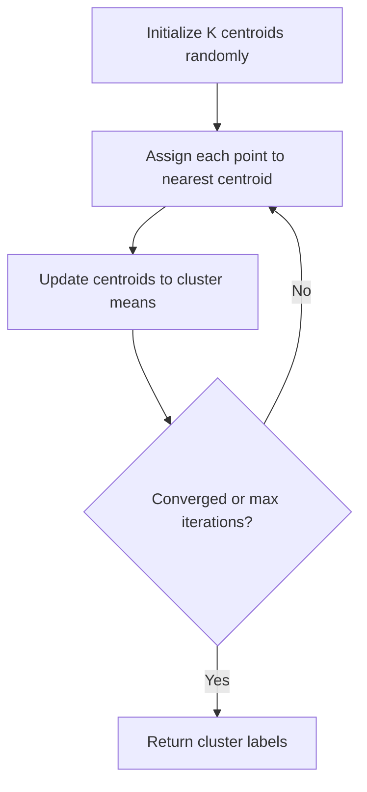

# K-Means Clustering

## 1. Overview

**K-Means Clustering** is an unsupervised machine learning algorithm that partitions a dataset into $k$ distinct, non-overlapping clusters. Each data point belongs to the cluster with the nearest centroid (cluster center).

The implementation in this repository performs K-Means clustering on 2D data points, iteratively refining cluster assignments and centroid positions until convergence or a maximum number of iterations.

### Historical Context

K-Means was first proposed by **Stuart Lloyd** of Bell Labs in 1957 (published in 1982) and independently by **James MacQueen** in 1967. It remains one of the most popular clustering algorithms due to its simplicity, efficiency, and effectiveness on many real-world datasets.

## 2. Mathematical Foundation

### 2.1 Problem Definition

Given a dataset $\mathbf{X} = \{\mathbf{x}_1, \mathbf{x}_2, \ldots, \mathbf{x}_n\}$ where $\mathbf{x}_i \in \mathbb{R}^d$, partition it into $k$ clusters $\mathbf{C} = \{C_1, C_2, \ldots, C_k\}$ such that:

$$\arg\min_{\mathbf{C}} \sum_{j=1}^{k} \sum_{\mathbf{x}_i \in C_j} \|\mathbf{x}_i - \boldsymbol{\mu}_j\|^2$$

Where $\boldsymbol{\mu}_j$ is the centroid (mean) of cluster $C_j$.

### 2.2 Mathematical Model

**Input**: 
- Set of $n$ points $\mathbf{X} = \{(x_1, y_1), \ldots, (x_n, y_n)\}$
- Number of clusters $k$
- Maximum iterations $T$

**Output**: 
- Cluster labels $\mathbf{L} = \{l_1, l_2, \ldots, l_n\}$ where $l_i \in \{0, 1, \ldots, k-1\}$

**Objective** (Within-Cluster Sum of Squares - WCSS):
$$\text{WCSS} = \sum_{j=0}^{k-1} \sum_{i: l_i = j} d(\mathbf{x}_i, \boldsymbol{\mu}_j)^2$$

### 2.3 Distance Metric

**Euclidean Distance** (used in this implementation):
$$d(\mathbf{p}, \mathbf{q}) = \sqrt{(p_x - q_x)^2 + (p_y - q_y)^2}$$

### 2.4 Centroid Update

For cluster $j$, the new centroid is:
$$\boldsymbol{\mu}_j = \frac{1}{|C_j|} \sum_{\mathbf{x}_i \in C_j} \mathbf{x}_i$$

## 3. Algorithm Description

### 3.1 Intuition

K-Means works like finding the optimal locations for $k$ "magnets" that attract nearby data points:

1. Place $k$ magnets randomly
2. Each point sticks to the nearest magnet
3. Move each magnet to the center of its attached points
4. Repeat until magnets stop moving

```
Initial          After Assignment    After Update
    ×              ×══○══○            ×══○══○
  ○   ○           ╱                    ╱
    ○          ○                    ○
      ○          ○══╲══╲          ○══╲
    ●   ●            ●            ●
              (× = centroid)
```

### 3.2 Pseudocode

```
FUNCTION k_means(data_points, k, max_iterations)
    INPUT: 
        data_points: Array of (x, y) coordinates
        k: Number of clusters
        max_iterations: Maximum iterations
    OUTPUT: Array of cluster labels or None
    
    IF length(data_points) < k THEN
        RETURN None  // Not enough points
    
    // Step 1: Random initialization
    centroids ← []
    FOR i = 1 TO k DO
        centroids.append(random_point_in_range)
    
    labels ← [0, 0, ..., 0]  // Length = n
    
    // Step 2: Iterative refinement
    FOR iteration = 1 TO max_iterations DO
        // Step 2a: Assignment step
        new_positions ← [(0, 0), ..., (0, 0)]  // k pairs
        cluster_counts ← [0, 0, ..., 0]        // k counts
        
        FOR i = 0 TO length(data_points) - 1 DO
            nearest_cluster ← find_nearest(data_points[i], centroids)
            labels[i] ← nearest_cluster
            
            // Accumulate for centroid update
            new_positions[nearest_cluster].x += data_points[i].x
            new_positions[nearest_cluster].y += data_points[i].y
            cluster_counts[nearest_cluster] += 1
        
        // Step 2b: Update step
        FOR j = 0 TO k - 1 DO
            IF cluster_counts[j] > 0 THEN
                centroids[j].x ← new_positions[j].x / cluster_counts[j]
                centroids[j].y ← new_positions[j].y / cluster_counts[j]
    
    RETURN labels

FUNCTION find_nearest(point, centroids)
    min_cluster ← 0
    FOR i = 1 TO length(centroids) - 1 DO
        IF distance(point, centroids[i]) < distance(point, centroids[min_cluster]) THEN
            min_cluster ← i
    RETURN min_cluster
```

### 3.3 Step-by-Step Example

**Input**: 
- Points: `[(0,0), (1,0), (0,1), (10,10), (11,10), (10,11)]`
- $k = 2$, $\text{max\_iter} = 3$

**Initialization** (random centroids):
- $\mu_0 = (0.5, 0.5)$
- $\mu_1 = (8.0, 9.0)$

**Iteration 1**:

| Point | Dist to $\mu_0$ | Dist to $\mu_1$ | Assigned |
|-------|-----------------|-----------------|----------|
| (0,0) | 0.71 | 12.0 | Cluster 0 |
| (1,0) | 0.71 | 11.4 | Cluster 0 |
| (0,1) | 0.71 | 11.3 | Cluster 0 |
| (10,10) | 13.4 | 2.2 | Cluster 1 |
| (11,10) | 14.1 | 3.2 | Cluster 1 |
| (10,11) | 14.1 | 2.8 | Cluster 1 |

**Update**: $\mu_0 = (0.33, 0.33)$, $\mu_1 = (10.33, 10.33)$

**Final Labels**: `[0, 0, 0, 1, 1, 1]` ✓

## 4. Complexity Analysis

### 4.1 Time Complexity

| Case | Complexity | Explanation |
|------|------------|-------------|
| Per Iteration | $O(n \cdot k)$ | Compare each point to each centroid |
| Total | $O(T \cdot n \cdot k)$ | For $T$ iterations |

Where:
- $n$ = number of data points
- $k$ = number of clusters
- $T$ = number of iterations

**Note**: Distance calculation is $O(d)$ for $d$ dimensions. For 2D: $O(1)$.

### 4.2 Space Complexity

| Type | Complexity | Explanation |
|------|------------|-------------|
| Centroids | $O(k)$ | Store $k$ centroid coordinates |
| Labels | $O(n)$ | Cluster assignment for each point |
| Temp accumulators | $O(k)$ | For centroid updates |
| **Total Auxiliary** | $O(n + k)$ | |

## 5. Implementation Notes

### 5.1 Rust-Specific Considerations

```rust
pub fn k_means(
    data_points: Vec<(f64, f64)>, 
    n_clusters: usize, 
    max_iter: i32
) -> Option<Vec<u32>>
```

**Dependencies**:
- Uses `rand::random` for centroid initialization

**Memory Management**:
- Takes ownership of `data_points`
- Returns `Option<Vec<u32>>` for cluster labels

**Implementation Details**:
- Centroids initialized in range $[0, 1)$ regardless of data range
- Handles empty clusters gracefully (skips update)
- Uses `u32` for labels (supports up to 4B clusters)

### 5.2 Edge Cases

| Case | Behavior | Recommendation |
|------|----------|----------------|
| $n < k$ | Returns `None` | Handled correctly |
| Empty input | Returns `None` | Validated |
| Empty cluster | Centroid unchanged | May cause issues |
| All points identical | All in one cluster | Expected behavior |
| $k = 1$ | All same label | Trivial case |
| $k = n$ | Each point own cluster | Degenerate case |

### 5.3 Known Issues & Improvements

1. **Random Initialization**:
   - Current: Uniform random in $[0, 1)$
   - Problem: May not cover actual data range
   - Fix: Use **K-Means++** initialization
   ```rust
   // Better: sample from actual data points
   let idx = random::<usize>() % data_points.len();
   centroids.push(data_points[idx]);
   ```

2. **Convergence Check**:
   - Current: Fixed iterations
   - Better: Stop when centroids don't move
   ```rust
   if max_movement < epsilon { break; }
   ```

3. **Empty Clusters**:
   - Current: Centroid stays at old position
   - Better: Reinitialize from data or split largest cluster

4. **Type Consistency**:
   - Use `usize` for iterations instead of `i32`

## 6. Real-World Applications

### 6.1 Software Engineering Use Cases

| Domain | Application | Example |
|--------|-------------|---------|
| **Log Analysis** | Group similar error patterns | Cluster by error message similarity |
| **User Segmentation** | Group users by behavior | Features: session length, clicks, pages |
| **Code Similarity** | Find duplicate code | Cluster by AST features |
| **Performance Analysis** | Identify bottleneck patterns | Cluster by latency profiles |

### 6.2 Industry Applications

- **Marketing**: Customer segmentation for targeted campaigns
- **Image Processing**: Color quantization, image compression
- **Bioinformatics**: Gene expression analysis
- **Anomaly Detection**: Cluster normal behavior, flag outliers
- **Recommendation Systems**: Group similar items/users

### 6.3 Related Algorithms

| Algorithm | Key Difference |
|-----------|----------------|
| **K-Medoids** | Uses actual data points as centers |
| **DBSCAN** | Density-based, handles arbitrary shapes |
| **Hierarchical** | Produces cluster tree (dendrogram) |
| **Gaussian Mixture** | Probabilistic, soft assignments |
| **Mini-Batch K-Means** | Scales to large datasets |

## 7. Visualization

### Clustering Process

```
 Iteration 0 (Random Init)     Iteration 3 (Converged)
       │                              │
  10 ┼ ×₁ ○ ○ ○                  10 ┼   ×₁ ○ ○
     │                               │    ○ ○
   5 ┼                             5 ┼
     │   ×₀                          │
   0 ┼ ● ● ●                      0 ┼ ×₀ ● ● ●
     └─────────→                     └─────────→
       0   5  10                       0   5  10
     
     × = centroid                  ● = cluster 0
                                   ○ = cluster 1
```

### Algorithm Convergence



## 8. Choosing K

### Elbow Method
Plot WCSS vs $k$ and find the "elbow" point:

```
WCSS
│
│ ╲
│  ╲
│   ╲___  ← Elbow (optimal k)
│       ───────
└──────────────→ k
  1  2  3  4  5
```

### Silhouette Score
Measures how similar points are to their own cluster vs. other clusters.
Range: $[-1, 1]$, higher is better.

## 9. References

### Academic Papers
- Lloyd, S. P. (1982). "Least squares quantization in PCM"
- MacQueen, J. (1967). "Some methods for classification and analysis of multivariate observations"
- Arthur, D. & Vassilvitskii, S. (2007). "k-means++: The Advantages of Careful Seeding"

### Books
- Bishop, C. M. (2006). *Pattern Recognition and Machine Learning*, Chapter 9
- Murphy, K. P. (2012). *Machine Learning: A Probabilistic Perspective*

### Implementation Reference
- Source: [src/machine_learning/k_means.rs](../../src/machine_learning/k_means.rs)
