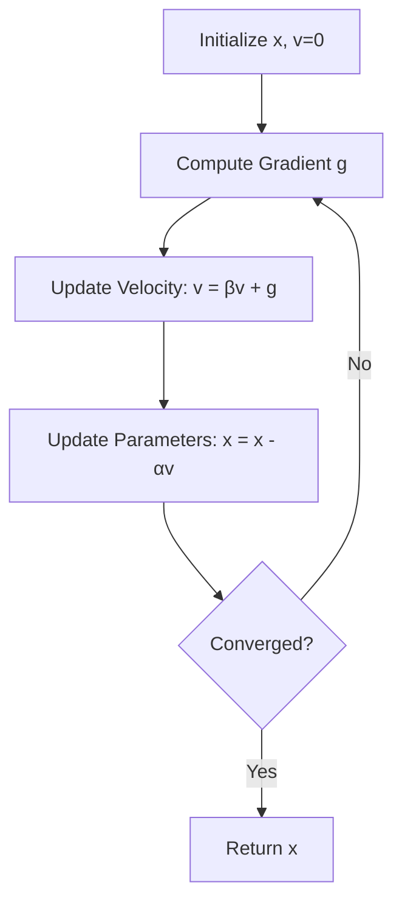

# Momentum Optimizer

## 1. Overview

**Momentum** is an extension of gradient descent that accelerates convergence by accumulating a velocity vector in directions of persistent gradient descent. It helps the optimizer navigate ravines (elongated valleys in the loss surface) and escape shallow local minima.

This implementation provides a momentum-based optimizer that maintains an exponentially decaying moving average of past gradients, enabling faster and smoother convergence than vanilla gradient descent.

### Historical Context

The momentum method was introduced by **Boris Polyak** in 1964. It draws inspiration from physics: a ball rolling down a hill accumulates momentum, allowing it to roll through small bumps and valleys. This concept was adapted for optimization to overcome the slow convergence and oscillation problems of standard gradient descent.

## 2. Mathematical Foundation

### 2.1 Problem Definition

Given an objective function $f(\mathbf{x})$, find parameters $\mathbf{x}^*$ that minimize $f$, using velocity-accelerated updates.

### 2.2 Mathematical Model

**Hyperparameters**:
- $\alpha$ (learning rate): Step size
- $\beta$ (momentum coefficient): Weight of past velocity (typically $0.9$)

**State Variable**:
- $\mathbf{v}_t$: Velocity vector (accumulated gradient)

### 2.3 Update Equations

**Initialize**: $\mathbf{v}_0 = \mathbf{0}$

**At each step** $t$:

1. **Update velocity**:
   $$\mathbf{v}_t = \beta \cdot \mathbf{v}_{t-1} + \nabla f(\mathbf{x}_{t-1})$$

2. **Update parameters**:
   $$\mathbf{x}_t = \mathbf{x}_{t-1} - \alpha \cdot \mathbf{v}_t$$

**Expanded form** (showing momentum accumulation):
$$\mathbf{v}_t = \nabla f(\mathbf{x}_{t-1}) + \beta \nabla f(\mathbf{x}_{t-2}) + \beta^2 \nabla f(\mathbf{x}_{t-3}) + \ldots$$

### 2.4 Physical Interpretation

```
           ╱╲        Without Momentum
          ╱  ╲       (Oscillates in ravine)
         ╱    ╲╱╲
        ╱        ╲╱╲
       ╱            ╲
      Start         Minimum

           ╱         With Momentum
          ╱          (Smooth trajectory)
         ╱╲
        ╱  ──╲
       ╱      ──╲
      Start      Minimum
```

### 2.5 Effective Learning Rate

With momentum, the effective step size in consistent gradient directions is amplified:

$$\text{Effective step} = \alpha \cdot \frac{1}{1-\beta}$$

For $\beta = 0.9$: effective step is $10\times$ larger for consistent gradients.

## 3. Algorithm Description

### 3.1 Intuition

Imagine pushing a heavy ball down a bumpy hill:
- Without momentum: The ball stops at every small bump
- With momentum: The ball's inertia carries it over small bumps, following the overall downhill direction

The velocity vector remembers which direction the ball has been rolling, making it harder to change direction suddenly (reducing oscillations) but easier to maintain speed in consistent directions.

### 3.2 Pseudocode

```
FUNCTION momentum(derivative_fn, x, learning_rate, beta, num_iterations)
    INPUT:
        derivative_fn: Function computing gradient at x
        x: Initial parameters (mutable)
        learning_rate: Step size α
        beta: Momentum coefficient β (typically 0.9)
        num_iterations: Number of iterations
    OUTPUT: Optimized parameters x
    
    // Initialize velocity to zero
    velocity ← [0, 0, ..., 0]  // Same size as x
    
    FOR iteration = 1 TO num_iterations DO
        gradient ← derivative_fn(x)
        
        // Update velocity and parameters
        FOR i = 0 TO length(x) - 1 DO
            velocity[i] ← beta × velocity[i] + gradient[i]
            x[i] ← x[i] - learning_rate × velocity[i]
    
    RETURN x
```

### 3.3 Step-by-Step Example

**Objective**: Minimize $f(x, y) = x^2 + 10y^2$ (elongated bowl)

**Parameters**: $\alpha = 0.01$, $\beta = 0.9$, initial $\mathbf{x} = (5, 3)$

| Iter | $\mathbf{x}$ | $\nabla f$ | $\mathbf{v}$ | Update |
|------|--------------|------------|--------------|--------|
| 0 | $(5.0, 3.0)$ | $(10, 60)$ | $(0, 0)$ | - |
| 1 | $(5.0, 3.0)$ | $(10, 60)$ | $(10, 60)$ | $(4.9, 2.4)$ |
| 2 | $(4.9, 2.4)$ | $(9.8, 48)$ | $(18.8, 102)$ | $(4.71, 1.38)$ |
| 3 | $(4.71, 1.38)$ | $(9.42, 27.6)$ | $(26.3, 119)$ | $(4.45, 0.19)$ |
| ... | ... | ... | ... | ... |

**Key observation**: The y-component of velocity builds up quickly (consistent gradient), while x oscillations are dampened.

### 3.4 Comparison with Gradient Descent

```
Iteration Count to Converge (Lower is Better)
                    │
         GD         │████████████████████████████████████████ (100 iters)
                    │
     Momentum       │████████████████████ (50 iters)
                    │
                    └────────────────────────────────────────→
```

## 4. Complexity Analysis

### 4.1 Time Complexity

| Operation | Complexity | Explanation |
|-----------|------------|-------------|
| Per iteration | $O(n + G)$ | $n$ updates + gradient cost $G$ |
| Total | $O(k(n + G))$ | For $k$ iterations |

Same as gradient descent, but typically requires fewer iterations.

### 4.2 Space Complexity

| Type | Complexity | Explanation |
|------|------------|-------------|
| Parameters | $O(n)$ | Input vector |
| Velocity | $O(n)$ | Momentum accumulator |
| Gradient | $O(n)$ | Temporary |
| **Total Auxiliary** | $O(n)$ | One velocity vector |

## 5. Implementation Notes

### 5.1 Rust-Specific Considerations

```rust
pub fn momentum(
    derivative: impl Fn(&[f64]) -> Vec<f64>,
    x: &mut Vec<f64>,
    learning_rate: f64,
    beta: f64,
    num_iterations: i32,
) -> &mut Vec<f64>
```

**Key Design**:
- Takes mutable reference, modifies in place
- Returns the same reference for chaining
- Velocity initialized inside function (not persistent across calls)

**Iterator Pattern**:
```rust
for ((x_k, vel), grad) in x.iter_mut().zip(velocity.iter_mut()).zip(gradient.iter()) {
    *vel = beta * *vel + grad;
    *x_k -= learning_rate * *vel;
}
```
Uses triple zip for simultaneous iteration.

### 5.2 Edge Cases

| Case | Behavior | Note |
|------|----------|------|
| Empty parameters | Returns empty | Works correctly |
| $\beta = 0$ | Equivalent to vanilla GD | Valid |
| $\beta = 1$ | Velocity grows unboundedly | Avoid |
| $\beta > 1$ | Diverges | Invalid |
| $\beta < 0$ | Unusual behavior | Not recommended |

### 5.3 Typical Values

| Parameter | Typical Range | Default |
|-----------|---------------|---------|
| $\alpha$ | $0.001$ to $0.1$ | Problem-dependent |
| $\beta$ | $0.8$ to $0.99$ | $0.9$ |

### 5.4 Potential Improvements

1. **Nesterov Momentum** (look-ahead gradient):
   ```rust
   // Compute gradient at "look-ahead" position
   let look_ahead: Vec<f64> = x.iter()
       .zip(velocity.iter())
       .map(|(xi, vi)| xi - learning_rate * beta * vi)
       .collect();
   let gradient = derivative(&look_ahead);
   ```

2. **Persistent Velocity** (stateful optimizer):
   ```rust
   struct MomentumOptimizer {
       velocity: Vec<f64>,
       beta: f64,
       learning_rate: f64,
   }
   ```

3. **Learning Rate Scheduling**:
   ```rust
   let effective_lr = learning_rate / (1.0 + decay * iteration as f64);
   ```

## 6. Momentum Variants

### 6.1 Classical vs Nesterov

| Type | Update Order | Convergence |
|------|--------------|-------------|
| **Classical** | Gradient → Velocity → Position | $O(1/k)$ |
| **Nesterov** | Velocity → Gradient → Position | $O(1/k^2)$ |

**Nesterov Momentum** (NAG):
$$\mathbf{v}_t = \beta \cdot \mathbf{v}_{t-1} + \nabla f(\mathbf{x}_{t-1} - \alpha\beta\mathbf{v}_{t-1})$$

### 6.2 Comparison Chart

```
                    Gradient Descent    Momentum    Nesterov
Speed               Slow               Fast        Faster
Oscillation         High               Medium      Low
Overshoot           None               Some        Corrected
Memory              O(1)               O(n)        O(n)
```

## 7. Real-World Applications

### 7.1 Machine Learning Use Cases

| Application | Why Momentum Helps |
|-------------|-------------------|
| **Neural Networks** | Escapes shallow minima |
| **Convex Optimization** | Faster convergence |
| **Deep Learning** | Navigates ravines in loss landscape |
| **Online Learning** | Smooths noisy gradients |

### 7.2 When to Use Momentum

✅ **Use momentum when**:
- Loss landscape has ravines (different curvatures)
- Standard GD oscillates
- Training is slow to converge
- Gradients are noisy (mini-batch)

❌ **Consider alternatives when**:
- Memory is extremely limited
- Problem is very simple (momentum overhead not worth it)
- Need adaptive per-parameter learning rates → use Adam

### 7.3 Related Algorithms

| Algorithm | Relationship |
|-----------|--------------|
| [Gradient Descent](gradient_descent.md) | Momentum = GD + velocity |
| [Adam](adam.md) | Momentum + adaptive rates |
| **Nesterov** | Look-ahead momentum |
| **RMSprop** | Different acceleration strategy |

## 8. Visualization

### Convergence Path Comparison

```
Standard GD (oscillates)         Momentum (smooth path)
        │                              │
        │   ╱─╲                        │
        │  ╱   ╲                       │ ╲
        │ ╱     ╲                      │  ╲
        │╱       ╲╱─╲                  │   ╲
        ●           ╲                  ●    ╲
      Start          ●               Start   ●
                   End                      End
```

### Velocity Accumulation

```
Iteration:  1     2     3     4     5
           ─┬─   ─┬─   ─┬─   ─┬─   ─┬─
Gradient:   │     │     │     │     │
            ▼     ▼     ▼     ▼     ▼
           ┌─┐   ┌─┐   ┌─┐   ┌─┐   ┌─┐
Velocity:  │1│ + │2│ + │3│ + │4│ + │5│
           └─┘   └─┘   └─┘   └─┘   └─┘
             (exponentially weighted sum)
```

### Algorithm Flow



## 9. Common Issues

| Problem | Symptom | Solution |
|---------|---------|----------|
| **Overshooting** | Loss increases suddenly | Lower $\alpha$ or $\beta$ |
| **Too slow** | Slow convergence | Increase $\beta$ |
| **Oscillation persists** | Still zigzagging | Increase $\beta$ toward 0.99 |
| **Stuck in local min** | Loss plateaus | Increase $\alpha$ or use SGD noise |

## 10. References

### Academic Papers
- Polyak, B. T. (1964). "Some methods of speeding up the convergence of iteration methods"
- Sutskever, I., et al. (2013). "On the importance of initialization and momentum in deep learning"
- Nesterov, Y. (1983). "A method for unconstrained convex minimization problem with the rate of convergence $O(1/k^2)$"

### Books
- Goodfellow, I., et al. (2016). *Deep Learning*, Chapter 8
- Boyd, S., & Vandenberghe, L. (2004). *Convex Optimization*

### Online Resources
- [Distill.pub: Momentum](https://distill.pub/2017/momentum/)
- [Sebastian Ruder's Overview](https://ruder.io/optimizing-gradient-descent/)

### Implementation Reference
- Source: [src/machine_learning/optimization/momentum.rs](../../src/machine_learning/optimization/momentum.rs)
