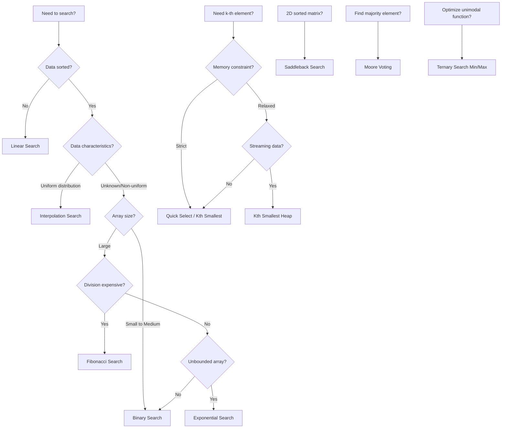

# Searching Algorithms

This directory contains detailed documentation for all searching algorithms implemented in the **TheAlgorithms/Rust** repository.

## Overview

Searching algorithms are fundamental techniques used to locate specific items within a data structure. The choice of algorithm depends on the data's organization (sorted vs. unsorted), size, and the specific requirements of the application.

## Algorithm Categories

### 1. Basic Searches
| Algorithm | Time Complexity | Space | Prerequisites |
|-----------|-----------------|-------|---------------|
| [Linear Search](linear_search.md) | O(n) | O(1) | None |
| [Binary Search](binary_search.md) | O(log n) | O(1) | Sorted array |
| [Binary Search (Recursive)](binary_search_recursive.md) | O(log n) | O(log n) | Sorted array |

### 2. Improved Binary Searches
| Algorithm | Time Complexity | Space | Best Use Case |
|-----------|-----------------|-------|---------------|
| [Jump Search](jump_search.md) | O(√n) | O(1) | Sorted array, backward jumps costly |
| [Exponential Search](exponential_search.md) | O(log n) | O(1) | Unbounded/infinite arrays |
| [Fibonacci Search](fibonacci_search.md) | O(log n) | O(1) | Large arrays, division costly |
| [Interpolation Search](interpolation_search.md) | O(log log n)* | O(1) | Uniformly distributed data |

*Average case for uniformly distributed data; O(n) worst case.

### 3. Ternary Search Variants
| Algorithm | Time Complexity | Space | Purpose |
|-----------|-----------------|-------|---------|
| [Ternary Search](ternary_search.md) | O(log₃ n) | O(1) | Sorted array search |
| [Ternary Search (Recursive)](ternary_search_recursive.md) | O(log₃ n) | O(log n) | Sorted array search |
| [Ternary Search Min/Max](ternary_search_min_max.md) | O(log n) | O(1) | Unimodal function optimization |
| [Ternary Search Min/Max (Recursive)](ternary_search_min_max_recursive.md) | O(log n) | O(log n) | Unimodal function optimization |

### 4. Selection Algorithms
| Algorithm | Time Complexity | Space | Purpose |
|-----------|-----------------|-------|---------|
| [Quick Select](quick_select.md) | O(n)* | O(1) | Find k-th smallest element |
| [Kth Smallest](kth_smallest.md) | O(n)* | O(1) | Find k-th order statistic |
| [Kth Smallest (Heap)](kth_smallest_heap.md) | O(n log k) | O(k) | Streaming k-th smallest |

*Average case; O(n²) worst case.

### 5. Specialized Searches
| Algorithm | Time Complexity | Space | Use Case |
|-----------|-----------------|-------|----------|
| [Moore Voting](moore_voting.md) | O(n) | O(1) | Find majority element |
| [Saddleback Search](saddleback_search.md) | O(m + n) | O(1) | Search in sorted 2D matrix |

## Complexity Comparison

```
Time Complexity (Best to Worst):
O(1) < O(log log n) < O(log n) < O(√n) < O(n) < O(n log n) < O(n²)

       Interpolation*    Binary      Jump     Linear
                         Ternary     Fibonacci
                         Exponential
```

## Decision Tree: Which Algorithm to Use?



## Implementation Notes

### Rust-Specific Considerations

1. **Generic Bounds**: Most algorithms use `T: Ord` for comparison
2. **Ownership**: Functions typically take `&[T]` (borrowed slice) for read-only access
3. **Option Return**: Search functions return `Option<usize>` to handle not-found cases idiomatically
4. **Zero-Cost Abstractions**: Iterators and pattern matching have no runtime overhead

### Common Edge Cases

All implementations handle:
- Empty arrays
- Single-element arrays
- Element at boundaries (first/last)
- Element not present
- Duplicate elements (returns one valid index)

## Performance Benchmarks

For an array of n = 1,000,000 elements:

| Algorithm | Avg. Comparisons | Best For |
|-----------|-----------------|----------|
| Binary Search | ~20 | General sorted arrays |
| Interpolation | ~4* | Uniformly distributed integers |
| Jump Search | ~1000 | Systems with expensive backward moves |
| Fibonacci | ~20 | Systems with expensive multiplication |

*With uniformly distributed data.

## References

- Cormen, T. H., et al. "Introduction to Algorithms" (3rd ed.), MIT Press
- Knuth, D. E. "The Art of Computer Programming, Vol. 3: Sorting and Searching"
- Sedgewick, R. & Wayne, K. "Algorithms" (4th ed.), Addison-Wesley

## File Index

| File | Algorithm |
|------|-----------|
| [binary_search.md](binary_search.md) | Binary Search (Iterative) |
| [binary_search_recursive.md](binary_search_recursive.md) | Binary Search (Recursive) |
| [linear_search.md](linear_search.md) | Linear Search |
| [jump_search.md](jump_search.md) | Jump Search |
| [interpolation_search.md](interpolation_search.md) | Interpolation Search |
| [exponential_search.md](exponential_search.md) | Exponential Search |
| [ternary_search.md](ternary_search.md) | Ternary Search (Iterative) |
| [ternary_search_recursive.md](ternary_search_recursive.md) | Ternary Search (Recursive) |
| [ternary_search_min_max.md](ternary_search_min_max.md) | Ternary Search for Optimization |
| [ternary_search_min_max_recursive.md](ternary_search_min_max_recursive.md) | Ternary Search Optimization (Recursive) |
| [fibonacci_search.md](fibonacci_search.md) | Fibonacci Search |
| [quick_select.md](quick_select.md) | Quick Select |
| [kth_smallest.md](kth_smallest.md) | Kth Smallest Element |
| [kth_smallest_heap.md](kth_smallest_heap.md) | Kth Smallest Element (Heap-based) |
| [moore_voting.md](moore_voting.md) | Moore's Voting Algorithm |
| [saddleback_search.md](saddleback_search.md) | Saddleback Search |
