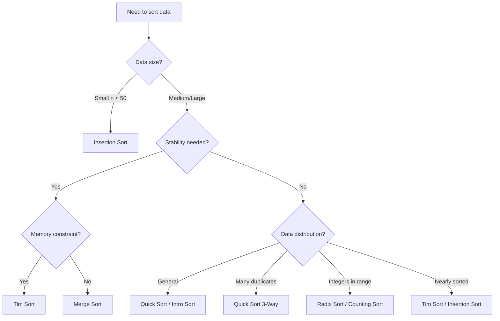

# Sorting Algorithms

This directory contains comprehensive documentation for all sorting algorithms implemented in TheAlgorithms/Rust.

## Overview

Sorting algorithms are fundamental algorithms that arrange elements of a list in a certain order. The most common orderings are numerical and lexicographical. Efficient sorting is important for optimizing the use of other algorithms that require sorted data.

## Algorithm Categories

### Comparison-Based Sorting
These algorithms determine order through comparisons between elements.

| Algorithm | Best Case | Average Case | Worst Case | Space | Stable | File |
|-----------|-----------|--------------|------------|-------|--------|------|
| [Quick Sort](quick_sort.md) | O(n log n) | O(n log n) | O(n²) | O(log n) | No | [quick_sort.rs](../../src/sorting/quick_sort.rs) |
| [Quick Sort 3-Way](quick_sort_3_ways.md) | O(n) | O(n log n) | O(n²) | O(log n) | No | [quick_sort_3_ways.rs](../../src/sorting/quick_sort_3_ways.rs) |
| [Merge Sort](merge_sort.md) | O(n log n) | O(n log n) | O(n log n) | O(n) | Yes | [merge_sort.rs](../../src/sorting/merge_sort.rs) |
| [Heap Sort](heap_sort.md) | O(n log n) | O(n log n) | O(n log n) | O(1) | No | [heap_sort.rs](../../src/sorting/heap_sort.rs) |
| [Tim Sort](tim_sort.md) | O(n) | O(n log n) | O(n log n) | O(n) | Yes | [tim_sort.rs](../../src/sorting/tim_sort.rs) |
| [Intro Sort](intro_sort.md) | O(n log n) | O(n log n) | O(n log n) | O(log n) | No | [intro_sort.rs](../../src/sorting/intro_sort.rs) |
| [Insertion Sort](insertion_sort.md) | O(n) | O(n²) | O(n²) | O(1) | Yes | [insertion_sort.rs](../../src/sorting/insertion_sort.rs) |
| [Binary Insertion Sort](binary_insertion_sort.md) | O(n) | O(n²) | O(n²) | O(1) | Yes | [binary_insertion_sort.rs](../../src/sorting/binary_insertion_sort.rs) |
| [Selection Sort](selection_sort.md) | O(n²) | O(n²) | O(n²) | O(1) | No | [selection_sort.rs](../../src/sorting/selection_sort.rs) |
| [Bubble Sort](bubble_sort.md) | O(n) | O(n²) | O(n²) | O(1) | Yes | [bubble_sort.rs](../../src/sorting/bubble_sort.rs) |
| [Shell Sort](shell_sort.md) | O(n log n) | O(n^1.25) | O(n²) | O(1) | No | [shell_sort.rs](../../src/sorting/shell_sort.rs) |
| [Comb Sort](comb_sort.md) | O(n log n) | O(n²/2^p) | O(n²) | O(1) | No | [comb_sort.rs](../../src/sorting/comb_sort.rs) |
| [Cocktail Shaker Sort](cocktail_shaker_sort.md) | O(n) | O(n²) | O(n²) | O(1) | Yes | [cocktail_shaker_sort.rs](../../src/sorting/cocktail_shaker_sort.rs) |
| [Gnome Sort](gnome_sort.md) | O(n) | O(n²) | O(n²) | O(1) | Yes | [gnome_sort.rs](../../src/sorting/gnome_sort.rs) |
| [Cycle Sort](cycle_sort.md) | O(n²) | O(n²) | O(n²) | O(1) | No | [cycle_sort.rs](../../src/sorting/cycle_sort.rs) |
| [Pancake Sort](pancake_sort.md) | O(n) | O(n²) | O(n²) | O(1) | No | [pancake_sort.rs](../../src/sorting/pancake_sort.rs) |
| [Stooge Sort](stooge_sort.md) | O(n^2.7) | O(n^2.7) | O(n^2.7) | O(n) | No | [stooge_sort.rs](../../src/sorting/stooge_sort.rs) |
| [Odd-Even Sort](odd_even_sort.md) | O(n) | O(n²) | O(n²) | O(1) | Yes | [odd_even_sort.rs](../../src/sorting/odd_even_sort.rs) |
| [Exchange Sort](exchange_sort.md) | O(n²) | O(n²) | O(n²) | O(1) | No | [exchange_sort.rs](../../src/sorting/exchange_sort.rs) |
| [Tree Sort](tree_sort.md) | O(n log n) | O(n log n) | O(n²) | O(n) | Yes | [tree_sort.rs](../../src/sorting/tree_sort.rs) |
| [Patience Sort](patience_sort.md) | O(n log n) | O(n log n) | O(n log n) | O(n) | Yes | [patience_sort.rs](../../src/sorting/patience_sort.rs) |
| [Bitonic Sort](bitonic_sort.md) | O(n log² n) | O(n log² n) | O(n log² n) | O(1) | No | [bitonic_sort.rs](../../src/sorting/bitonic_sort.rs) |

### Non-Comparison-Based Sorting
These algorithms sort without comparing elements directly.

| Algorithm | Best Case | Average Case | Worst Case | Space | Stable | File |
|-----------|-----------|--------------|------------|-------|--------|------|
| [Radix Sort](radix_sort.md) | O(nk) | O(nk) | O(nk) | O(n+k) | Yes | [radix_sort.rs](../../src/sorting/radix_sort.rs) |
| [Counting Sort](counting_sort.md) | O(n+k) | O(n+k) | O(n+k) | O(k) | Yes | [counting_sort.rs](../../src/sorting/counting_sort.rs) |
| [Bucket Sort](bucket_sort.md) | O(n+k) | O(n+k) | O(n²) | O(n+k) | Yes | [bucket_sort.rs](../../src/sorting/bucket_sort.rs) |
| [Pigeonhole Sort](pigeonhole_sort.md) | O(n+N) | O(n+N) | O(n+N) | O(N) | Yes | [pigeonhole_sort.rs](../../src/sorting/pigeonhole_sort.rs) |
| [Bead Sort](bead_sort.md) | O(n) | O(S) | O(S) | O(n²) | N/A | [bead_sort.rs](../../src/sorting/bead_sort.rs) |

### Specialized Sorting
Algorithms designed for specific use cases.

| Algorithm | Description | File |
|-----------|-------------|------|
| [Dutch National Flag Sort](dutch_national_flag_sort.md) | 3-way partitioning for elements with three distinct values | [dutch_national_flag_sort.rs](../../src/sorting/dutch_national_flag_sort.rs) |
| [Wave Sort](wave_sort.md) | Arranges elements in wave pattern | [wave_sort.rs](../../src/sorting/wave_sort.rs) |
| [Wiggle Sort](wiggle_sort.md) | Arranges elements such that a[0] < a[1] > a[2] < a[3]... | [wiggle_sort.rs](../../src/sorting/wiggle_sort.rs) |
| [Bingo Sort](bingo_sort.md) | Variant of selection sort for elements with many duplicates | [bingo_sort.rs](../../src/sorting/bingo_sort.rs) |

### Impractical/Educational Sorting
These algorithms are primarily for educational purposes.

| Algorithm | Time Complexity | Description | File |
|-----------|-----------------|-------------|------|
| [Bogo Sort](bogo_sort.md) | O((n+1)!) | Random permutation until sorted | [bogo_sort.rs](../../src/sorting/bogo_sort.rs) |
| [Sleep Sort](sleep_sort.md) | O(max(input)) | Uses thread sleep as sorting mechanism | [sleep_sort.rs](../../src/sorting/sleep_sort.rs) |

## Algorithm Selection Guide

### When to Use Which Algorithm



### Quick Reference

| Scenario | Recommended Algorithm |
|----------|----------------------|
| General purpose | Quick Sort, Intro Sort |
| Guaranteed O(n log n) | Merge Sort, Heap Sort |
| Nearly sorted data | Tim Sort, Insertion Sort |
| Many duplicate keys | Quick Sort 3-Way |
| Small datasets (n < 50) | Insertion Sort |
| Integers in known range | Counting Sort, Radix Sort |
| Memory constrained | Heap Sort |
| Stable sort required | Merge Sort, Tim Sort |
| Parallel sorting | Bitonic Sort |

## Complexity Notation

- **n**: Number of elements
- **k**: Range of input values (for counting/radix sort)
- **S**: Sum of all elements (for bead sort)
- **N**: Range size (max - min + 1)
- **p**: Number of increments (for comb sort)

## Testing

All sorting algorithms in this repository include comprehensive tests covering:
- Empty arrays
- Single element arrays
- Already sorted arrays
- Reverse sorted arrays
- Arrays with duplicate elements
- Random arrays

Run tests with:
```bash
cargo test sorting
```

## Contributing

When adding a new sorting algorithm:
1. Implement the algorithm in `src/sorting/`
2. Add comprehensive tests
3. Update `src/sorting/mod.rs`
4. Create documentation following the template in this directory
5. Update this README

## References

- Cormen, T. H., et al. "Introduction to Algorithms" (CLRS)
- Sedgewick, R. "Algorithms in C++"
- Knuth, D. E. "The Art of Computer Programming, Vol. 3: Sorting and Searching"
